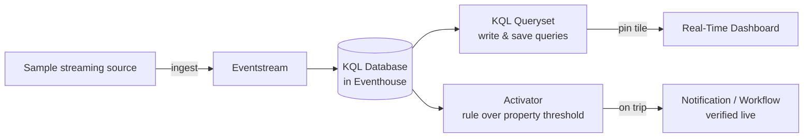

# Unit 8 — Exercise: Get started with Real-Time Intelligence in Microsoft Fabric

> [!quote] Source
> Microsoft Learn · Path 1 · Module 5 · Unit 8 · "Exercise - Get started with Real-Time Intelligence in Microsoft Fabric"
> <https://learn.microsoft.com/en-us/training/modules/get-started-kusto-fabric/5-exercise-use-kusto-query-data-onelake/>

## 🎯 What the lab does

This 30-minute hands-on exercise puts the whole RTI pipeline into practice on a real Microsoft Fabric tenant. You will **ingest real-time data**, then **query and visualize** it, and finally **define an alert to automate an action** based on a threshold in the live stream.

> [!info] Lab goal (verbatim)
> In this exercise, you'll **ingest real-time data into Microsoft Fabric**. You'll then **query and visualize the data** before **defining an alert to automate an action** based on a threshold value in the real-time data stream.

> [!warning] Prerequisites
> You need a **Microsoft Fabric tenant** to complete this exercise. See [Getting started with Fabric](https://learn.microsoft.com/en-us/fabric/get-started/fabric-trial) for trial access.

## 🧪 Lab summary (not the lab itself)

> [!note] Lab philosophy
> This note **summarizes what the lab walks you through**. The step-by-step UI is in the official Microsoft Learn lab — link at the top of this unit. Reproducing the UI here would duplicate paid/proprietary content and go stale every Fabric release.

The lab stitches together every concept covered in [[Unit-3-RTI-Components]] through [[Unit-7-Automate-Actions]]:

| Lab stage | RTI components used | Skill practiced |
|-----------|---------------------|-----------------|
| 1. Set up an Eventhouse + KQL database | **Eventhouse**, **KQL database** | Creating the storage target |
| 2. Create an Eventstream to ingest a sample stream | **Eventstreams**, **Real-Time hub** | Wiring source → destination |
| 3. Write KQL queries against the streaming data | **KQL Queryset**, **KQL** | `take`, `where`, `summarize`, `project` |
| 4. Build a Real-Time Dashboard from the KQL queries | **Real-Time Dashboards** | Pinning query results as tiles |
| 5. Define an Activator alert on a threshold | **Activator**, **Event → Property → Rule** | Triggering an automated action |
| 6. Verify the action fires when the threshold trips | **Activator** | Observability of event-driven automation |

## 🧠 Visual — what you'll build

## 🎓 Skills you'll demonstrate

- **Ingest** streaming data with an Eventstream (the **Eventstream** path from [[Unit-4-Ingest-Transform]]).
- **Query** streaming data with KQL ([[Unit-5-Store-Query-KQL]]).
- **Visualize** streaming insights with Real-Time Dashboard tiles ([[Unit-6-Visualize-Real-Time]]).
- **Automate** an action with an Activator rule on a property threshold ([[Unit-7-Automate-Actions]]).

> [!success] Why this exercise matters for DP-600
> The exam expects you to recognize *which* RTI component fits *which* job. This lab walks the canonical **ingest → query → visualize → alert** path — the same shape most DP-600 real-time scenarios take.

## 🔗 Launch the lab

- Official Microsoft Learn unit: <https://learn.microsoft.com/en-us/training/modules/get-started-kusto-fabric/5-exercise-use-kusto-query-data-onelake/>
- Launch button (Microsoft hosted lab VM): <https://go.microsoft.com/fwlink/?linkid=2260722>

## 🧭 Next

→ [[Unit-9-Module-Assessment]]
← [[Unit-7-Automate-Actions]]
↑ [[_MOC]]