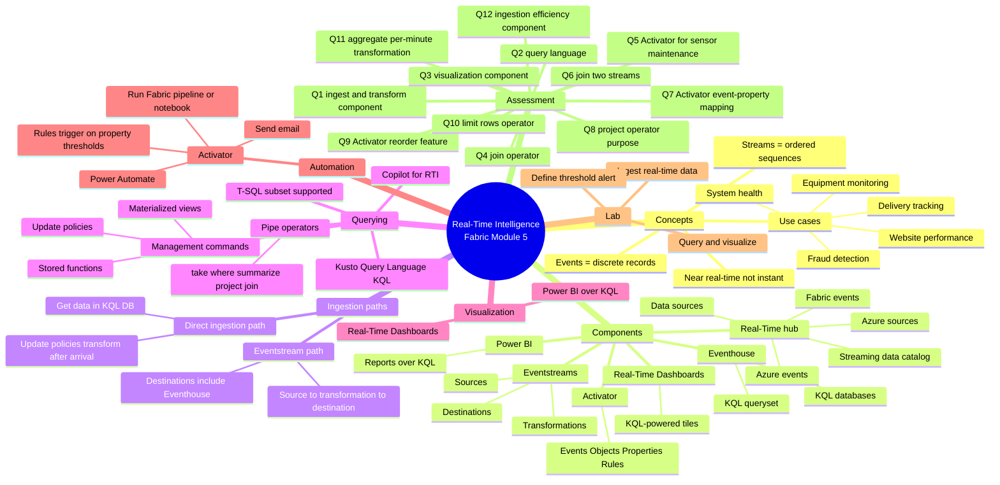

# Path 1 · Module 5 — Get started with Real-Time Intelligence in Microsoft Fabric

> [!info] Module map
> This module introduces **Microsoft Fabric Real-Time Intelligence (RTI)** — the end-to-end stack for working with **data in motion**. It covers ingestion (Eventstreams), discovery (Real-Time hub), storage (Eventhouse / KQL databases), querying (KQL), visualization (Real-Time Dashboards + Power BI), and automated response (Activator).

## 🎯 Learning objectives (synthesized from unit-level goals)

By the end of this module you should be able to:

1. **Define** real-time analytics and contrast it with batch analytics; explain **events**, **streams**, and the components of a real-time solution.
2. **Identify** the Real-Time Intelligence components in Fabric (Eventstreams, Eventhouse, KQL Queryset, Real-Time Dashboards, Activator, Real-Time hub) and how they fit end-to-end.
3. **Ingest and transform** streaming data with Eventstreams (sources → transformations → destinations) **and** by direct ingestion into a KQL database.
4. **Store and query** real-time data in a KQL database using KQL (and T-SQL), plus leverage update policies, materialized views, and stored functions.
5. **Visualize** real-time insights using Real-Time Dashboards (KQL tiles) and Power BI reports over KQL databases.
6. **Automate actions** with Activator using Events, Objects, Properties, and Rules to trigger notifications, Power Automate flows, pipelines, or notebooks.
7. **Complete the hands-on lab** that ingests, queries, visualizes, and alerts on a real-time stream.

## 🧠 Module mind map

> [!tip] How to use
> The mind map below is duplicated as a standalone Mermaid file (`Module-5-Mind-Map.md`) you can open in Obsidian's Mermaid preview or the [Mermaid Live Editor](https://mermaid.live). It is the **single-page view** of the entire module.

## 📑 Unit breakdown

| # | Unit | XP | Minutes | Focus |
|---|------|----|---------|-------|
| 1 | [Introduction](./Unit-1-Introduction.md) | 100 | 2 | Scenario framing: delivery ops |
| 2 | [What is real-time data analytics?](./Unit-2-Real-Time-Analytics.md) | 100 | 5 | Events, streams, RTI capabilities |
| 3 | [Real-Time Intelligence in Microsoft Fabric](./Unit-3-RTI-Components.md) | 100 | 8 | 6 RTI components + use cases |
| 4 | [Ingest and transform real-time data](./Unit-4-Ingest-Transform.md) | 100 | 6 | Eventstreams + direct ingestion + update policies |
| 5 | [Store and query real-time data](./Unit-5-Store-Query-KQL.md) | 100 | 5 | Eventhouse, KQL Queryset, KQL syntax, management commands |
| 6 | [Visualize real-time data](./Unit-6-Visualize-Real-Time.md) | 100 | 2 | Real-Time Dashboards + Power BI |
| 7 | [Automate actions](./Unit-7-Automate-Actions.md) | 100 | 4 | Activator: Events / Objects / Properties / Rules |
| 8 | [Exercise — Get started with RTI](./Unit-8-Exercise.md) | 100 | 30 | Hands-on lab: ingest → query → visualize → alert |
| 9 | [Module assessment](./Unit-9-Module-Assessment.md) | 200 | 10 | 12 knowledge-check questions |
| 10 | [Summary](./Unit-10-Summary.md) | 100 | 1 | Recap + learn-more links |

**Total: 1100 XP · ~73 minutes**

## 🔗 Knowledge-check answers (unit 9)

> [!warning] Note on answer extraction
> Microsoft Learn intentionally **does not display the correct answers** on the assessment page (only the questions + options). The answers below are derived from the unit content per Microsoft Fabric's documented behavior.

| Q | Question | Correct answer |
|---|----------|---------------|
| 1 | Which Microsoft Fabric Real-Time Intelligence component should you use to ingest and transform a stream of real-time data? | **Eventstream** |
| 2 | Which language is optimized for querying real-time data in an eventhouse? | **KQL** |
| 3 | Which Microsoft Fabric Real-Time Intelligence component is used to visualize and explore real-time data in tiles? | **Real-Time Dashboards** |
| 4 | Which KQL operator would you use to combine data from two tables based on a shared key in Microsoft Fabric? | **join** |
| 5 | Your company wants to use Activator to reduce downtime by automating responses to equipment sensor warnings. What should you configure to ensure immediate action is taken when a warning is detected? | **Set up activator rules to trigger maintenance workflows.** |
| 6 | Which method would you use to combine temperature and humidity data from two different streams in Microsoft Fabric? | **Join transformation** |
| 7 | You notice that your Activator workflow in Microsoft Fabric is not responding to changes in event data as expected. What should you verify first? | **The event properties are correctly mapped to the corresponding rules.** |
| 8 | How does the 'project' operator function in KQL queries within Microsoft Fabric? | **It selects specific columns to include in the query results.** |
| 9 | In designing a real-time workflow to manage inventory levels, which Activator feature should be utilized to automatically reorder stock when levels fall below a specified point? | **Rules** |
| 10 | While executing a KQL query, you find that the query returns more rows than expected. Which KQL operator might you need to adjust to limit the number of rows returned? | **take** |
| 11 | Which transformation would you use in Eventstreams to calculate the average temperature from a stream of sensor data every minute? | **Aggregate transformation** |
| 12 | Your organization is experiencing delays in processing real-time data from IoT devices. Which Microsoft Fabric component should you check to ensure efficient data ingestion and transformation? | **Eventstreams** |

## 🧭 Downstream links

- [[Unit-1-Introduction]] · [[Unit-2-Real-Time-Analytics]] · [[Unit-3-RTI-Components]] · [[Unit-4-Ingest-Transform]] · [[Unit-5-Store-Query-KQL]] · [[Unit-6-Visualize-Real-Time]] · [[Unit-7-Automate-Actions]] · [[Unit-8-Exercise]] · [[Unit-9-Module-Assessment]] · [[Unit-10-Summary]]
- [[Module-5-Mind-Map]]
- Career/DP-600 index (parent MOC) — *to be created*

## 📚 External references

- Microsoft Learn module page: <https://learn.microsoft.com/en-us/training/modules/get-started-kusto-fabric/>
- Real-Time Intelligence docs: <https://learn.microsoft.com/en-us/fabric/real-time-intelligence/>
- KQL overview: <https://learn.microsoft.com/en-us/kusto/query/>
- Activator introduction: <https://learn.microsoft.com/en-us/fabric/real-time-intelligence/data-activator/activator-introduction>
- Copilot for Real-Time Intelligence: <https://learn.microsoft.com/en-us/fabric/real-time-intelligence/copilot-writing-queries>