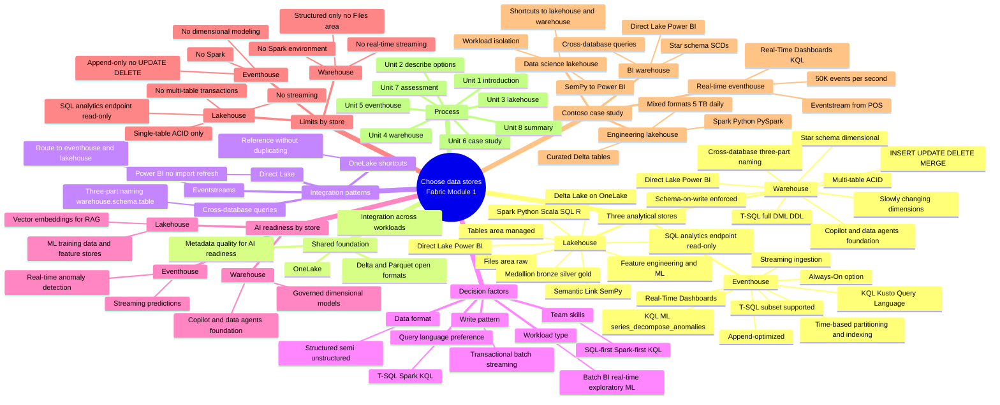

# Module mind map — Choose data stores in Microsoft Fabric

> [!info] How to use
> Open this file in Obsidian's Mermaid preview, or copy the `mermaid` block below into [Mermaid Live Editor](https://mermaid.live) for an exportable image. This is the **single-page mental model** for the entire module — print it, pin it, draw it from memory.

