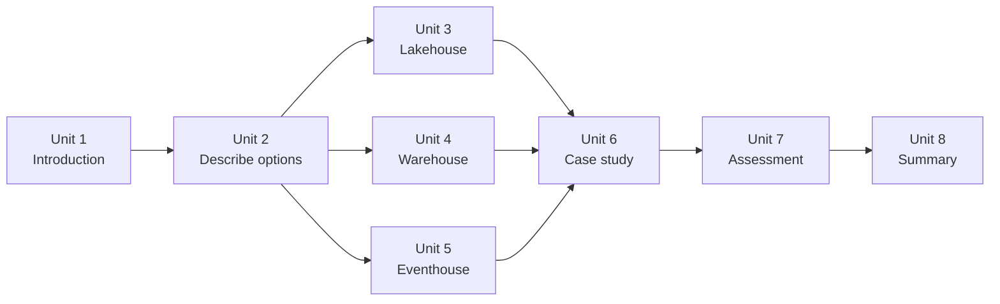

# Unit 1 — Introduction

## 🎯 Why this matters

Choosing the right analytical data store is one of the most consequential decisions you make when building an analytics solution in Microsoft Fabric. The choice affects how data is ingested, how the team queries it, and how the solution adapts as requirements evolve. This module gives you a framework for making that decision confidently.

> [!info] Module goal
> By the end of this module, you're able to evaluate **lakehouse**, **warehouse**, and **eventhouse** capabilities and confidently choose the appropriate data store for a given business scenario.

## 🛒 The retail scenario

Suppose you're a data professional at a retail organization adopting Microsoft Fabric. Three business groups need different analytics solutions:

| Business group | Need |
|---|---|
| **Sales** | Structured reporting with complex joins |
| **Data science** | Exploratory work on transaction data + web clickstream logs |
| **Operations** | Real-time monitoring of IoT sensor data from distribution centers |

Each group has different data types, query preferences, and performance requirements. Your task: evaluate Fabric's analytical data stores and recommend the right one for each.

## 🧱 The three analytical data stores

Microsoft Fabric provides three primary analytical data stores. All three:

- Store data in **OneLake**
- Use an **open format** (Delta / Parquet)
- Integrate with other Fabric workloads

But they differ in **query language**, **write capabilities**, and **workload fit**:

| Data store | Primary use | Query language | Write pattern | Data types |
|---|---|---|---|---|
| **Lakehouse** | Flexible analytics & data engineering | Spark (Python, Scala, SQL, R) and T-SQL (read-only) | Batch via Spark notebooks, pipelines, dataflows | Structured, semi-structured, unstructured |
| **Warehouse** | Structured analytics & BI reporting | T-SQL (full DML/DDL) | Transactional via T-SQL, pipelines, dataflows | Structured |
| **Eventhouse** | Real-time analytics | KQL and T-SQL (subset) | Streaming ingestion and batch | Time-series, event, semistructured |

## 📋 What you'll be able to do

In this module, you will:

- **Survey** the three analytical data store options in Microsoft Fabric — lakehouse, warehouse, and eventhouse.
- **Evaluate** the strengths and ideal use cases for each data store.
- **Apply** a decision framework to match data characteristics and team skills to the right store.
- **Practice** choosing the appropriate data store for real-world business scenarios.

## 🗺️ Module map

> [!tip] How to study this module
> Read Units 2–5 to build the conceptual model, then walk through Unit 6's case study to see the framework applied. Use Unit 7's knowledge check to confirm retention, and Unit 8 for a recap of the key takeaways.

## 🔗 Related

- [[_MOC|Module index]]
- [[Unit-2-Describe-Options|Next → Describe analytical data store options]]
- [[Module-Mind-Map|Module mind map]]