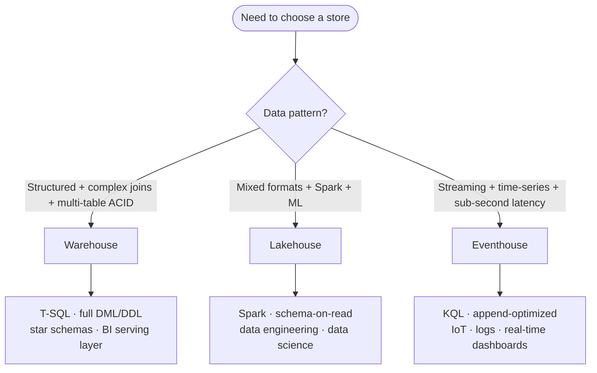

# Unit 2 — Describe analytical data store options

## 🎯 Why this matters

Before you can choose between Fabric's data stores, you need a shared mental model of what each one does well and where it falls short. This unit introduces the **comparison axes** (query language, write pattern, data types) and the **decision factors** (data format, query preference, write pattern, team skills, workload type) you'll apply throughout the rest of the module.

## 📊 The three stores at a glance

All three analytical data stores share a common foundation. They store data in OneLake, support open formats like Delta and Parquet, and integrate with other Fabric workloads. They differ in primary query language, write capabilities, and the data types they handle best.

| Data store | Primary use | Query language | Write pattern | Data types |
|---|---|---|---|---|
| **Lakehouse** | Flexible analytics and data engineering | Spark (Python, Scala, SQL, R) and T-SQL (read-only) | Batch via Spark notebooks, pipelines, dataflows | Structured, semi-structured, unstructured |
| **Warehouse** | Structured analytics and BI reporting | T-SQL (full DML/DDL) | Transactional via T-SQL, pipelines, dataflows | Structured |
| **Eventhouse** | Real-time analytics | KQL (Kusto Query Language) and T-SQL | Streaming ingestion and batch | Time-series, event, semistructured |

> [!info] Other Fabric stores — operational, not analytical
> Fabric also includes **SQL database in Fabric** for operational transactional workloads and **Cosmos DB in Fabric** for AI, NoSQL, and vector search scenarios. These stores serve **operational** purposes rather than analytical ones. This module focuses on the three analytical data stores: **lakehouse**, **warehouse**, **eventhouse**.

## 🔗 How data stores connect through OneLake

Because all three stores write data to **OneLake**, data doesn't need to be copied or moved between systems for cross-workload access. Fabric provides several integration points:

> [!tip] OneLake integration points
> - **Shortcuts** let you reference data in one store from another without duplicating it. A warehouse can create a shortcut to Delta tables managed by a lakehouse.
> - **Cross-database queries** in the warehouse let you join data from multiple warehouses and lakehouse SQL analytics endpoints using three-part naming (`warehouse.schema.table`).
> - **The SQL analytics endpoint** on a lakehouse automatically exposes Delta tables for T-SQL queries and Power BI Direct Lake connections.

This shared foundation means your choice of data store doesn't lock you into a single access pattern. You choose the store that best handles data ingestion and transformation for a given workload, and other teams access that data through the method that suits them.

## 🧭 Decision factors

The diagram below shows the ideal use cases for each Fabric data store.

When you evaluate which data store to use for a specific scenario, consider these key factors:

> [!info] The five decision factors
> - **Data format.** Is the data structured, semi-structured, or unstructured? Warehouses work best with structured data. Lakehouses handle all three. Eventhouses are optimized for time-series and semistructured event data.
> - **Query language preference.** Does your team prefer T-SQL, Spark, or KQL? The warehouse provides the fullest T-SQL experience. The lakehouse supports both Spark and read-only T-SQL. The eventhouse uses KQL for its most powerful analytics.
> - **Write pattern.** Do you need transactional updates (INSERT, UPDATE, DELETE, MERGE)? Only the warehouse provides full multi-table ACID transaction support through T-SQL. The lakehouse supports writes through Spark. The eventhouse is designed for streaming ingestion with append-optimized writes.
> - **Team skills.** What tools and languages does your team know? SQL-first teams often prefer the warehouse. Teams with data engineering or data science skills lean toward the lakehouse and Spark notebooks. Teams handling operational monitoring and telemetry benefit from KQL expertise.
> - **Workload type.** Is this batch analytics, real-time monitoring, or exploratory data science? Batch and BI workloads align with the warehouse. Exploratory and ML workloads align with the lakehouse. Streaming and time-series workloads align with the eventhouse.

> [!success] You don't have to choose just one
> Many Fabric solutions use a **lakehouse** for data engineering and staging, a **warehouse** for curated BI-ready data, and an **eventhouse** for real-time monitoring. The right question isn't "which store should we use?" but "**which store should we use for this specific workload?**"

## 🤖 Designing for AI usage

Your data store choice affects how easily AI capabilities can access and use your data. All three stores integrate with **Copilot** and AI features in Fabric, but they support different AI scenarios:

> [!important] AI-readiness by store
> - **Lakehouse** is the natural home for **ML training data and feature stores**. Data scientists use Spark notebooks to build, train, and score models directly against lakehouse data. **Semantic Link (SemPy)** connects lakehouse data to Power BI semantic models, enabling data scientists to validate model outputs against business definitions. The lakehouse also supports **vector embeddings** and unstructured data formats that generative AI workflows require.
> - **Warehouse** provides the structured, governed data that **Copilot and data agents** use when answering natural language questions. Curated dimensional models in a warehouse serve as a strong foundation for semantic models and AI agents. Clear naming conventions, well-defined relationships, and consistent data types help AI tools interpret your data correctly and generate accurate responses.
> - **Eventhouse** supports **real-time AI scoring**, streaming predictions, and anomaly detection against live event data. **KQL's built-in machine learning functions** enable time-series forecasting and pattern detection without moving data to a separate compute environment.

> [!quote] Metadata quality matters
> Well-governed data in any of these stores is accessible to Copilot-enabled tools across Fabric. The work you do to organize, govern, and describe your data directly supports your organization's AI initiatives. **Metadata quality — clear table names, descriptive column names, and documented relationships — is as important as data quality when preparing for AI.**

## 🔗 Related

- [[Unit-1-Introduction|← Unit 1 — Introduction]]
- [[Unit-3-Evaluate-Lakehouse|Next → Evaluate lakehouse capabilities]]
- [[Unit-4-Evaluate-Warehouse|Evaluate warehouse capabilities]]
- [[Unit-5-Evaluate-Eventhouse|Evaluate eventhouse capabilities]]
- [[_MOC|Module index]]