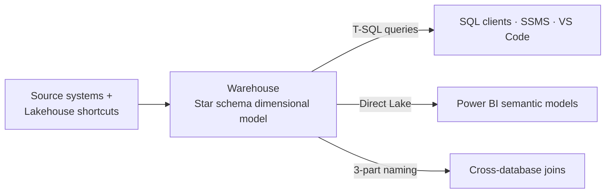

# Unit 4 — Evaluate warehouse capabilities

## 🎯 Why this matters

A **warehouse** in Microsoft Fabric is an enterprise-scale relational data store built on a data lake foundation. It provides a full **T-SQL** experience for creating, loading, and querying structured data with **multi-table ACID transaction support**. If your team works primarily with SQL and you need transactional write capabilities, the warehouse is designed for that workload.

## 🏛️ Architecture and capabilities

The Fabric warehouse stores all data in **Delta format on OneLake**, just like the lakehouse. However, the warehouse provides a fundamentally different development experience — you interact with the warehouse through T-SQL, using familiar SQL Server patterns for table creation, data loading, and query optimization.

> [!info] What the warehouse supports
> - **Full DML operations** — INSERT, UPDATE, DELETE, MERGE. You can modify data in place, which is essential for maintaining slowly changing dimensions and handling corrections.
> - **Full DDL operations** — CREATE TABLE, ALTER TABLE, views, stored procedures, functions. You define your schema with the same T-SQL statements you use in SQL Server.
> - **Multi-table ACID transactions** — changes across multiple tables commit or roll back together, which is critical for maintaining referential integrity in dimensional models.
> - **Cross-database queries** — join data from multiple warehouses and lakehouse SQL analytics endpoints using three-part naming, without moving or copying data.

### Capability summary

| Capability | Details |
|---|---|
| **Data types** | Structured |
| **Primary development tool** | T-SQL |
| **Write support** | T-SQL (INSERT, UPDATE, DELETE, MERGE, COPY INTO, CTAS), pipelines, dataflows |
| **Read support** | T-SQL (SELECT, views, stored procedures), Power BI Direct Lake |
| **Storage format** | Delta (Parquet with transaction log) |
| **Schema management** | Schema-on-write with enforced data types |
| **Transaction support** | Full multi-table ACID transactions |

## ✅ When to choose a warehouse

The warehouse is the right choice when your scenario matches several of these characteristics:

> [!success] Warehouse fits when…
> - **SQL-first teams.** Your developers and analysts work primarily with T-SQL. They want to create tables, write stored procedures, and query data using the same tools and language they use with SQL Server or Azure SQL Database. The warehouse supports **SQL Server Management Studio (SSMS)**, **VS Code**, and other SQL Server-compatible tools.
> - **Transactional write patterns.** You need to update, delete, or merge records as part of your data pipeline. Dimensional models with **slowly changing dimensions** require UPDATE and DELETE capabilities that only the warehouse provides through T-SQL.
> - **Star schema and dimensional modeling.** You're building curated data marts with fact and dimension tables for BI reporting. The warehouse's schema-on-write enforcement and full DDL support make it straightforward to define and maintain dimensional models.
> - **Strict schema governance.** Regulatory or business requirements demand that data types and constraints are enforced from the moment data is loaded. The warehouse validates data on write, catching type mismatches and constraint violations early.
> - **Complex analytical queries.** You need to run queries with multiple joins, aggregations, window functions, and subqueries. The warehouse's distributed query processing engine is optimized for complex analytical workloads.

> [!tip] Zero capacity management
> The warehouse doesn't require any capacity configuration or compute management. Fabric handles scaling automatically, with no knobs to turn for performance tuning.

## ❌ When a warehouse isn't the best fit

The warehouse has trade-offs that make other stores better choices for certain scenarios:

> [!warning] Consider a different store when…
> - **Spark-based workloads.** If your team uses Python, Scala, or R in Spark notebooks for data engineering or data science, the **lakehouse** provides native Spark support. The warehouse is designed for T-SQL development, not notebook-based exploration.
> - **Unstructured or semi-structured data.** If you need to store raw JSON files, images, or documents alongside your tables, the **lakehouse's** Files area handles those formats. The warehouse is designed for structured, tabular data.
> - **Streaming and real-time data.** If your data arrives continuously and needs to be queryable within seconds, the **eventhouse's** streaming ingestion is purpose-built for that pattern. The warehouse handles batch and micro-batch loading.
> - **Highly flexible schemas.** If your data model is evolving rapidly and you don't want to define the schema upfront, the **lakehouse's** schema-on-read approach gives you more flexibility. The warehouse's schema-on-write model enforces structure at load time.

## 🧩 Warehouse in the broader Fabric solution

In many Fabric solutions, the warehouse serves as the **curated serving layer**. Data flows from source systems through a lakehouse (where data engineers transform it with Spark), then into the warehouse (where it's organized into dimensional models for BI consumption).

The warehouse's full T-SQL support makes it the **preferred foundation for semantic models in Power BI**. Curated fact and dimension tables in the warehouse map directly to the tables and relationships that Power BI semantic models expose to report creators and end users.

The warehouse also plays a critical role in **AI readiness**. Its structured, well-governed data is the foundation that Copilot and data agents rely on when answering natural language questions:

> [!important] AI scenarios powered by the warehouse
> - **Copilot in Power BI** generates DAX queries against semantic models that sit on top of warehouse star schemas. The clearer your dimensional model, the more accurate the AI-generated answers.
> - **Data agents** translate natural language into T-SQL queries against warehouse tables. Consistent naming conventions, well-defined relationships, and descriptive column names directly improve agent accuracy.
> - **Semantic models** built on warehouse data serve as the governed layer that multiple AI features consume. The work you invest in schema design, column descriptions, and referential integrity pays off across every AI tool that reads your data.

> [!quote] Schema enforcement is an AI prerequisite
> The schema enforcement and governance that the warehouse provides more than good data management practices — **they're prerequisites for effective AI adoption.**

## ✅ Check your understanding

**Q1.** A BI team with 10+ years of SQL Server experience needs to build dimensional models with daily dimension updates. They need to support complex multi-table joins for Power BI reports. Is warehouse the right choice?

> [!success] Answer: Yes, warehouse is ideal for this scenario
> SQL Server experience maps directly to T-SQL in the warehouse. Daily dimension updates require UPDATE/DELETE support that only the warehouse provides. Multi-table joins for Power BI dimensional models are the warehouse's core strength, and Direct Lake mode keeps Power BI fast.

**Q2.** An analytics team works entirely in T-SQL and needs to query data across multiple sources: two different warehouses and Delta tables from a lakehouse. They don't want to copy or move data. Is warehouse the right choice for their queries?

> [!success] Answer: Yes, warehouse is ideal for this scenario
> The warehouse supports **cross-database queries** using three-part naming (`warehouse.schema.table`), joining data across multiple warehouses and lakehouse SQL analytics endpoints without moving data. T-SQL is the native language, so no rewrites or data copies are needed.

## 🔗 Related

- [[Unit-3-Evaluate-Lakehouse|← Unit 3 — Evaluate lakehouse capabilities]]
- [[Unit-5-Evaluate-Eventhouse|Next → Evaluate eventhouse capabilities]]
- [[Unit-6-Case-Study|Case study]]
- [[_MOC|Module index]]