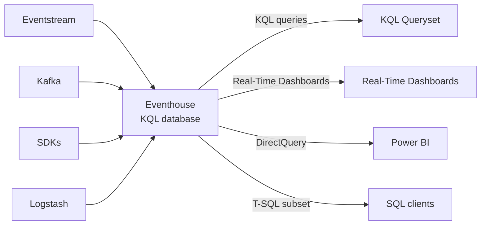

# Unit 5 — Evaluate eventhouse capabilities

## 🎯 Why this matters

An **eventhouse** in Microsoft Fabric is designed for **real-time analytics** on streaming and time-series data. It efficiently handles large volumes of events arriving continuously, and it provides fast query performance on data with a natural time component. If your workload involves telemetry, logs, IoT data, or any event-based pattern, the eventhouse is purpose-built for that scenario.

## 🏛️ Architecture and capabilities

An **eventhouse** is a workspace of **KQL databases** that share capacity and resources. Each KQL database stores event-based data that's automatically **indexed and partitioned by ingestion time**. This time-based partitioning is fundamental to how the eventhouse achieves fast query performance on large volumes of event data.

The eventhouse accepts data from multiple sources and pipelines, including **Eventstream**, SDKs, Kafka, Logstash, dataflows, and more. Data arrives in various formats and is ingested in near real-time. Unlike the lakehouse and warehouse, the eventhouse is optimized for **append-heavy workloads** where new events stream in continuously and existing data is rarely modified.

The primary query language for the eventhouse is **Kusto Query Language (KQL)**. KQL is designed specifically for time-series analysis and provides built-in operators for aggregations over time windows, anomaly detection, pattern matching, and geospatial analysis. The eventhouse also supports a subset of **T-SQL** for teams that prefer SQL syntax, though KQL provides the richest analytics experience.

### Capability summary

| Capability | Details |
|---|---|
| **Data types** | Time-series, event-based, semistructured (JSON, text), structured |
| **Primary development tool** | KQL (Kusto Query Language) |
| **Write support** | Streaming ingestion, batch ingestion, Eventstream, SDKs, Kafka |
| **Read support** | KQL, T-SQL (subset), Power BI DirectQuery |
| **Storage format** | Columnar store with automatic indexing and compression |
| **Schema management** | Schema-on-write with dynamic fields for semistructured data |
| **Transaction support** | Append-optimized; not designed for UPDATE/DELETE operations |

## ✅ When to choose an eventhouse

The eventhouse is the right choice when your scenario matches several of these characteristics:

> [!success] Eventhouse fits when…
> - **IoT telemetry and sensor data.** You ingest data from equipment, sensors, or devices that generate continuous streams of measurements. The eventhouse's streaming ingestion and time-based partitioning handle this pattern efficiently.
> - **Log and event analytics.** You collect application logs, security events, or system metrics that need to be searchable and analyzable in near real-time. KQL's full-text search and pattern-matching operators are designed for this type of data.
> - **Real-time dashboards and monitoring.** You need dashboards that refresh frequently and show current state alongside historical trends. The eventhouse's fast query engine and Power BI integration support low-latency visualizations.
> - **Time-series analysis.** You analyze trends, seasonality, or anomalies in data with a natural time dimension. KQL provides built-in time-series functions like `make-series`, `series_decompose`, and `series_decompose_anomalies`.
> - **High-volume ingestion.** You receive millions of events per day and need them to be queryable within seconds. The eventhouse is optimized for high-throughput ingestion with automatic scaling.

> [!tip] Always-On option
> The eventhouse includes an **Always-On** option for time-sensitive systems that can't tolerate any startup latency. When enabled, the service stays available continuously and scales according to the autoscale mechanism.

## ❌ When an eventhouse isn't the best fit

The eventhouse has characteristics that make other stores better choices for certain scenarios:

> [!warning] Consider a different store when…
> - **Traditional dimensional modeling.** If you're building star schemas with fact and dimension tables for structured BI reporting, the **warehouse** provides better support for that pattern. The eventhouse is optimized for flat, denormalized event data, not normalized relational models.
> - **Transactional updates.** If you need to update or delete individual records frequently, the **warehouse or lakehouse** is a better fit. The eventhouse is designed for append-only workloads. While it supports some data management operations, it isn't built for heavy UPDATE/DELETE patterns.
> - **Batch-only workloads.** If all your data arrives in scheduled batch loads and you don't need real-time query performance, a **lakehouse or warehouse** handles batch processing efficiently without the overhead of streaming infrastructure.
> - **Spark-based data engineering.** If your team works primarily in Spark notebooks for data transformation and ML, the **lakehouse** is the right choice. The eventhouse doesn't provide a Spark execution environment.

## 🧩 Eventhouse in the broader Fabric solution

In many Fabric solutions, the eventhouse **runs alongside a lakehouse or warehouse**. The eventhouse handles **hot data** that arrives in real time and needs immediate analysis. When that data ages and becomes part of historical analysis, it can be made available in **OneLake** for access by other Fabric workloads.

The eventhouse supports **real-time AI scenarios** that the other stores can't handle at the same speed:

> [!important] Real-time AI scenarios powered by KQL
> - **Anomaly detection.** KQL's `series_decompose_anomalies` function identifies outliers in time-series data as events arrive, enabling automated alerts for unusual patterns.
> - **Time-series forecasting.** Built-in functions like `series_decompose_forecast` project future values based on historical patterns without exporting data to a separate ML environment.
> - **Streaming predictions.** Events flowing through Eventstream can trigger real-time scoring pipelines, so you detect problems as they happen rather than discovering them hours or days later in a batch report.

> [!quote] When sub-second AI matters
> When your AI use case requires acting on data within seconds of arrival, the eventhouse provides both the ingestion speed and the built-in analytics to make that possible.

## ✅ Check your understanding

**Q1.** A reporting team needs to analyze sales data that's updated once per day in batch. They build star schema dimensional models and write complex T-SQL queries with multi-table joins. Is eventhouse the right choice?

> [!warning] Answer: No, choose a different store
> Daily batch updates + star schema + complex multi-table T-SQL joins describe a textbook **warehouse** workload. The eventhouse is built for streaming and time-series, not dimensional BI on slowly changing tables.

**Q2.** A team collects application log data continuously but only analyzes it weekly to identify trends and errors. They're comfortable learning KQL if it provides benefits. Is eventhouse the right choice?

> [!success] Answer: Yes, eventhouse is ideal for this scenario
> Continuous ingestion is the eventhouse's strength, and KQL's built-in time-series and pattern-matching operators are well suited to weekly trend and error analysis on log data. Even with weekly analysis cadence, having data queryable immediately upon arrival provides flexibility, and the team is open to KQL.

## 🔗 Related

- [[Unit-4-Evaluate-Warehouse|← Unit 4 — Evaluate warehouse capabilities]]
- [[Unit-6-Case-Study|Next → Case study]]
- [[Unit-2-Describe-Options|Decision factors recap]]
- [[_MOC|Module index]]