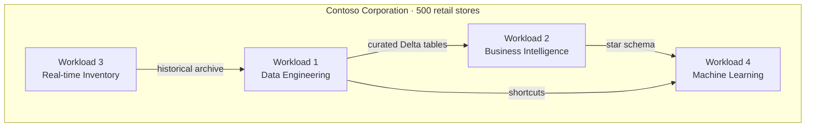
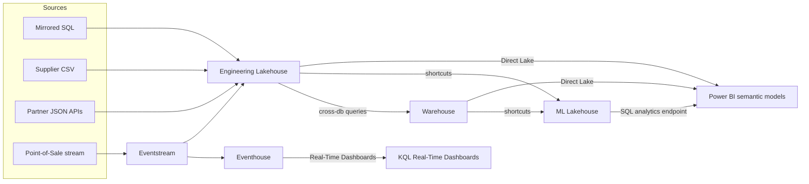

# Unit 6 — Case study: Choose data stores for an integrated analytics solution

## 🎯 Why this matters

This unit is a **case study**, not a hands-on lab. It applies the decision framework from Units 2–5 to **Contoso Corporation** — a fictional retail organization modernizing their analytics platform with Microsoft Fabric. You'll see how each of the three stores is chosen for a specific workload and how the stores integrate through OneLake.

> [!info] How to use this case study
> For each workload, **read the scenario first** and form your own recommendation. Then expand the **Recommendation** tab (here, the matching subsection below) to check your answer against the official recommendation and reasoning.

## 🏢 The business scenario

**Contoso Corporation** operates **500 retail stores** across North America. They're modernizing their analytics platform with Microsoft Fabric to support **four workloads**:

1. **Data engineering** — ingest and transform raw data from many sources
2. **Business intelligence (BI)** — executive dashboards and operational reports
3. **Real-time inventory monitoring** — live inventory across 500 stores
4. **Machine learning** — predictive models for customer churn and product recommendations

## 🛠️ Workload 1 — Data engineering

### Scenario

Contoso's data engineering team needs to build the analytics foundation.

> [!info] Requirements
> - **Data sources:** Mirrored SQL databases, supplier CSV files, partner JSON APIs, legacy Parquet exports
> - **Volume:** 5 TB of new data daily
> - **Data formats:** Structured, semi-structured, and unstructured
> - **Processing:** Batch transformations that clean and validate raw data into curated tables
> - **Schema:** Source schemas change frequently as upstream systems evolve
> - **Output:** Clean, validated tables that downstream analysts and data scientists can trust
> - **Team skills:** Python and PySpark

**Consider the decision factors: data format, write pattern, workload type, team skills. Which Fabric data store would you recommend?**

### Recommendation

> [!success] Recommendation: Lakehouse

| Factor | Requirement | Why lakehouse fits |
|---|---|---|
| **Data format** | Structured, semi-structured, and unstructured | Lakehouse handles all three in its Tables and Files areas |
| **Write pattern** | Batch transformations | Spark notebooks provide distributed batch processing |
| **Workload type** | Data engineering | Built for ingest-transform-serve pipelines |
| **Team skills** | Python and PySpark | Native Spark notebook environment |

The lakehouse also creates a **SQL analytics endpoint** automatically, exposing every Delta table through T-SQL. This means downstream teams can query the same data with SQL or connect Power BI through **Direct Lake mode**, with no extra work from the engineering team.

> [!tip] AI readiness
> The lakehouse stores all data formats, including unstructured documents and images that generative AI and RAG pipelines require. Feature engineering happens here in Spark notebooks using the full Python ML ecosystem.

## 📊 Workload 2 — Business intelligence

### Scenario

With curated data now available from the engineering lakehouse, Contoso's BI team needs to build executive dashboards and operational reports.

> [!info] Requirements
> - **Data modeling:** Star schemas with fact and dimension tables
> - **Update pattern:** Slowly changing dimensions that require daily in-place updates (price changes, address corrections)
> - **Write operations:** Must support UPDATE, DELETE, and MERGE across multiple tables with transactional consistency
> - **Reporting:** Subsecond Power BI dashboard performance for hundreds of business users
> - **Data access:** Need to read curated tables from the engineering lakehouse without copying data
> - **Team skills:** SQL Server experience using stored procedures, views, and complex joins

**The engineering lakehouse's SQL analytics endpoint is read-only, so it can't support the write operations this team needs. Which Fabric data store would you recommend?**

### Recommendation

> [!success] Recommendation: Warehouse

| Factor | Requirement | Why warehouse fits |
|---|---|---|
| **Data format** | Structured dimensional model | Warehouse enforces schemas on write |
| **Write pattern** | UPDATE, DELETE, MERGE with multi-table transactions | Full T-SQL DML with ACID support |
| **Workload type** | BI reporting and dimensional modeling | Optimized for star schema queries |
| **Team skills** | SQL Server expertise | Same T-SQL language and tooling |

The warehouse reads data from the engineering lakehouse through **cross-database queries** using three-part naming (`lakehouse.schema.table`), with no data movement required. The BI team builds **Power BI semantic models** on top of the warehouse star schema using **Direct Lake mode** for fast report performance.

> [!tip] AI readiness
> The warehouse provides the governed dimensional model that Copilot and data agents query when business users ask natural language questions. Clear star schemas with descriptive names make AI-generated answers more accurate.

## ⚡ Workload 3 — Real-time inventory monitoring

### Scenario

Contoso's operations team needs to monitor inventory across 500 stores in real time.

> [!info] Requirements
> - **Data source:** Point-of-sale systems generating **50,000 events per second**, continuously
> - **Data pattern:** Append-only events with timestamps (transactions, inventory changes)
> - **Query pattern:** Time-window analysis like "which stores sold more than 50 units of Product X in the last 15 minutes?"
> - **Latency:** Stockout risks must be detected within seconds, not hours
> - **Visualization:** Dashboards that auto-refresh every few seconds
> - **Historical data:** Older events should be available for long-term trend analysis in another store

**Neither the lakehouse (batch ingestion) nor the warehouse (not optimized for streaming time-series at this scale) fits these requirements. Which Fabric data store would you recommend?**

### Recommendation

> [!success] Recommendation: Eventhouse

| Factor | Requirement | Why eventhouse fits |
|---|---|---|
| **Data format** | Time-series event data | Automatic time-based partitioning and indexing |
| **Write pattern** | Continuous streaming ingestion | Purpose-built for high-throughput append-only events |
| **Workload type** | Real-time monitoring | Near real-time query performance on high-granularity data |
| **Query language** | Time-window analysis | KQL provides native time-series operators |

An **eventstream** routes point-of-sale events to both the eventhouse for real-time monitoring and the lakehouse for long-term historical analysis. The operations team builds **Real-Time Dashboards** using KQL for live visibility into store operations.

> [!tip] AI readiness
> The eventhouse enables real-time anomaly detection on streaming IoT data using KQL's built-in ML functions, with no batch delay and no separate ML pipeline.

## 🧪 Workload 4 — Machine learning

### Scenario

Contoso's data science team needs to build predictive models for customer churn and product recommendations.

> [!info] Requirements
> - **Data sources:** Transaction history from the warehouse, curated datasets from the engineering lakehouse, and external economic indicators
> - **Processing:** Distributed feature engineering across 100+ GB datasets
> - **Tools:** Python, scikit-learn, pandas, and Spark MLlib
> - **Isolation:** Experiments involve frequent schema changes and failed runs that must not affect production data pipelines
> - **Output:** Trained models and feature sets that other teams can access for reporting

**The team needs the same Spark and Python capabilities as the engineering lakehouse, but can't risk disrupting production pipelines. What would you recommend?**

### Recommendation

> [!success] Recommendation: A dedicated data science lakehouse

This second lakehouse is **separate** from the engineering lakehouse, which provides workload isolation.

| Factor | Requirement | Why a dedicated lakehouse fits |
|---|---|---|
| **Data format** | Mixed structured data from multiple sources | Lakehouse handles diverse formats |
| **Write pattern** | Experimental, iterative batch processing | Spark notebooks with schema-on-read flexibility |
| **Workload type** | Data science and ML | Native Python and Spark MLlib environment |
| **Isolation** | Can't impact production pipelines | Separate lakehouse with its own workspace |

Instead of copying data, **shortcuts** to the engineering lakehouse and warehouse let the team read source data directly through OneLake. The SQL analytics endpoint on this lakehouse makes feature datasets and model outputs accessible to Power BI for exploratory reporting.

> [!tip] AI readiness
> The ML lakehouse uses **Semantic Link (SemPy)** to connect data science outputs to Power BI semantic model definitions, so data scientists can reuse business logic like measures and relationships without reimplementing them.

## 🏗️ How the complete solution fits together

Four data stores, each chosen for specific workload characteristics, all integrated through **OneLake**.

Data flows through the solution in a clear path:

1. The **engineering lakehouse** ingests raw data from all sources and produces curated Delta tables.
2. The **warehouse** builds star schemas on top of lakehouse data through cross-database queries, with no copying.
3. An **eventstream** routes point-of-sale events to the **eventhouse** for real-time monitoring and to the **lakehouse** for historical analysis.
4. The **ML lakehouse** reads from both the warehouse and engineering lakehouse via shortcuts to train models.
5. **Power BI** connects to warehouse and lakehouses with Direct Lake. **Real-Time Dashboards** query eventhouse with KQL.

### Key integration patterns

| Pattern | What it does |
|---|---|
| **OneLake shortcuts** | ML lakehouse reads directly from engineering lakehouse and warehouse without duplicating data |
| **Cross-database queries** | Warehouse reads lakehouse data through three-part naming (`lakehouse.schema.table`) |
| **Eventstreams** | Route events from the same source to both eventhouse and lakehouse simultaneously |
| **Direct Lake** | Power BI reads data directly from OneLake with no import refresh |

> [!success] The deeper lesson
> You rarely choose just one store. **Build in layers:** start with lakehouse for your data foundation, add warehouse for BI, eventhouse for real-time, and connect them through cross-database queries and OneLake shortcuts. Let each store do what it does best, and let integration handle the rest.

> [!info] Operational systems are not analytical stores
> Contoso's operational systems (**Azure SQL Database** for e-commerce, **Azure Cosmos DB** for the mobile app) aren't analytical data stores. They're optimized for writing individual records quickly. They integrate with Fabric through **database mirroring**, which continuously replicates data to OneLake without impacting operational performance. The engineering lakehouse reads this mirrored data as a source for transformation.

## 🔗 Related

- [[Unit-3-Evaluate-Lakehouse|Lakehouse]]
- [[Unit-4-Evaluate-Warehouse|Warehouse]]
- [[Unit-5-Evaluate-Eventhouse|Eventhouse]]
- [[Unit-7-Knowledge-Check|Next → Module assessment]]
- [[_MOC|Module index]]