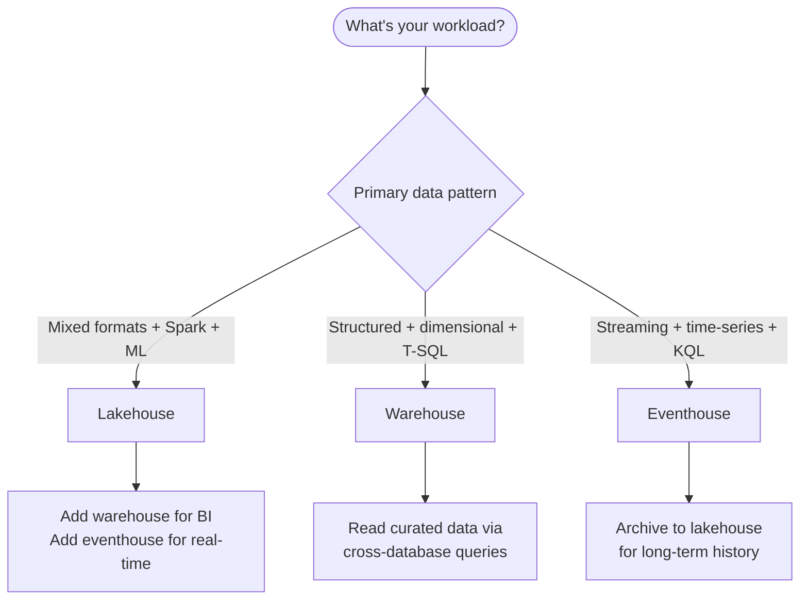

# Unit 8 — Summary

## 🎯 Why this matters

This unit is the **recap** — a tight consolidation of the decision framework, the three stores at a glance, and the integration patterns that make multi-store Fabric solutions work. If you've been through Units 2–7, this is your single-page reference.

## 🧭 The decision framework in one view

You built a decision framework for choosing between the three primary analytical data stores in Microsoft Fabric:

> [!success] The three stores at a glance
> - **Lakehouse** for **mixed data formats**, Spark-based engineering, and data science workloads with **dual access** through Spark and a read-only SQL analytics endpoint.
> - **Warehouse** for **SQL-first teams** building dimensional models with **full T-SQL DML support**, multi-table ACID transactions, and strict schema governance.
> - **Eventhouse** for **streaming and time-series data** with **KQL-powered real-time dashboards**, IoT telemetry, and log analysis.

These stores are **not mutually exclusive** — many Fabric solutions use multiple stores together, connected through **OneLake shortcuts** and **cross-database queries**. Your data store choice also affects AI readiness, so **metadata quality is as important as data quality** when preparing for AI.

## 🗺️ Quick decision cheatsheet

| If your scenario is… | Choose | Why |
|---|---|---|
| Mixed structured + semi/unstructured data, Spark/Python team, data engineering or data science | **Lakehouse** | Schema-on-read, dual Spark + SQL access, native ML ecosystem |
| Star schemas, dimensional modeling, multi-table ACID, SQL-first team, BI serving layer | **Warehouse** | Full T-SQL DML/DDL, multi-table transactions, schema-on-write |
| Streaming/telemetry/IOT, time-series, sub-second latency, log analytics | **Eventhouse** | Append-optimized, KQL time-series operators, streaming ingestion |

## 📚 Further reading

Microsoft Learn has deeper decision guides that complement this module:

- [Microsoft Fabric decision guide: choose a data store](https://learn.microsoft.com/en-us/fabric/fundamentals/decision-guide-data-store)
- [Choose between Warehouse and Lakehouse](https://learn.microsoft.com/en-us/fabric/fundamentals/decision-guide-lakehouse-warehouse)
- [Eventhouse overview](https://learn.microsoft.com/en-us/fabric/real-time-intelligence/eventhouse)

> [!info] Operational vs. analytical stores
> You also learned that Fabric includes **SQL database in Fabric** and **Cosmos DB in Fabric** for **operational** purposes such as OLTP workloads, application backends, and low-latency NoSQL access. These workloads serve **different needs** than the three analytical data stores covered in this module.

## ✅ What you should be able to do now

By evaluating **data format**, **query language**, **write patterns**, **team skills**, and **workload type**, you can make informed recommendations that set the foundation for a well-architected analytics solution.

> [!success] Module complete
> By the end of this module, you're able to **evaluate lakehouse, warehouse, and eventhouse capabilities** and **confidently choose the appropriate data store for a given business scenario** — and to **combine multiple stores through OneLake** when the workload demands it.

## 🔗 Related

- [[Unit-7-Knowledge-Check|← Unit 7 — Knowledge check]]
- [[Unit-1-Introduction|Unit 1 — Introduction]]
- [[_MOC|Module index]]
- [[Module-Mind-Map|Module mind map]]