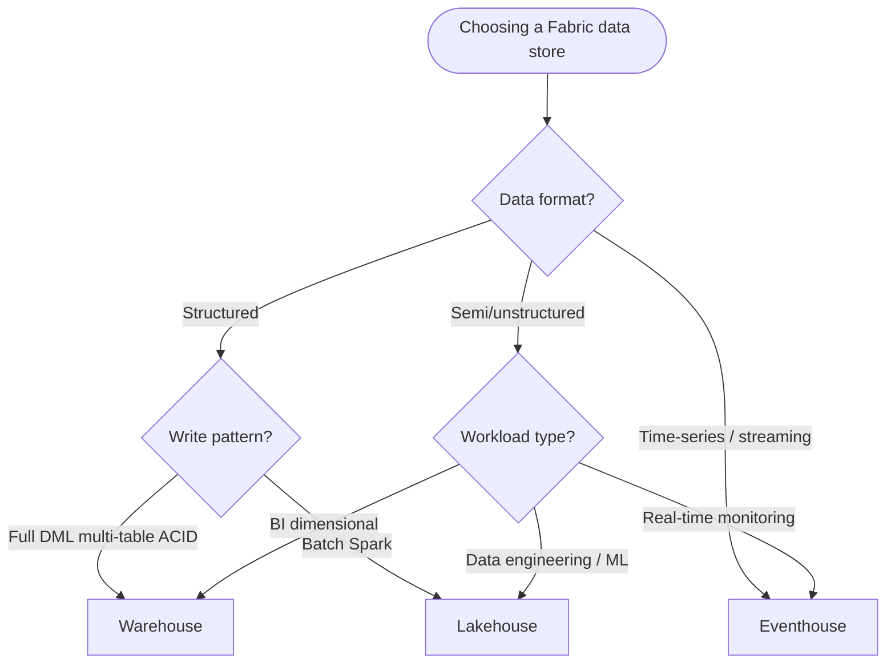
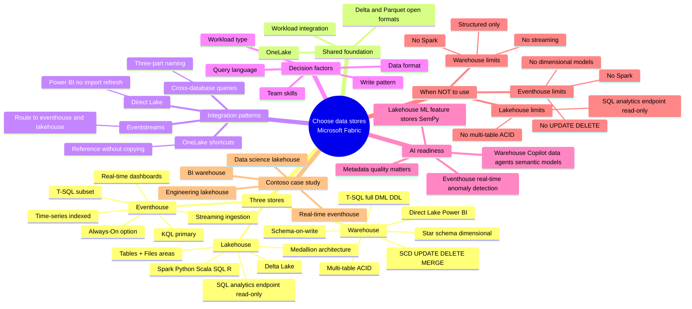

# Path 2 · Module 1 — Choose data stores in Microsoft Fabric

> [!info] Module map
> This module gives you a **decision framework** for choosing between the three primary analytical data stores in Microsoft Fabric — **lakehouse**, **warehouse**, and **eventhouse** — and shows how to combine them through OneLake. You'll learn the comparison axes (data format, query language, write pattern, team skills, workload type) and apply them to a four-workload Contoso case study.

## 🎯 Learning objectives

By the end of this module you should be able to:

1. **Survey** the three analytical data store options — lakehouse, warehouse, eventhouse — and their core characteristics.
2. **Identify** the decision factors (data format, query language, write pattern, team skills, workload type) that drive the choice.
3. **Evaluate** the strengths, ideal use cases, and limitations of each store.
4. **Apply** a decision framework to recommend the right store for a real-world workload.
5. **Combine** stores through OneLake shortcuts, cross-database queries, Eventstreams, and Direct Lake.
6. **Recognize** how the data store choice affects AI readiness (Copilot, data agents, semantic models, real-time anomaly detection).

## 📚 Units

| # | Unit | XP | Min | Notes |
|---|---|---|---|---|
| 1 | [[Unit-1-Introduction\|Introduction]] | 100 | 2 | Retail scenario + module goals |
| 2 | [[Unit-2-Describe-Options\|Describe analytical data store options]] | 100 | 6 | Comparison axes + decision factors + AI readiness |
| 3 | [[Unit-3-Evaluate-Lakehouse\|Evaluate lakehouse capabilities]] | 200 | 6 | Tables/Files areas, Spark + SQL analytics endpoint, medallion |
| 4 | [[Unit-4-Evaluate-Warehouse\|Evaluate warehouse capabilities]] | 200 | 6 | Full T-SQL DML/DDL, multi-table ACID, star schema |
| 5 | [[Unit-5-Evaluate-Eventhouse\|Evaluate eventhouse capabilities]] | 200 | 5 | KQL, time-series, streaming ingestion, Always-On |
| 6 | [[Unit-6-Case-Study\|Case study — Choose data stores for an integrated analytics solution]] | 100 | 8 | Contoso four-workload decision walkthrough |
| 7 | [[Unit-7-Knowledge-Check\|Module assessment]] | 200 | 3 | 5 multiple-choice questions + reasoned answers |
| 8 | [[Unit-8-Summary\|Summary]] | 100 | 2 | Decision cheatsheet + further reading |
| **Total** | | **1200** | **38** | |

> [!tip] How to study
> Walk Units 2 → 5 in order to build the conceptual model. Unit 6's case study is the consolidation — apply the framework before peeking at the recommendations. Use Unit 7's knowledge check to confirm retention and Unit 8 as a quick-reference summary.

## 🧭 The decision framework in one view

> [!success] The deeper lesson
> You rarely choose just one store. **Build in layers:** start with lakehouse for your data foundation, add warehouse for BI, eventhouse for real-time, and connect them through cross-database queries and OneLake shortcuts. Let each store do what it does best, and let integration handle the rest.

## 🧠 Module mind map

The mind map below is duplicated as a standalone Mermaid file (`Module-Mind-Map.md`) you can open in Obsidian's Mermaid preview or the [Mermaid Live Editor](https://mermaid.live). It is the **single-page view** of the entire module.

## 🔗 Related

- [[Module-Mind-Map|Module mind map (standalone)]]
- [[../03-Path1-Module2-Discover-OneLake/|Path 1 · Module 2 — Discover OneLake]]
- [[../03-Path1-Module3-Lakehouses/|Path 1 · Module 3 — Lakehouses]]
- [[../03-Path1-Module4-Warehouses/|Path 1 · Module 4 — Warehouses]]
- [[../03-Path1-Module5-Real-Time-Intelligence/|Path 1 · Module 5 — Real-Time Intelligence]]