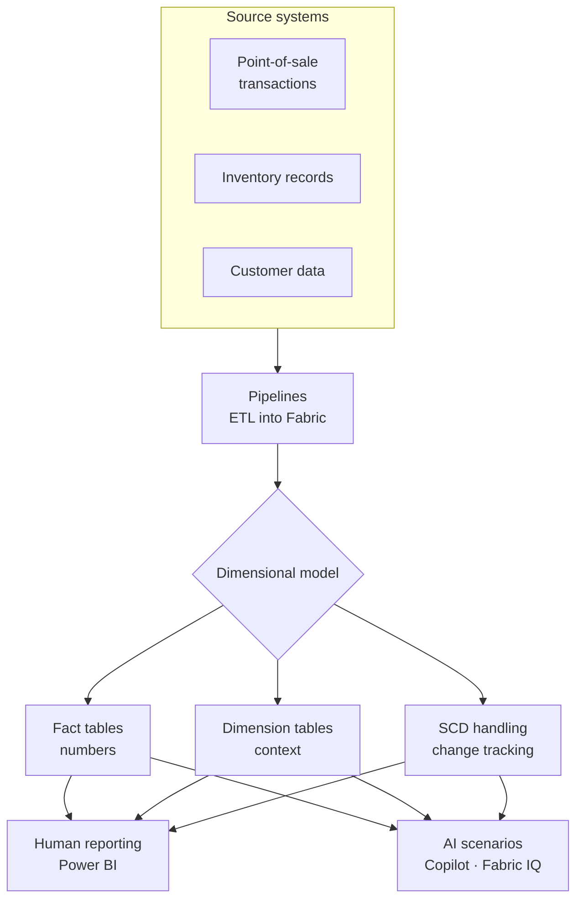

# Unit 1 — Introduction

> [!quote] Source
> Microsoft Learn · Module 2 · Unit 1 · "Introduction"
> <https://learn.microsoft.com/en-us/training/modules/design-dimensional-models-fabric/1-introduction>

## 🎯 Purpose

A short framing unit that explains **why dimensional modeling exists**, how analytical data stores differ from transactional systems, and what you'll build by the end of the module. Scenario: a retail analytics organization with point-of-sale transactions, inventory records, and customer data that needs to be modeled for efficient querying, filtering, and aggregation in Microsoft Fabric.

> [!note] Framing
> The source content for this unit is conceptual scene-setting — most of the substantive material begins in [[Unit-2-Describe-Schema-Types]] and continues through [[Unit-5-Implement-Slowly-Changing-Dimensions]].

## 🔑 Key takeaways

- **Analytical workloads need a different structure than transactional ones.** Transactional databases optimize for fast inserts and updates; analytical queries need data shaped for filtering and aggregation.
- **Dimensional modeling is the design framework** that makes this possible — it organizes data into fact tables (numbers) and dimension tables (context).
- In this module you will **describe** dimensional schema types (star vs. snowflake), **design** fact tables (grain, measures, types), **design** dimension tables (surrogate keys, hierarchies, conformed / role-playing / junk), and **implement** slowly changing dimension patterns.
- A guided **hands-on exercise** in a Fabric Warehouse puts it all together — create fact and dimension tables, load sample data, run analytical queries, and implement SCD patterns.
- The end goal: a dimensional model that supports **efficient analytical queries for both human reporting and AI scenarios** (Copilot in Power BI, Fabric IQ data agents).

## 🧠 Visual

## 🧭 Next

→ [[Unit-2-Describe-Schema-Types]]
↑ [[_MOC]]
