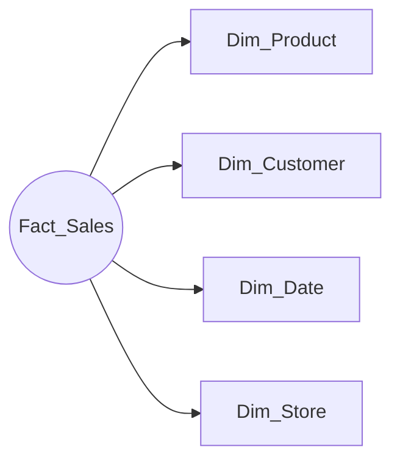
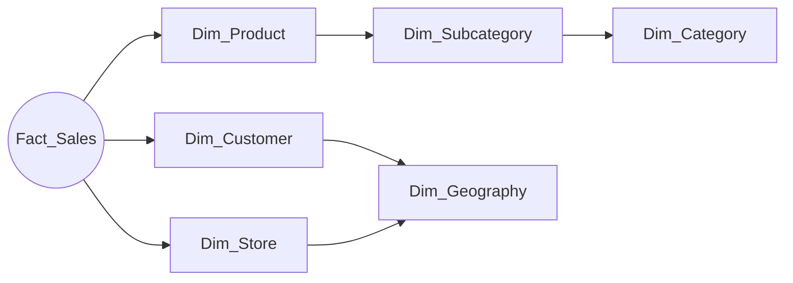

# Unit 2 — Describe dimensional schema types

> [!quote] Source
> Microsoft Learn · Module 2 · Unit 2 · "Describe dimensional schema types"
> <https://learn.microsoft.com/en-us/training/modules/design-dimensional-models-fabric/2-describe-schema-types>

## 🎯 Purpose

Define **dimensional modeling**, separate **fact tables from dimension tables**, and compare the two ways you can arrange them in Microsoft Fabric — **star schema** (the recommended default) vs. **snowflake schema** (normalized dimensions).

## 🏗️ Dimensional modeling in one paragraph

A **design technique that organizes data for analytical workloads**. Unlike normalized transactional models, dimensional models **prioritize query performance and user comprehension**, so the resulting structure reflects how business users think about their data and enables efficient reporting. In Fabric you can implement dimensional models in either a **Fabric Warehouse** or a **lakehouse**.

> [!info] The two table types
> - **Fact tables** — store **measurements** associated with business events or observations (sales amounts, order quantities, temperature readings). Numeric values that can be aggregated.
> - **Dimension tables** — describe the **entities** you model (products, customers, dates, locations). They provide the **context** for analyzing fact data.

## 🌟 Star schema

A star schema places a **fact table at the center** with dimension tables **radiating outward**. Each dimension table connects directly to the fact table through key relationships. The name comes from the visual appearance: a central fact table with dimension tables forming the points of a star.

> [!success] Why star schema is recommended for most Fabric analytics workloads
> - **Fewer joins** → faster queries. Most queries need only one join per dimension.
> - **Intuitive structure** that maps to how business users think about data — they filter and group by *who*, *what*, *when*, *where* and aggregate measures.
> - **Foundation for semantic models** in Power BI — star schemas are a prerequisite for enterprise semantic models, and they support Copilot and AI scenarios.
> - **Low maintenance** as the warehouse evolves — adding a new attribute or a new fact table is straightforward.

> [!tip] A single model often contains multiple star schemas
> A retail model might have separate stars for **sales**, **inventory**, and **purchasing**, all sharing common dimensions. They emerge through *conformed dimension* design, covered in [[Unit-4-Design-Dimension-Tables]].

## ❄️ Snowflake schema

A snowflake schema **extends the star schema by normalizing dimension tables**. Instead of storing all attributes in a single dimension table, related attributes are split into separate, related tables. For example, a product dimension might have separate tables for **subcategory** and **category**, each linked by foreign keys.

> [!info] When to consider a snowflake
> - A dimension is **extremely large** and storage costs outweigh query performance needs.
> - You need **keys to relate dimension data to facts at different levels of granularity** (e.g. product-level sales and subcategory-level sales targets).
> - You need to **track historical changes at higher levels of granularity**.

> [!warning] Tradeoffs
> Snowflake schemas require **more joins**, which **reduces query performance** and adds query complexity. If you plan to build a semantic model, create a view that joins the snowflake tables back together — **Power BI hierarchies require columns from a single table**.

## ⚖️ Choosing a schema type

| Schema type | Best for | Tradeoffs |
|-------------|----------|-----------|
| **Star** | Most analytics workloads, Power BI semantic models, AI scenarios | Minor storage redundancy from denormalized dimensions |
| **Snowflake** | Very large dimensions with shared hierarchies across different grain levels | Complex queries, more joins |

As your warehouse grows, you naturally end up with **multiple star schemas that share dimensions** — through conformed-dimension design.

## 🤖 Dimensional models as a foundation for AI

> [!important] Why this matters beyond reporting
> The schema choice flows through to AI. **Copilot in Power BI** generates better natural-language answers when the data uses clear star-schema relationships, because the separation of *facts* and *dimensions* maps directly to how questions are asked — *"Show me total sales by region by quarter."*

The structure also feeds the **Fabric IQ workload**. The ontology item in Fabric IQ defines business concepts as **entity types** (Customer, Product), **properties**, and **relationships** — concepts that map naturally to dimensional modeling:

| Dimensional-model concept | Fabric IQ ontology counterpart |
|---------------------------|--------------------------------|
| Dimension table | Entity type |
| Dimension attribute | Property |
| Foreign-key relationship between fact and dimension | Relationship |

You can **generate an ontology directly from a Power BI semantic model** built on a dimensional model — so the design decisions you make here flow through to AI agents that reason about your data in business terms.

## 🔑 Key takeaways

- **Dimensional modeling** separates **measurements** (facts) from **context** (dimensions) — optimized for analytics, not transactions.
- **Star schema** is the recommended default for Fabric: central fact table + denormalized dimensions, fewer joins, semantic-model ready.
- **Snowflake schema** normalizes dimensions into hierarchies — more joins, more complexity; useful only for very large dimensions or shared hierarchies.
- Schema choice has **downstream AI consequences** — clean star schemas make Copilot and Fabric IQ data agents reason better about your data.
- A mature warehouse naturally contains **multiple star schemas sharing conformed dimensions**.

## 🧭 Next

→ [[Unit-3-Design-Fact-Tables]]
← [[Unit-1-Introduction]]
↑ [[_MOC]]
