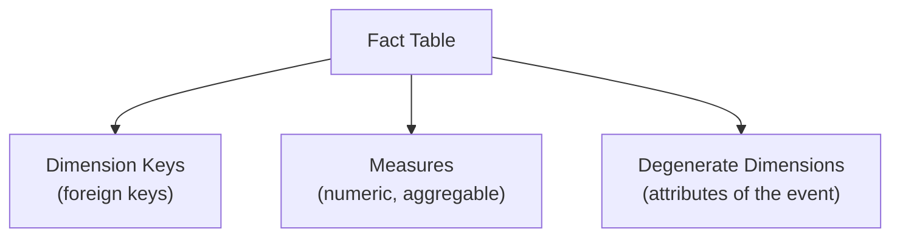
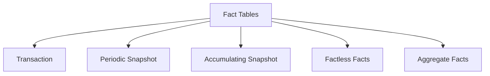

# Unit 3 — Design fact tables

> [!quote] Source
> Microsoft Learn · Module 2 · Unit 3 · "Design fact tables"
> <https://learn.microsoft.com/en-us/training/modules/design-dimensional-models-fabric/3-design-fact-tables>

## 🎯 Purpose

Design the **center of every dimensional model**: the fact table. Capture **what fact tables contain**, make the **grain** your first decision, pick from the **three fact-table types** (transaction, periodic snapshot, accumulating snapshot), and classify **measure types** (additive, semi-additive, non-additive) before naming conventions.

## 🧱 Fact table structure — three column types

A fact table contains three kinds of columns. A well-designed fact table is **narrow** — only keys, measures, and essential attributes; descriptive information belongs in dimension tables.

| Column type | Purpose | Examples |
|-------------|---------|----------|
| **Dimension keys** | Foreign keys referencing dimension tables — they determine the *dimensionality* of the facts and link each event to its context (who, what, when, where) | `CustomerKey`, `ProductKey`, `DateKey` |
| **Measures** | Numeric values that can be aggregated | `SalesAmount`, `Quantity`, `Cost`, `Duration` |
| **Degenerate dimensions** | Attributes of the event itself, stored on the fact row because they don't deserve a separate dimension table (e.g. order numbers, tracking codes) | `OrderNumber`, `TrackingCode` |

> [!warning] Keep facts narrow
> Descriptive information belongs in dimension tables. If a column is just a label, store it in a dimension and keep the fact row small.

## 🎯 Defining the grain — the most important decision

The **grain** specifies **what one row in the fact table represents**. Examples:

- Sales fact → one row per **sales order line item**.
- Inventory fact → one row per **product per day**.

> [!important] Always define the grain first
> Define the grain **before** identifying dimensions and measures. The grain determines which dimension keys and measures belong in the table.

Two failure modes to avoid:

| Problem | Consequence |
|---------|-------------|
| **Grain too high-level** | Lose detail you might need later. Storing one row per daily sales total (instead of per order line) means you can't later break down by individual products or customers. |
| **Grain too detailed** | Increase storage and processing costs without analytical value. Storing one row per second for a sensor that only changes readings every hour creates unnecessary volume. |

> [!tip] Align dimension keys to grain
> The grain also dictates which dimension keys belong in the fact table. If the sales grain is *one row per order line*, the dimension keys must include customer, product, date, and salesperson — and **each dimension key must align with the stated grain**.

## 🗂️ Three fact-table types

### Transaction fact tables

- One row **per business event**.
- Each row is **fully known when inserted** and doesn't change (except to correct errors).
- Examples: individual sales order lines, website clicks, support tickets.
- Typically store data at the **lowest possible granularity**; measures are **additive across all dimensions**.

### Periodic snapshot fact tables

- Capture the **state of something at regular intervals**.
- Instead of recording individual events, record a **summary at a point in time**.
- Example: an inventory fact table with one row per product per day, holding the **end-of-day stock level**.
- Useful for **trend analysis and monitoring change over time**; measures are typically **semi-additive** (summable across some dimensions but not across time).

### Accumulating snapshot fact tables

- Track the **progress of a process through milestones**.
- A row is **created when the process begins** and **updated as each milestone is reached**.
- Example: an order-fulfillment fact table with date keys for *placed*, *approved*, *shipped*, *delivered*.
- Have **multiple date dimension keys** (one per milestone) and often include **duration measures between milestones**.

## 📐 Choosing measure types

> [!tip] Aggregation governs analytical value
> When classifying a measure, ask: *"Can I sum it across *every* dimension?"* — that determines which category it falls into.

| Type | Description | Example |
|------|-------------|---------|
| **Additive** | Can be summed across all dimensions | `Revenue`, `Quantity`, `Cost` |
| **Semi-additive** | Can be summed across some dimensions, but not all (typically **not across time**) | `AccountBalance`, `InventoryLevel` |
| **Non-additive** | Cannot be summed meaningfully across any dimension | `UnitPrice`, `Temperature`, ratios |

> [!success] Store the components, not the ratio
> When you need a non-additive measure like a ratio, **store the underlying values instead**. Example: store `DiscountAmount` and `SalesRevenue` rather than `DiscountPercentage` so the ratio can be computed correctly at **any** level of aggregation.

## 🏷️ Naming conventions

In a Fabric Data Warehouse, prefix fact table names with `f_` or `Fact_` to identify them clearly — e.g. `f_Sales` or `Fact_Inventory`. This makes it easy for analysts and tools to distinguish facts from dimensions (which conventionally use `d_` or `Dim_` — see [[Unit-4-Design-Dimension-Tables]]).

## 🧩 Two additional fact-table patterns to know

- **Factless fact tables** — record **events that don't have numeric measures** (a student attending a class, a promotion applied to a product). You analyze them by **counting rows**.
- **Aggregate fact tables** — store **precomputed summaries** of a base fact table at a higher level of granularity or lower dimensionality. Example: a monthly sales summary from a daily transaction fact table. Purpose: **accelerate commonly run queries**. In Power BI, user-defined aggregations can achieve a similar result, or you can use the aggregate table directly through DirectQuery storage mode.

## 🔑 Key takeaways

- A fact table contains **dimension keys**, **measures**, and **degenerate dimensions** — keep it narrow.
- **Grain is the most important design decision** — define it first; it determines which keys and measures belong.
- Three core fact-table types: **transaction**, **periodic snapshot**, **accumulating snapshot** — plus **factless facts** and **aggregate facts** for special cases.
- Measures are **additive**, **semi-additive**, or **non-additive** — pick the right type so aggregation behaves correctly.
- Apply a consistent **naming prefix** (`f_` / `Fact_`) to distinguish fact tables from dimensions.

## 🧭 Next

→ [[Unit-4-Design-Dimension-Tables]]
← [[Unit-2-Describe-Schema-Types]]
↑ [[_MOC]]
