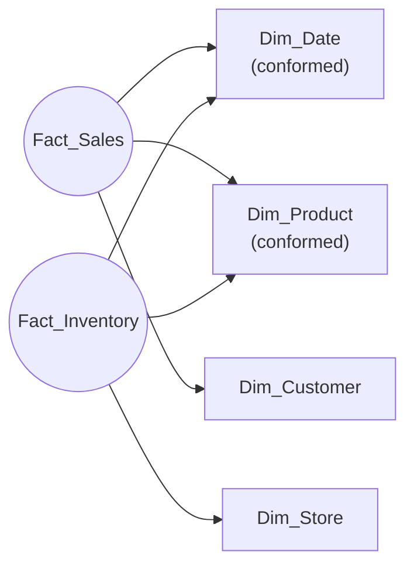
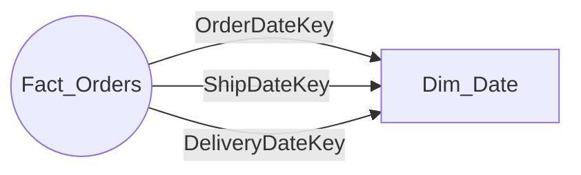

# Unit 4 — Design dimension tables

> [!quote] Source
> Microsoft Learn · Module 2 · Unit 4 · "Design dimension tables"
> <https://learn.microsoft.com/en-us/training/modules/design-dimensional-models-fabric/4-design-dimension-tables>

## 🎯 Purpose

Design the **context layer** of the dimensional model. Master **surrogate keys**, the case for **denormalization**, **hierarchies** for drill-downs, and three advanced patterns — **conformed**, **role-playing**, and **junk** dimensions.

## 🧱 Dimension table structure

Dimension tables provide the context that makes fact data meaningful — the **who**, **what**, **when**, **where**, **why** behind every measurement. Three types of columns:

| Column type | Definition | Role |
|-------------|-----------|------|
| **Surrogate key** | System-generated unique identifier, primary key of the dimension | Insulates the warehouse from source-system changes; enables historical tracking |
| **Natural key** (a.k.a. business key) | Identifier from the source system | Links the dimension back to source data during ETL |
| **Dimension attributes** | Descriptive columns used to filter, group, and label data | Examples: product name, customer segment, region |

## 🔑 Why surrogate keys — not just natural keys

> [!important] Surrogate keys are recommended even when a natural key seems usable.
>
> - **Consolidate** data from multiple source systems without key conflicts.
> - **Replace** multi-column natural keys with a single, efficient column.
> - **Support SCD Type 2** tracking, where multiple versions of the same entity need distinct keys.
> - **Reduce fact-table storage** by using small integer data types.

> [!note] The date dimension is the accepted exception
> Its surrogate key typically uses `YYYYMMDD` format stored as an integer — meaningful **and** efficient.

> [!success] How to find the dimensions you need
> Listen for the word **"by"**. When stakeholders say they need sales *by* region *by* product category *by* month, they're telling you which dimensions and attributes the model requires.

## 🗂️ Common dimensions

| Dimension | Purpose | Example attributes |
|-----------|---------|--------------------|
| **Date** | Time-based analysis and calendar hierarchies | Year, quarter, month, day, fiscal year, is_holiday |
| **Customer** | Customer demographics and segmentation | Name, segment, region, loyalty tier |
| **Product** | Product categorization and description | Category, subcategory, brand, SKU |
| **Geography** | Location-based analysis | City, state/province, country/region, postal code |
| **Employee** | Organizational structure | Department, title, manager, hire_date |

## 📐 Denormalize for performance

In most cases, dimension tables should be **denormalized** — flatten hierarchies and store redundant data directly in the dimension row.

> [!example] Example
> A product dimension stores the **category name on every row** rather than referencing a separate category table.

The storage cost is small compared with the performance benefit: **fewer joins** mean faster queries, and analysts can filter and group by **any attribute** without complex multi-table lookups.

## 🪜 Hierarchies for drill-down

Hierarchies let report consumers start at a high level and drill down to detail.

| Type | Structure | Example |
|------|-----------|---------|
| **Balanced** | Same number of levels in every branch | Calendar — year → quarter → month → day |
| **Unbalanced** | Branches with varying depth (parent–child) | Organizational reporting structure |
| **Ragged** | Some members skip intermediate levels | Geography where some regions have no states or provinces |

## 🌐 Three advanced dimension patterns

### 1. Conformed dimensions — shared across fact tables

A **conformed dimension** is shared across multiple fact tables. The date dimension is the most common conformed dimension because almost every fact table records events by date.

> [!success] Conformed dimensions deliver consistency
> When the sales fact table and the inventory fact table share the **same product dimension**, analysts can compare product-level data across both business processes using a single, consistent set of attributes.

### 2. Role-playing dimensions — one dimension, multiple roles

A **role-playing dimension** is a single dimension **referenced multiple times** in one fact table, each time representing a different context. Example: a sales fact table references the date dimension three times — once for *order date*, once for *ship date*, once for *delivery date*.

Each reference is a distinct *role*, but there is **only one physical dimension table**. Role-playing dimensions keep the model simple while supporting multiple analytical perspectives.

### 3. Junk dimensions — consolidate low-cardinality flags

When you have **many small, independent dimensions with low cardinality** (few values each), consolidate them into a **junk dimension**. A junk dimension stores the **Cartesian product** of all the attribute values in a single table with a surrogate key.

> [!tip] Good candidates for junk dimensions
> Flags, indicators, order-status values, and demographic categories (age group, gender). Junk dimensions reduce the **number of dimension tables** in the model and **decrease the number of foreign keys** in the fact table.

## 🏷️ Naming conventions

In a Fabric Warehouse, **prefix dimension table names with `d_` or `Dim_`** to distinguish them from fact tables — e.g. `d_Product` or `Dim_Customer`. Pair this with the fact-table prefix convention from [[Unit-3-Design-Fact-Tables]] (`f_` / `Fact_`) for a consistent warehouse-wide vocabulary.

## 🔑 Key takeaways

- A dimension table contains a **surrogate key**, a **natural key**, and **descriptive attributes**.
- **Surrogate keys** insulate the warehouse from source changes, support SCD Type 2, and keep fact rows small.
- **Denormalize** dimension tables — flatten hierarchies for fast, intuitive queries.
- Use **hierarchies** (balanced, unbalanced, ragged) for drill-down reporting.
- Apply advanced patterns when they fit: **conformed** (shared across facts), **role-playing** (one dim, multiple roles), **junk** (consolidated low-cardinality flags).

## 🧭 Next

→ [[Unit-5-Implement-Slowly-Changing-Dimensions]]
← [[Unit-3-Design-Fact-Tables]]
↑ [[_MOC]]
