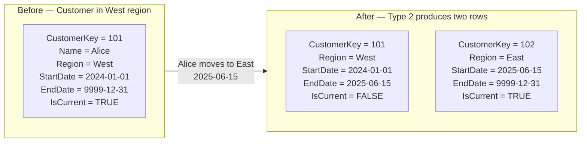

# Unit 5 — Implement slowly changing dimensions

> [!quote] Source
> Microsoft Learn · Module 2 · Unit 5 · "Implement slowly changing dimensions"
> <https://learn.microsoft.com/en-us/training/modules/design-dimensional-models-fabric/5-implement-slowly-changing-dimensions>

## 🎯 Purpose

Define the four commonly used **slowly changing dimension (SCD) patterns** (plus one hybrid), explain the **business trigger** for each, and surface the **implementation tradeoffs** so you can pick the right pattern for each attribute.

## 🤔 Why SCDs exist

Dimension data changes over time. Customers move to new cities, products get renamed, employees transfer between departments. A primary role of a data warehouse is to **describe the past accurately**, so you need a strategy for handling these changes. SCD patterns define how your dimensional model responds when source data changes.

> [!info] The SCD spectrum ranges from "ignore changes entirely" to "maintain full historical records".

## 🧩 The five SCD types

### Type 0 — Retain original

Type 0 **preserves the original value and never allows changes**. Use it for **fixed reference data** that shouldn't change, such as an original credit score at the time of application or a date of birth.

### Type 1 — Overwrite

Type 1 **overwrites the existing value with the new value**. **No history is maintained.** Appropriate when:

- The change is a **correction to an error**.
- Historical accuracy for the changed attribute **isn't important**.
- You want the **simplest possible maintenance**.

> [!example] Example
> A customer's email address changes → a Type 1 update replaces the old email with the new one. All historical facts associated with that customer now reflect the current email address.

> [!warning] Type 1 can warp history
> If a salesperson is reassigned to a new region and you **overwrite the region**, **all their past sales appear under the new region**. Consider whether this behavior meets your reporting requirements.

### Type 2 — Add new row *(the workhorse)*

Type 2 **inserts a new row for each change**, maintaining **full history**. The original row remains, and each version of the dimension member gets its **own surrogate key**. This SCD type is **most common for attributes where historical accuracy matters**.

> [!example] Example
> If you need to report sales **by the region a salesperson was assigned to at the time of each sale**, Type 2 preserves that context. Without it, every past sale would silently shift to the salesperson's current region.

A Type 2 implementation requires these additional columns:

| Column | Purpose |
|--------|---------|
| **`StartDate`** | When this version became effective |
| **`EndDate`** | When this version was superseded — current rows use a far-future sentinel like `9999-12-31` |
| **`IsCurrent`** flag | Identifies the active version for lookups during fact-table loads |

When a change occurs, the ETL process performs a two-step update:

1. **Expire the existing current row** — set its `EndDate` to the change date and flip `IsCurrent` to `FALSE`.
2. **Insert the new version** — new surrogate key, new attribute values, `StartDate` set to the change date, `EndDate` to the sentinel, and `IsCurrent = TRUE`.

> [!tip] Don't track every attribute as Type 2
> Avoid applying Type 2 to **every** attribute in a dimension. Only track history on attributes where the business requires historical analysis. Use **Type 1** for the rest to keep the dimension manageable.

### Type 3 — Add new column

Type 3 **adds a column to store the previous value alongside the current value**. This tracks **limited history**, typically just the most recent change.

> [!example] Example
> A salesperson dimension has both `CurrentSalesRegion` and `PreviousSalesRegion`. When the salesperson moves, the current region shifts to the previous column, and the new region becomes current.

Useful when you only need to compare the current state with one prior state. However, it's **not commonly used** because you lose all intermediate changes.

### Type 6 — Hybrid approach (1 + 2 + 3)

Type 6 **combines elements of Type 1, Type 2, and Type 3**. It maintains full version history (Type 2) while also storing the **current value on every row** (Type 1 overwrite on a specific column) and the **previous value** (Type 3).

> [!success] Why Type 6 is interesting
> This hybrid enables queries to access **both the historical and current context** from any version row. However, it adds complexity to the ETL process because **every row for a dimension member must be updated when the current value changes**.

## ⚖️ Choosing the right SCD type

| Requirement | Recommended type |
|-------------|------------------|
| Fixed reference data that never changes | **Type 0** |
| Corrections, or history not needed | **Type 1** |
| Full historical accuracy required | **Type 2** |
| Only need current vs. previous comparison | **Type 3** |
| Need both current and historical views on every row | **Type 6** |

## ⚠️ Implementation tradeoffs

Each SCD type carries cost and complexity:

- **Storage** — Type 2 dimensions **grow over time** as new version rows accumulate. Plan for increased storage and consider how the growth affects query performance.
- **Query complexity** — Joining fact tables to Type 2 dimensions requires **matching on effective dates or using the current flag**, which adds complexity to queries.
- **ETL complexity** — Type 2 and Type 6 require **more sophisticated ETL logic** to detect changes, expire old rows, and insert new versions.
- **Business requirements** — The choice of SCD type should be **driven by business needs**. Don't track history where it isn't needed, and don't skip history tracking where it is.

> [!tip] Match pattern to attribute
> Track history on attributes where the business requires historical analysis. Use **Type 1** for the rest. Over-tracking history inflates the dimension and slows every join.

## 🔑 Key takeaways

- SCDs are the **strategy** for handling attribute changes — pick the type per attribute, not per table.
- **Type 0** never changes; **Type 1** overwrites; **Type 2** adds rows (most common); **Type 3** adds columns; **Type 6** is the hybrid.
- **Type 2** is the workhorse for "report by attribute as of the time of the event" scenarios — it preserves historical accuracy via `StartDate`, `EndDate`, `IsCurrent`, and a per-version surrogate key.
- Every SCD type beyond Type 0/1 adds **storage, query, and ETL** cost — let business requirements drive the choice.

## 🧭 Next

→ [[Unit-6-Exercise]]
← [[Unit-4-Design-Dimension-Tables]]
↑ [[_MOC]]
