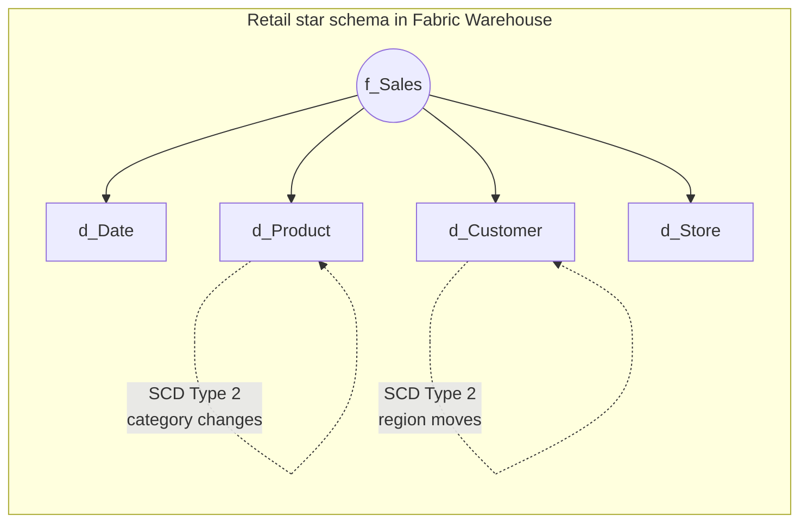

# Unit 6 — Exercise: Design and implement a dimensional model

> [!quote] Source
> Microsoft Learn · Module 2 · Unit 6 · "Exercise: Design and implement a dimensional model"
> <https://learn.microsoft.com/en-us/training/modules/design-dimensional-models-fabric/6-exercise>

## 🎯 Purpose

A **30-minute hands-on lab** that puts units [[Unit-2-Describe-Schema-Types]], [[Unit-3-Design-Fact-Tables]], [[Unit-4-Design-Dimension-Tables]], and [[Unit-5-Implement-Slowly-Changing-Dimensions]] into practice. The scenario: a **retail organization** that needs to analyze sales performance across stores, products, customers, and time periods, all built as a **star-schema dimensional model in a Fabric Warehouse**.

> [!warning] Prerequisites
> You need a **Microsoft Fabric-enabled workspace** to complete this exercise. See [Getting started with Fabric](https://learn.microsoft.com/en-us/fabric/get-started/fabric-trial) to enable a Fabric trial license.

## 🔬 What the lab does

The exercise walks you through the end-to-end workflow of standing up a star-schema dimensional model in a Fabric Warehouse:

1. **Design** — Decide on the grain of the sales fact (one row per order line) and the dimensions you'll need (date, product, customer, store).
2. **Create fact and dimension tables** — define the tables in your Fabric Warehouse with appropriate surrogate keys, dimension keys, measures, and naming-prefix conventions (`f_`, `d_`).
3. **Load sample data** — populate the tables with retail sales data so you have something to query.
4. **Run analytical queries** — typical star-schema questions (sales by region by quarter, by product category, by customer segment).
5. **Implement SCD patterns** — apply Type 2 (and possibly other types) to one or more dimension attributes and verify that historical facts continue to reflect the right context.

> [!info] Format note
> Per the task specification, this unit is a **summary of what the lab does, not the lab itself**. The full step-by-step lab lives behind the [launch exercise link](https://go.microsoft.com/fwlink/?linkid=2356046) on the Microsoft Learn page.

## 🔑 Skills practiced

| Skill | From unit |
|-------|-----------|
| Choose a star-schema layout for a retail sales model | [[Unit-2-Describe-Schema-Types]] |
| Define fact-table grain and measures | [[Unit-3-Design-Fact-Tables]] |
| Define dimension tables with surrogate keys and hierarchies | [[Unit-4-Design-Dimension-Tables]] |
| Implement SCD Type 2 (and other types) on a dimension | [[Unit-5-Implement-Slowly-Changing-Dimensions]] |
| Query the star schema for analytical insights | [[Unit-2-Describe-Schema-Types]] · [[Unit-3-Design-Fact-Tables]] |

## 🧠 Visual — what you'll build

## 🔗 Launch the exercise

> [!success] Launch
> [Launch the exercise on Microsoft Learn →](https://go.microsoft.com/fwlink/?linkid=2356046)

## 🧭 Next

→ [[Unit-7-Knowledge-Check]]
← [[Unit-5-Implement-Slowly-Changing-Dimensions]]
↑ [[_MOC]]
