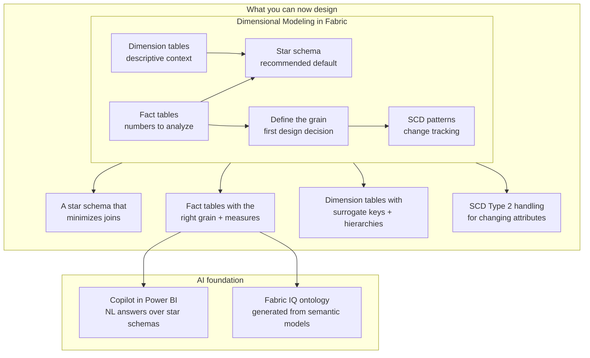

# Unit 8 — Summary

> [!quote] Source
> Microsoft Learn · Module 2 · Unit 8 · "Summary"
> <https://learn.microsoft.com/en-us/training/modules/design-dimensional-models-fabric/8-summary>

## 📝 Verbatim recap

> In this module, you learned how dimensional modeling organizes data into fact tables and dimension tables, and that **star schema is the recommended approach** for most analytics workloads in Microsoft Fabric.
>
> You designed fact tables by **defining the grain** and **choosing appropriate measure types**, and you designed dimension tables with **surrogate keys**, **denormalized attributes**, and **hierarchies**. You also implemented **slowly changing dimension patterns** to handle data that changes over time.

## 🧠 Key takeaway diagram

## 🔑 One-paragraph synthesis

A **dimensional model** in Microsoft Fabric splits analytical data into **fact tables** (the numbers you want to analyze) and **dimension tables** (the who/what/when/where/why context). The **star schema** is the recommended default — a central fact table surrounded by denormalized dimensions — because it minimizes joins, matches how analysts think, and is the prerequisite for Power BI semantic models, Copilot, and Fabric IQ. Designing facts means **defining the grain first**, then choosing dimension keys, **additive / semi-additive / non-additive** measures, and the appropriate **fact-table type** (transaction, periodic snapshot, accumulating snapshot, plus factless and aggregate variants). Designing dimensions means **surrogate keys**, **denormalized attributes**, **hierarchies** (balanced, unbalanced, ragged), and applying advanced patterns — **conformed**, **role-playing**, **junk** — when they fit. When a dimension attribute changes, **SCD Type 2** (full history via new rows + effective dates) is the workhorse, balanced against the storage, query, and ETL costs the choice introduces.

## 📚 Learn more (Microsoft docs)

- [Dimensional modeling in Fabric Data Warehouse](https://learn.microsoft.com/en-us/fabric/data-warehouse/dimensional-modeling-overview)
- [What is a star schema?](https://learn.microsoft.com/en-us/power-bi/guidance/star-schema)
- [Slowly changing dimensions (Kimball overview)](https://www.kimballgroup.com/data-warehouse-business-intelligence-resources/kimball-techniques/dimensional-modeling-techniques/type-2/)
- [Fabric IQ — ontology in business terms](https://learn.microsoft.com/en-us/fabric/fabric-iq/)

## 🧭 Done with Module 2

← [[Unit-7-Knowledge-Check]]
↑ [[_MOC]]

**Suggested next module:** continue along Learning Path 2 to deepen dimensional modeling and warehouse implementation skills.
