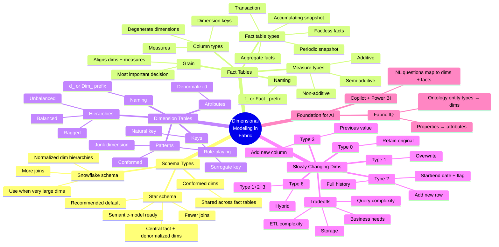

# Module — Design dimensional models for analytics in Microsoft Fabric

> [!info] Module map
> Path 2 Module 2 in the **Fabric Analytics Engineer** (DP-600) track. This module is a focused **dimensional-modeling deep-dive**: star vs. snowflake schemas, fact-table design (grain, measure types, fact table types), dimension-table design (surrogate keys, hierarchies, conformed/role-playing/junk dimensions), and SCD patterns (Types 0/1/2/3/6). Includes a hands-on lab and a 5-question knowledge check.

## 🎯 Learning objectives (synthesized from unit-level goals)

By the end of this module you should be able to:

1. **Compare** the star and snowflake schema types and explain why star is recommended for most analytics workloads in Microsoft Fabric.
2. **Design** fact tables — define the grain, identify dimension keys, measures, and degenerate dimensions, and select additive / semi-additive / non-additive measure types.
3. **Design** dimension tables — use surrogate keys, denormalize attributes, and incorporate hierarchies, conformed dimensions, role-playing dimensions, and junk dimensions.
4. **Implement** slowly changing dimension (SCD) patterns — choose between Type 0, 1, 2, 3, and 6 based on business requirements.
5. **Apply** dimensional modeling concepts end-to-end in a Fabric Warehouse through a guided design and implementation exercise.

## 🧠 Module mind map

> [!tip] How to use
> The mind map below is duplicated as a standalone Mermaid file (`Module-Mind-Map.md`) you can open in Obsidian's Mermaid preview or the [Mermaid Live Editor](https://mermaid.live). It is the **single-page view** of the entire module.

## 📑 Unit breakdown

| # | Unit | XP | Minutes | Focus |
|---|------|----|---------|-------|
| 1 | [Introduction](./Unit-1-Introduction.md) | 100 | 2 | Why dimensional modeling matters for analytics |
| 2 | [Describe dimensional schema types](./Unit-2-Describe-Schema-Types.md) | 100 | 6 | Star vs. snowflake + AI foundation |
| 3 | [Design fact tables](./Unit-3-Design-Fact-Tables.md) | 100 | 7 | Grain, dimension keys, measures, fact-table types |
| 4 | [Design dimension tables](./Unit-4-Design-Dimension-Tables.md) | 100 | 6 | Surrogate keys, hierarchies, conformed/role-playing/junk |
| 5 | [Implement slowly changing dimensions](./Unit-5-Implement-Slowly-Changing-Dimensions.md) | 100 | 7 | SCD Types 0/1/2/3/6 + tradeoffs |
| 6 | [Exercise: Design and implement a dimensional model](./Unit-6-Exercise.md) | 100 | 30 | Hands-on lab in a Fabric Warehouse |
| 7 | [Knowledge check](./Unit-7-Knowledge-Check.md) | 200 | 3 | 5 questions derived from module content |
| 8 | [Summary](./Unit-8-Summary.md) | 100 | 2 | Recap + learn-more links |

**Total: 900 XP · ~63 minutes (~1 hr 3 min)**

## 🔗 Knowledge-check answers (unit 7)

Microsoft Learn does not display the correct answers; the table below is derived from the unit content.

| # | Question topic | Correct answer |
|---|----------------|----------------|
| 1 | Recommended schema type for most analytics workloads | **Star schema** |
| 2 | Most important design decision when creating a fact table | **Defining the grain** |
| 3 | Why surrogate keys are recommended for dimension tables | **They insulate the data warehouse from source system changes and support historical tracking** |
| 4 | SCD type for "sales by salesperson region at the time of each sale" | **Type 2, which adds a new version row** |
| 5 | Measure type that best describes an end-of-day inventory balance | **Semi-additive** |

See [[Unit-7-Knowledge-Check]] for full reasoning.

## 🧭 Downstream links

- [[Unit-1-Introduction]] · [[Unit-2-Describe-Schema-Types]] · [[Unit-3-Design-Fact-Tables]] · [[Unit-4-Design-Dimension-Tables]] · [[Unit-5-Implement-Slowly-Changing-Dimensions]] · [[Unit-6-Exercise]] · [[Unit-7-Knowledge-Check]] · [[Unit-8-Summary]]
- [[Module-Mind-Map]]
- Parent MOC — `../02-Study-Guide-Index/_MOC.md`

## 📚 External references

- Microsoft Learn module page: <https://learn.microsoft.com/en-us/training/modules/design-dimensional-models-fabric/>
- [Dimensional modeling in Fabric Data Warehouse](https://learn.microsoft.com/en-us/fabric/data-warehouse/dimensional-modeling-overview)
- [What is a star schema?](https://learn.microsoft.com/en-us/power-bi/guidance/star-schema)
- [Slowly changing dimensions — Kimball](https://www.kimballgroup.com/data-warehouse-business-intelligence-resources/kimball-techniques/dimensional-modeling-techniques/type-2/)
- [Fabric IQ overview](https://learn.microsoft.com/en-us/fabric/fabric-iq/)
