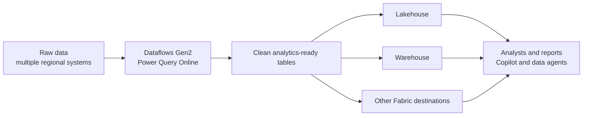

# Unit 1 — Introduction

> [!quote] Source
> Microsoft Learn · Path 2 · Module 3 · Unit 1 · "Introduction"
> <https://learn.microsoft.com/en-us/training/modules/fabric-transform-data-dataflows/1-introduction/>

## 🎯 Purpose

A short framing unit that motivates **Dataflows Gen2**: not every team member writes Spark or T-SQL code, but almost every analytics team still needs clean, analytics-ready data. Dataflows Gen2 give those teams a **Power Query-based, low-code, cloud-scale** transformation experience that loads results directly into Fabric lakehouses, warehouses, and other destinations.

## 🔑 Key takeaways

- **Data transformation is critical** — raw data has to be shaped before analytics is meaningful.
- **Teams have mixed skills** — many data wranglers are comfortable with Power Query in Excel or Power BI Desktop but not with Spark or T-SQL code.
- **Dataflows Gen2 in Microsoft Fabric** deliver a **Power Query-based transformation experience that runs in the cloud**.
- If you already know **Power Query in Excel or Power BI Desktop**, you already know the core interface — Dataflows Gen2 extends those skills to **enterprise-scale data preparation**.
- Dataflows Gen2 can **load transformed data directly into lakehouses, warehouses, and other Fabric destinations**.
- **Real-world framing:** a retail organization with sales data from multiple regional systems needs to standardize, clean, and combine data before analysts build reports. Power-Query-experienced team members can apply those skills upstream and produce reusable, scheduled, analytics-ready data.

> [!important] Why it matters
> Dataflows Gen2 unlock the **Power Query skill set that already exists in most organizations** (Excel + Power BI Desktop users) for use against cloud-scale data and **Fabric destinations** — closing the gap between "business-friendly shaping" and "lakehouse / warehouse output" without forcing everyone to learn Spark or SQL.

## 🧠 Visual

## 📚 What this module teaches

Per the source page, you will learn:

- How **Dataflows Gen2 work**, from connecting to data sources to applying transformations.
- How to **optimize performance** so refreshes are fast and reliable.
- How to **load results to Fabric destinations** (lakehouses, warehouses, etc.).
- How the **clean, well-structured data** you produce becomes part of the foundation that supports **Copilot experiences and AI-driven insights** across the platform.

## 🧭 Next

→ [[Unit-2-Understand-Dataflows]]
← [[_MOC]]