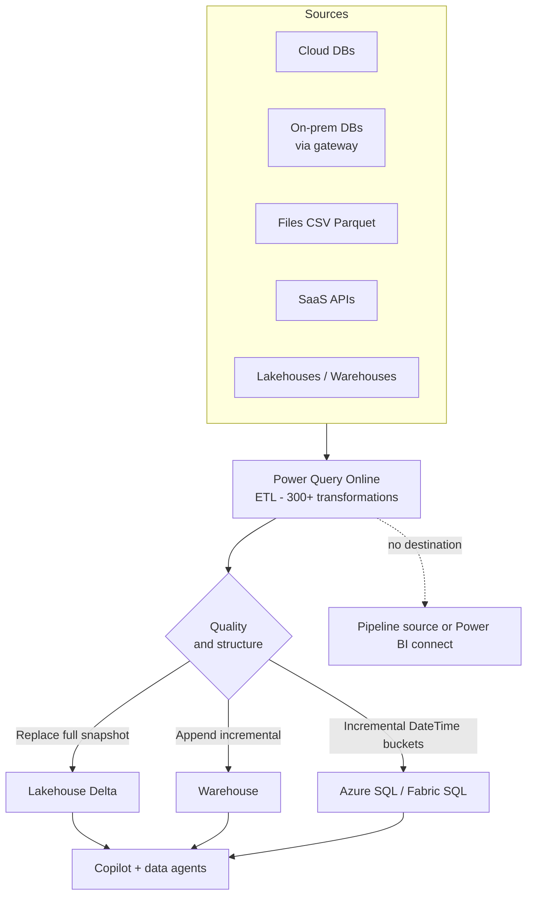

# Unit 2 — Understand Dataflows Gen2

> [!quote] Source
> Microsoft Learn · Path 2 · Module 3 · Unit 2 · "Understand Dataflows Gen2"
> <https://learn.microsoft.com/en-us/training/modules/fabric-transform-data-dataflows/2-understand-dataflows/>

## 🎯 Purpose

Set the conceptual ground for the rest of the module: **what Dataflows Gen2 are**, what they can do, where they can send data, how to update those destinations, how they compare to Gen1 / Power Platform dataflows, and **when to use them vs alternatives**.

## 🔑 Key takeaways

- **What they are:** Dataflows Gen2 are **cloud-based ETL** tools that use **Power Query** to connect to data sources, apply transformations, and load results to a destination. You build the logic visually in **Power Query Online** — the same editor found in Excel and Power BI Desktop.
- **Applied steps = auditable recipe:** every transformation you apply is recorded as an **applied step**, creating an auditable and repeatable recipe for data preparation.
- **Managed compute:** dataflows run in Microsoft Fabric using **managed compute resources** — no infrastructure, no gateways (for cloud sources), no execution environment to maintain. Publishing a dataflow gives you Fabric-managed compute, scheduling, and monitoring.
- **Naming convention:** after the first reference, this module uses **"dataflows"** as shorthand for Dataflows Gen2. Earlier versions are explicitly called **"Gen1"** or **"Power BI dataflows"**.

> [!info] Why "Gen2" matters
> Dataflows Gen2 are Fabric's modern dataflow surface. They are **not** the same as legacy Power BI dataflows (Gen1) or Power Platform dataflows. When you see "dataflows" in this module it always means **Dataflows Gen2** unless stated otherwise.

## 🧠 Dataflows Gen2 capabilities

| Capability | What it means |
|---|---|
| **Connect to hundreds of data sources** | Cloud + on-premises databases (via gateway), files, web services, SaaS apps, and Fabric items (lakehouses, warehouses). |
| **Apply 300+ transformations** | Filter, sort, merge, pivot, aggregate, reshape via the Power Query UI; plus **custom M language expressions** for advanced logic. |
| **Load to multiple destinations** | Send results to lakehouses, warehouses, SQL DBs, Azure SQL, ADLS Gen2, Azure Data Explorer, Snowflake, etc. |
| **AutoSave + background publishing** | Work is saved as you go; publishing runs validation in parallel for faster publishing. |
| **Schedule and automate** | Run manually, on a refresh schedule (with parameters), or as part of a **data pipeline** for orchestration. Email alerts on failed scheduled refreshes. |
| **AI-powered assistance** | Use natural-language prompts with **Copilot for Dataflow Gen2** to generate transformations, explain steps, and understand your query. |
| **Environment portability** | **Variable Libraries** + relative references let you promote dataflows across environments with fewer manual edits (CI/CD lifecycle management). |

## 📤 Output destinations

| Destination | Description |
|---|---|
| **Lakehouse** | Load as **Delta tables** or **files** (CSV, Parquet, Excel (Preview)). |
| **Warehouse** | Load to **warehouse tables** with schema support. |
| **Azure Data Lake Storage Gen2** | Write files directly to ADLS Gen2. |
| **Azure SQL Database** | Load to external SQL databases. |
| **Fabric SQL database** | Load to Fabric SQL database tables. |
| **SharePoint Files** | Write delimited text or Excel files to SharePoint. |
| **Azure Data Explorer (Kusto)** | Load to Kusto databases and KQL databases. |
| **Snowflake** | Load to Snowflake databases. |

> [!tip] Destination is optional
> Adding a data destination is **optional**. If you don't configure one, your dataflow still runs and processes the transformations — you can then use the dataflow as a **data source in a pipeline** or connect to it from Power BI.

## 🔄 Update methods

When you configure a destination, you also choose an **update method** that controls how data is loaded during each refresh.

| Update method | Behavior |
|---|---|
| **Replace** | Drops and recreates the destination every refresh → a **full snapshot** of the transformed data. |
| **Append** | Adds new rows to the existing destination **without removing previous data** → good for incremental loads where history should persist. |
| **Incremental refresh** | Refreshes only **new or changed data** using a **DateTime column**, divided into configurable time-range buckets. Supported destinations: **Fabric Lakehouse, Fabric Warehouse, Azure SQL Database**. Significantly reduces refresh time and resource consumption for large / frequently updated datasets. |

> [!important] Schema & method caveats
> - **Schema-aware destinations** (Lakehouses, Warehouses, SQL DBs) support writing into **specific schemas**, giving more control over table organization and enterprise naming conventions.
> - **Azure Data Explorer and KQL databases** support **only the Append update method**.

## 🧠 Dataflow types comparison

| Type | Platform | Best for |
|---|---|---|
| **Dataflows Gen2** | Microsoft Fabric | Lakehouse & warehouse output, **best performance**, **Copilot support**. **Use this for new Fabric projects.** |
| **Dataflows Gen1** | Power BI service | Legacy Power BI dataflows, internal storage only. |
| **Power Platform dataflows** | Power Apps, Power Automate | Business-application data preparation. |

## ✅ When to use dataflows

Use dataflows when **any** of the following apply:

- **Low-code preference** — your team is comfortable with Power Query but doesn't write Spark or T-SQL.
- **Familiar patterns** — team members already use Power Query in Excel or Power BI Desktop.
- **Simple-to-moderate transformations** — filtering, merging, reshaping, cleaning (not heavy compute).
- **Reusable logic** — you want to define the transformation once and apply it across multiple destinations or consumers.
- **Multiple destinations** — you need the same transformed data in both a lakehouse and a warehouse.

## ❌ When to consider other approaches

Consider **alternatives** when:

- **Complex transformations require code** — advanced algorithms, iterative processing, large-scale joins → **Apache Spark notebooks** give more flexibility and performance.
- **Large-scale data processing** — datasets that need **distributed compute** across a cluster → Spark notebooks.
- **Full T-SQL is needed** — transformations rely on stored procedures, complex joins, or DML operations → T-SQL in a warehouse / SQL analytics endpoint.

> [!quote] The 80/20 rule for transformation
> "Dataflows cover the common 80% of transformation needs, while notebooks and T-SQL handle the more complex 20%." — Microsoft Learn

## 🧠 How dataflows support the intelligent data platform

The tables you produce through dataflows become the data that **AI features in Fabric rely on**:

- **Copilot in Power BI** — when a user asks Copilot to "summarize sales trends", Copilot generates a query against the underlying tables. **Clear column names + correct data types → accurate results.** Messy / ambiguous data → unreliable responses.
- **Fabric data agents** — natural-language question answering agents that read your lakehouse can only be as accurate as the data they query.

**Implication:** Dataflows give you a **repeatable process** to ensure data is clean, well-typed, and consistently structured **before** it reaches downstream AI experiences.

## 🧠 Visual

## 📚 Module context

This unit is the conceptual baseline for the rest of the module — Unit 3 dives into Power Query, Unit 4 into performance, and the exercise in Unit 5 puts all of this together.

## 🧭 Next

→ [[Unit-3-Transform-Power-Query]]
← [[Unit-1-Introduction]]
↑ [[_MOC]]