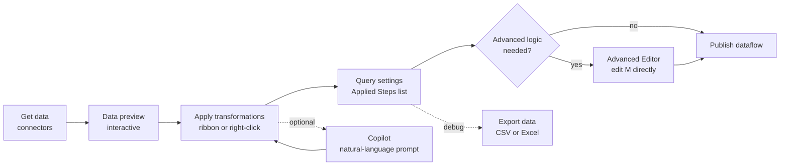

# Unit 3 — Transform data with Power Query

> [!quote] Source
> Microsoft Learn · Path 2 · Module 3 · Unit 3 · "Transform data with Power Query"
> <https://learn.microsoft.com/en-us/training/modules/fabric-transform-data-dataflows/3-transform-power-query/>

## 🎯 Purpose

The hands-on unit: walk through the **Power Query Online editor** end-to-end — how to create a dataflow, navigate the editor, apply common transformations, clean and standardize data, drop down to the **M language** when needed, and use **Copilot for Dataflow Gen2**.

## 🛠️ Create a dataflow

1. Navigate to your Fabric **workspace**.
2. Select **+ New item** → **Dataflow Gen2**.
3. Build your transformation logic in the **Power Query Online editor**.

**Inside the editor:**

1. Select **Get data** on the ribbon to browse **available connectors** (hundreds of sources — cloud DBs, on-prem DBs via gateway, flat files, web services, other Fabric items).
2. A **preview of your data** appears in the editor.
3. Apply transformations **visually**, configure your **output destination**, and **publish** the dataflow.

## 🧭 Navigate the Power Query editor

The Power Query Online editor has **five main areas**:

| Area | What it does |
|---|---|
| **Ribbon** | Commands by tab (**Home, Transform, Add Column, View**). Source connectors, transformation operations, destination settings. |
| **Queries pane** | Lists every data source connection (each called a **query**; queries become **tables** when loaded to a destination). You can duplicate, reference, or disable queries here. |
| **Diagram view** | Visual map of how queries connect and which transformations apply to each. Toggle from the **View** tab. |
| **Data preview** | A subset of the data — lets you see the effect of each transformation. Right-click columns to filter, remove, or rename. |
| **Query settings** | Shows the **Applied Steps** for the selected query. Every transformation is recorded as a step. You can **reorder, rename, delete, or modify** steps. Also shows the configured **data destination**. |

> [!tip] Gear icon → modify a step
> Each applied step has a **gear icon** that lets you modify the step's settings. If a step **doesn't have a gear icon**, you must **delete it and reapply the transformation** with different settings.

## 🔧 Apply common transformations

| Transformation | Purpose |
|---|---|
| **Filter rows** | Remove rows that don't meet criteria |
| **Select or remove columns** | Keep only the columns you need |
| **Change data types** | Set correct types for analysis |
| **Split columns** | Separate values by delimiter or position |
| **Merge columns** | Combine values from multiple columns |
| **Pivot columns** | Convert row values into column headers |
| **Unpivot columns** | Convert column headers into row values |
| **Group by** | Aggregate data by one or more columns |
| **Add calculated columns** | Create new columns based on expressions |
| **Merge queries** | Join two queries on matching columns (like a SQL **JOIN**) |
| **Append queries** | Stack rows from two or more queries (like a SQL **UNION**) |

Apply via the **ribbon** or by **right-clicking columns** in the data preview.

## 🧼 Clean and standardize data

| Operation | How to do it |
|---|---|
| **Handle null values** | Filter out rows with nulls, or replace with defaults using **Replace Values**. |
| **Remove duplicates** | Right-click a column → **Remove Duplicates** → keeps only unique rows based on that column. |
| **Trim whitespace** | **Transform** tab → trim leading/trailing spaces from text columns. |
| **Standardize text** | Apply **Capitalize Each Word**, **UPPERCASE**, or **lowercase** for consistent formatting. |
| **Handle errors** | Right-click a column → **Remove Errors** (filter out rows where the transformation errored) or **Replace Errors** (substitute a default value). |

> [!important] Why cleaning matters for AI
> "Consistent, clean data is especially important when the data supports downstream AI experiences. **Copilot and data agents perform better when column values are standardized and free of noise.**" — Microsoft Learn

## 📝 Work with the M language

Every transformation you apply through the Power Query UI **generates M language code** under the hood. **M** is a functional language that fully describes a query's transformation logic. View / edit it via **Advanced Editor** on the **View** tab.

> [!tip] Visual first, M second
> For most transformations the **visual interface is the fastest and least error-prone** approach. Drop down to **M** when you need **custom functions**, **parameterization**, **error handling**, or **advanced logic** the UI can't express.

**When to write M directly:**

- **Custom functions** — reusable transformation logic across multiple queries (e.g., a function that standardizes date formats).
- **Parameterized queries** — dynamic connection strings, filter values, or settings based on environment.
- **Error handling** — `try...otherwise` expressions for graceful fallback values.
- **Advanced logic** — iterative calculations, conditional branching, complex business rules.

**Example — custom function in M that trims + uppercases a text column:**

```powerquery-m
(inputText as text) as text =>
    Text.Upper(Text.Trim(inputText))
```

Calling this with the input `" hello world "` returns `"HELLO WORLD"`. Apply it to any text column across your queries.

## 🤖 Use Copilot for Dataflow Gen2

**Copilot for Dataflow Gen2** lets you use **natural-language prompts** to generate transformation logic — accelerating common shaping tasks and helping you discover the right Power Query patterns faster.

- Open Copilot chat: select the **Copilot** button on the **Home** tab.
- Each action Copilot takes appears as a **response card** with corresponding steps in the **Applied Steps** list — review, modify, or undo.

**Example prompts:**

- *"Remove rows where Status is null"*
- *"Add a column that calculates profit as Revenue minus Cost"*
- *"Only keep rows where Category is Electronics or Clothing"*
- *"Count the total number of orders by customer"*

### The explainer skill

Copilot also includes an **explainer** for understanding existing query logic:

| Goal | How |
|---|---|
| **Explain a full query** | Right-click the query in the **Queries** pane → **Describe** or **Explain**. |
| **Explain a single applied step** | Right-click the step in the **Applied Steps** pane → **Explain this step**. |

Returns a plain-language summary — useful when inheriting a dataflow or debugging unfamiliar transformations.

> [!warning] Copilot capacity requirement
> Copilot for Dataflow Gen2 requires a **paid Fabric capacity of F2 or higher, or P1 or higher**. **Trial SKUs aren't supported.** See the [Copilot in Fabric documentation](https://learn.microsoft.com/en-us/fabric/get-started/copilot-fabric-overview) for regional availability.

## 📤 Export query results for validation

You can **export query results** directly from the Power Query authoring experience:

1. Select the query in the **Queries** pane.
2. Select **Export data** from the **Home** tab.
3. Export to **CSV** or **Excel** as needed.

**Why it helps:**

- **Faster troubleshooting** — export a shaped dataset and compare results across steps.
- **Better collaboration** — share a snapshot of outputs with business users or support teams without leaving your authoring flow.

## 🧠 Visual — Power Query authoring pipeline



## 🧭 Next

→ [[Unit-4-Optimize-Performance]]
← [[Unit-2-Understand-Dataflows]]
↑ [[_MOC]]