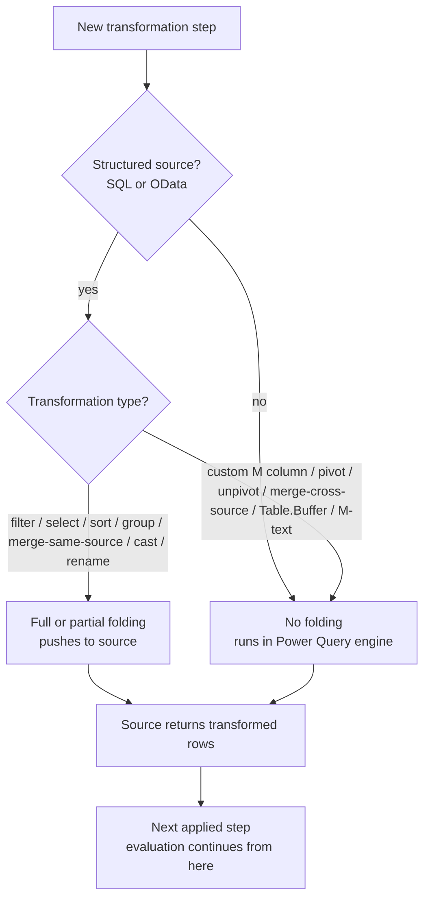
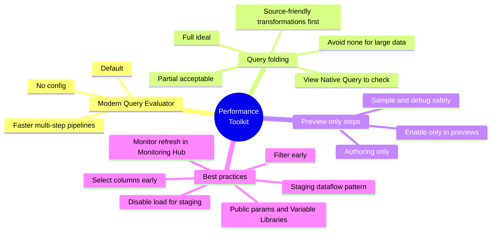

# Unit 4 — Optimize Dataflows Gen2 performance

> [!quote] Source
> Microsoft Learn · Path 2 · Module 3 · Unit 4 · "Optimize Dataflows Gen2 performance"
> <https://learn.microsoft.com/en-us/training/modules/fabric-transform-data-dataflows/4-optimize-performance/>

## 🎯 Purpose

Make your transformations **fast and efficient**. This unit covers the **Modern Query Evaluator** (the default engine), **query folding** (the single biggest performance lever), **preview-only steps** (a developer-ergonomics lever), and a checklist of **best practices**.

## ⚡ Modern Query Evaluator

The **Modern Query Evaluator** delivers improved performance and reliability for Power Query transformations in Dataflow Gen2.

**Enabled by default for all Dataflow Gen2 instances.** No configuration needed.

| Benefit | What it means |
|---|---|
| **Faster refreshes** | Multi-step shaping pipelines involving joins, group-bys, type conversions, complex expressions |
| **More predictable execution** | Scaling a single dataflow to larger datasets or higher-frequency schedules |
| **Better resource utilization** | Improved query optimization |

## 📉 Understand query folding

> [!info] Definition
> **Query folding** is the process of **pushing transformation logic from Power Query to the data source** for execution. Instead of downloading all the raw data and processing it in the Power Query engine, query folding **translates your M steps into a native query language (like SQL)** that the data source executes. The source returns only the transformed results.

**Why it's faster:**

- The **data source typically has more compute resources** and is optimized for query execution.
- **Less data transfers over the network** — filtering and aggregation happen *before* the data leaves the source.
- The **Power Query engine does less processing** → reduced refresh time and resource consumption.

### The three possible outcomes

| Outcome | Description |
|---|---|
| **Full folding** | All transformations pushed to the source. Power Query receives the final result with minimal processing. **Ideal for performance.** |
| **Partial folding** | Some transformations pushed; remaining steps run in the Power Query engine. Acceptable when only a few lightweight steps run locally. |
| **No folding** | No transformations pushed. Power Query downloads raw data and processes everything locally. **Avoid for large datasets.** |

> [!important] When folding applies
> Query folding is primarily available with **structured data sources** like **SQL databases** and **OData feeds**. **File-based sources like CSV and Excel generally don't support query folding.**

## 🔍 Check if a step folds

1. **Right-click** the step in the **Applied Steps** pane.
2. Look for **View Native Query**:
   - **Available** → that step folds to the data source.
   - **Grayed out** → that step and **all following steps** run in the Power Query engine — the query **does not** fold from that point onward.

**Check folding regularly as you build.** Knowing **where folding breaks** helps you **restructure your steps** to maximize what the source handles.

## ✅ Apply folding-friendly patterns

**Transformations that typically fold:**

- **Filter rows** → `WHERE`
- **Select / remove columns** → `SELECT` specific columns
- **Sort rows** → `ORDER BY`
- **Group by + aggregate** → `GROUP BY` with `SUM`, `COUNT`, etc.
- **Merge queries from the same source** → `JOIN`
- **Change data types** → `CAST`
- **Rename columns** → `AS` aliases

**Transformations that typically break folding:**

- Add **custom columns** with complex M expressions
- **Pivot and unpivot** operations
- **Merge queries from different data sources**
- Operations using `Table.Buffer` (forces evaluation)
- Some **text transformations** with M-specific functions

> [!warning] Folding break is sticky
> When folding breaks at a step, **all subsequent steps also run in the Power Query engine**. The **order of your transformations is important** to support query folding — put filter / select / sort / group-by early; leave pivots and complex custom columns late.

## 🧪 Use preview-only steps for efficient iteration

**Preview-only steps** let you add transformation steps that **run during data preview and authoring validation but are excluded from final execution during refresh**. They help you iterate faster while keeping production refresh logic clean.

- Right-click the step in the **Applied Steps** pane → **Enable only in previews**.

**Common uses:**

- **Speed up authoring** — sample / filter / limit rows during design-time without changing production output.
- **Safer experimentation** — test new steps; keep exploratory logic out of scheduled refresh.
- **Debug specific scenarios** — add temporary filters to focus on problem rows.

Useful on **large datasets** where you want a representative sample during development but need the full dataset in production.

## 📋 Follow performance best practices

| Practice | What to do | Why it helps |
|---|---|---|
| **Filter early** | Apply row filters as the **first steps** in your query. | Every subsequent transformation processes less data. |
| **Select columns early** | Remove columns you don't need **as soon as possible**. | Fewer columns → less data to process and transfer. |
| **Disable unnecessary loads** | For staging / reference queries (e.g., a lookup table used in a merge), right-click the query → deselect **Enable load**. | Staging query doesn't load to the destination → less processing. |
| **Use staging dataflows** | One dataflow **extracts + stages** raw data into a lakehouse; a second dataflow **reads from staging + applies transformations**. | Extraction refreshes independently; multiple transformation dataflows reuse the same staged data; if a transformation fails, the raw data is still available for reprocessing. |
| **Parameterize for reuse** | Use **Public parameters** (standard Dataflow Gen2) or **Fabric Variable Libraries** (workspace-level config; requires **Dataflow Gen2 with CI/CD**, enabled at creation by selecting the Git integration option). | Less configuration drift when promoting across CI/CD environments. |
| **Monitor refresh performance** | Use the **Monitoring Hub** in Fabric and the refresh history on the dataflow. Email alerts on failed scheduled refreshes. | Spot growing datasets and inefficient transformations early. |

> [!success] Staging dataflow pattern — when it pays off
> The staging pattern (extract → stage → transform) is a **best practice for complex scenarios**: separates ingestion from transformation, allows independent refresh schedules, enables multiple downstream transformation dataflows to share the same staged source, and preserves raw data for reprocessing.

## 🧠 Visual — query folding decision tree

## 🧠 Visual — full performance toolkit

## 🧭 Next

→ [[Unit-5-Exercise-Dataflows-Gen2]]
← [[Unit-3-Transform-Power-Query]]
↑ [[_MOC]]