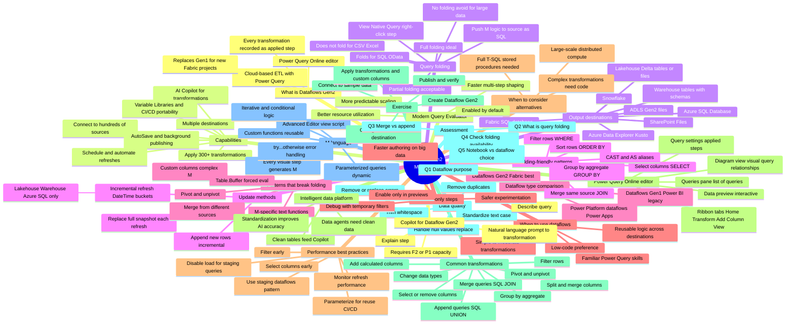

# Module 3 — Transform data using Dataflows Gen2 in Microsoft Fabric

> [!info] Module map
> This module zooms into **Dataflows Gen2** — Fabric's low-code ETL surface that brings the Power Query experience millions of Excel and Power BI Desktop users already know to **enterprise-scale cloud data preparation**. You will learn how dataflows connect to hundreds of sources, apply 300+ transformations, load results into lakehouses/warehouses/SQL destinations, and how to keep refresh times fast using the **Modern Query Evaluator**, **query folding**, and **preview-only steps**.

## 🎯 Learning objectives (synthesized from unit-level goals)

By the end of this module you should be able to:

1. **Describe** what Dataflows Gen2 are, how they run in Fabric, and how they differ from Dataflows Gen1 and Power Platform dataflows.
2. **Identify** supported **output destinations** (Lakehouse, Warehouse, ADLS Gen2, Azure SQL, Fabric SQL DB, Snowflake, Kusto, SharePoint) and the three **update methods** (Replace, Append, Incremental refresh).
3. **Use Power Query Online** — navigate the ribbon, Queries pane, Diagram view, Data preview, and Query settings (Applied Steps).
4. **Apply common transformations** — filter rows, select/remove columns, change types, split/merge, pivot/unpivot, group by, calculated columns, merge queries, append queries.
5. **Clean and standardize data** — handle nulls, remove duplicates, trim whitespace, standardize text case, handle errors.
6. **Read and write M language** for custom functions, parameterized queries, error handling (`try...otherwise`), and advanced logic.
7. **Use Copilot for Dataflow Gen2** to generate transformations and explain query logic via natural language prompts.
8. **Optimize performance** with the **Modern Query Evaluator**, **query folding**, **preview-only steps**, and other best practices (filter early, select columns early, disable load, use staging dataflows, parameterize for reuse).
9. **Build** a Dataflow Gen2 end-to-end in the hands-on exercise.

## 🧠 Module mind map

> [!tip] How to use
> The mind map below is duplicated as a standalone Mermaid file (`Module-Mind-Map.md`) you can open in Obsidian's Mermaid preview or the [Mermaid Live Editor](https://mermaid.live). It is the **single-page view** of the entire module.

## 📑 Unit breakdown

| # | Unit | XP | Minutes | Focus |
|---|------|----|---------|-------|
| 1 | [Introduction](./Unit-1-Introduction.md) | 100 | 2 | Why dataflows exist; Power Query familiarity framing |
| 2 | [Understand Dataflows Gen2](./Unit-2-Understand-Dataflows.md) | 100 | 8 | What they are, capabilities, destinations, update methods, when to use |
| 3 | [Transform data with Power Query](./Unit-3-Transform-Power-Query.md) | 100 | 10 | Power Query Online editor, common transformations, M language, Copilot |
| 4 | [Optimize Dataflows Gen2 performance](./Unit-4-Optimize-Performance.md) | 100 | 6 | Modern Query Evaluator, query folding, preview-only steps, best practices |
| 5 | [Exercise — Transform data with Dataflows Gen2](./Unit-5-Exercise-Dataflows-Gen2.md) | 100 | 30 | Hands-on: create dataflow, connect, transform, load to lakehouse |
| 6 | [Knowledge check](./Unit-6-Knowledge-Check.md) | 200 | 3 | 5 knowledge-check questions |
| 7 | [Summary](./Unit-7-Summary.md) | 100 | 2 | Recap + further reading |

**Total: 800 XP · ~61 minutes**

## 🔗 Knowledge-check answers (unit 6)

| Q | Question | Correct answer |
|---|----------|----------------|
| 1 | What is the primary purpose of a dataflow in Microsoft Fabric? | **To extract, transform, and load data using a low-code Power Query interface.** |
| 2 | What is query folding? | **The process of pushing transformation logic to the data source for execution instead of processing it in the Power Query engine.** |
| 3 | Which transformation combines rows from two queries into a single query, similar to a SQL JOIN? | **Merge queries.** |
| 4 | How can you check whether a specific applied step folds to the data source? | **Right-click the step in the Applied Steps pane and check if View Native Query is available.** |
| 5 | When is a notebook a better choice than a dataflow for data transformation? | **When transformations require complex logic or large-scale distributed processing.** |

## 🧭 Downstream links

- [[Unit-1-Introduction]] · [[Unit-2-Understand-Dataflows]] · [[Unit-3-Transform-Power-Query]] · [[Unit-4-Optimize-Performance]] · [[Unit-5-Exercise-Dataflows-Gen2]] · [[Unit-6-Knowledge-Check]] · [[Unit-7-Summary]]
- [[Module-Mind-Map]]
- Career/DP-600 index (parent MOC) — *to be created*

## 📚 External references

- Microsoft Learn module page: <https://learn.microsoft.com/en-us/training/modules/fabric-transform-data-dataflows/>
- What is Dataflow Gen2?: <https://learn.microsoft.com/en-us/fabric/data-factory/dataflows-gen2-overview>
- Query folding in Power Query: <https://learn.microsoft.com/en-us/power-query/power-query-folding>
- Copilot in Fabric overview: <https://learn.microsoft.com/en-us/fabric/get-started/copilot-fabric-overview>
- Data Factory pipelines (orchestrate dataflows): <https://learn.microsoft.com/en-us/fabric/data-factory/>
- Lakehouse overview: <https://learn.microsoft.com/en-us/fabric/data-engineering/lakehouse-overview>