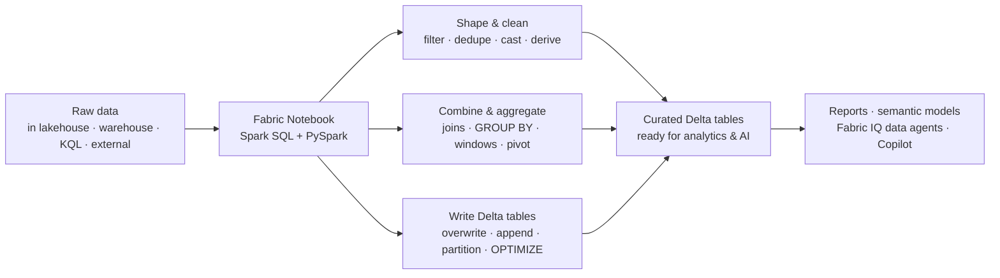

# Unit 1 — Introduction

> [!quote] Source
> Microsoft Learn · Path 2 · Module 4 · Unit 1 · "Introduction"
> <https://learn.microsoft.com/en-us/training/modules/fabric-transform-data-notebooks/1-introduction>

## 🎯 Purpose

A short framing unit that explains **why Fabric notebooks are the right tool for transformation work** and **what you'll build** by the end of the module. The scenario: a retail analytics organization with raw sales, customer, and product data sitting in a lakehouse that needs to be cleaned, joined, aggregated, and written out as reliable Delta tables for downstream analytics.

> [!note] Framing
> The source content for this unit is conceptual scene-setting — the substantive material begins in [[Unit-2-Describe-Notebooks]] and [[Unit-3-Shape-Clean-Data]].

## 🔑 Key takeaways

- Data-driven organizations need **reliable ways to transform raw data into clean, structured formats** ready for analysis.
- In Microsoft Fabric, **notebooks provide an interactive, code-based environment powered by Apache Spark**.
- Notebooks reach across the Fabric platform — they can read from and write to **lakehouses, warehouses, KQL databases, and external sources**.
- **Spark SQL** extends familiar SQL syntax to work with large datasets; **PySpark** provides a DataFrame API for the same transformations.
- Both languages run on the **same Spark engine**, so you can choose the approach that fits each task.
- Low-code tools handle simple transformations, but notebooks are needed for **complex joins, window functions, and custom business logic**.
- By the end of this module you'll know how to **shape data, combine tables, aggregate metrics, and write Delta tables** from a Fabric notebook.

## 🧠 Visual — what notebooks cover

## 🧭 Next

→ [[Unit-2-Describe-Notebooks]]
↑ [[_MOC]]
