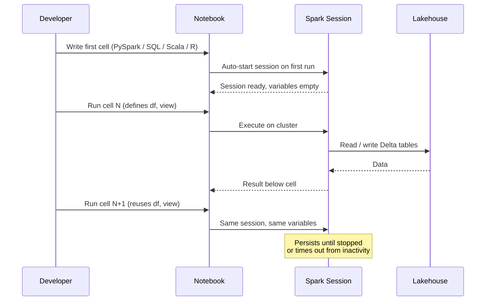

# Unit 2 — Describe notebooks in Fabric

> [!quote] Source
> Microsoft Learn · Path 2 · Module 4 · Unit 2 · "Describe notebooks in Fabric"
> <https://learn.microsoft.com/en-us/training/modules/fabric-transform-data-notebooks/2-describe-notebooks>

## 🎯 Purpose

Establish the **mental model** for working with Fabric notebooks before you start writing transformations: how they execute, what they connect to, when to use them vs. Dataflows Gen2, and the patterns that turn a development notebook into a reusable production asset.

## 🧱 What is a Fabric notebook

A Fabric notebook is a **web-based coding surface that runs on Apache Spark**. You write code in cells and run each cell independently, which makes it easy to develop and test transformations incrementally. Notebooks support **multiple languages**:

- **PySpark** (Python)
- **Spark SQL**
- **Scala**
- **R**

Each notebook connects to a **Spark session** that provides distributed computing power. When you run the first cell, Fabric starts a Spark session automatically. This session **persists until you stop it or it times out** due to inactivity. All cells in the notebook **share the same session**, so variables and temporary views you create in one cell are available in subsequent cells.

> [!tip] Mix code and narrative
> You can combine code cells with **markdown cells** to document your logic, making notebooks useful for both development and collaboration.

## 🔑 Key notebook concepts

### Cells
The **building blocks** of a notebook. Each cell contains either **code or markdown text**. You run code cells individually or run all cells in sequence. Results appear directly below each cell. This cell-by-cell approach lets you verify each transformation step before moving on.

### Lakehouse attachment
Connects your notebook to **one or more lakehouses**. When you attach a lakehouse, its tables and files become accessible in the notebook's **explorer panel**. You pin a **default lakehouse**, which sets the Hive metastore context for Spark SQL queries — so you can query tables by name without specifying a full path.

### Magic commands
Let you **switch languages within a single notebook**. For example, if the notebook's default language is PySpark, you can run a Spark SQL query in any cell by adding `%%sql` at the top of the cell. This means you can use the best language for each task without creating separate notebooks.

## ⚖️ Notebooks vs. Dataflows Gen2

Both transform data in Fabric. Choosing between them depends on your **transformation complexity and team preferences**.

| Factor | Notebooks | Dataflows Gen2 |
|---|---|---|
| **Complexity** | Complex logic, custom functions, multi-step processing | Simple to moderate transformations |
| **Interface** | Code-based (SQL, Python) | Visual, low-code (Power Query) |
| **Scale** | Large datasets with Spark distributed processing | Smaller to mid-size datasets |
| **Flexibility** | Full programming language capabilities | Prebuilt transformations and connectors |
| **Collaboration** | Version control, code review | Visual design, less technical barrier |

> [!success] When to reach for notebooks
> Use notebooks when transformations require **complex joins, window functions, conditional logic**, or when working with **large datasets** that benefit from Spark's distributed processing. Use Dataflows Gen2 when the team prefers a visual interface or when the transformations are straightforward.

## 🌐 What data stores can notebooks access

Because notebooks run on Apache Spark, they can read from and write to multiple data stores across the Fabric platform.

| Data store | How notebooks connect | Common use case |
|---|---|---|
| **Lakehouse** | Pin as default lakehouse; query Delta tables by name | Core transformation of raw-to-curated data |
| **Warehouse** | Cross-database queries via three-part naming (`warehouse.schema.table`) | Reading dimension tables managed by a SQL team |
| **KQL database** | KQL connector or Spark connector for Kusto | Writing processed events for real-time analytics |
| **External sources** | Spark connectors (JDBC, Azure Blob, ADLS, REST APIs) | Ingesting data from systems outside Fabric |

> [!info] Lakehouse is the most common surface
> The lakehouse is the most common source and destination for notebook transformations, because Spark **natively reads and writes the Delta format** that lakehouses use. The remaining units focus on lakehouse data as the primary teaching example, but the patterns apply to any store Spark can reach.

## 🛠️ Common development patterns

### Interactive development
The most common starting point. You write code in cells, run each cell, inspect the output, and refine your logic before committing to a final version. Ideal for **exploring unfamiliar data, prototyping transformations, and debugging**.

### Parameterized notebooks
Pass values into a notebook at run time: date ranges, file paths, environment names. Designate a cell as a **parameters cell**, and the calling process injects values that override the defaults. This turns a development notebook into a **reusable component** that handles different inputs without code changes.

### Pipeline integration
Add notebooks to your workflow orchestration. Add a **notebook activity** to a Data Factory pipeline, pass parameters, and chain it with other activities (data copies, dataflow refreshes). The pipeline handles **orchestration, retries, and monitoring** so the notebook focuses purely on transformation logic.

> [!info] Data lifecycle in Fabric
> Data typically moves from **raw ingestion → curated, analytics-ready tables**. Notebooks are well-suited for the transformation steps in the middle, turning raw or lightly processed data into clean, structured formats for downstream reporting and analysis.

> [!tip] Copilot assist
> **Copilot in Fabric notebooks** can help you write and debug Spark SQL and PySpark code. Describe a transformation in natural language and Copilot generates the corresponding code — useful when learning new syntax or converting between Spark SQL and PySpark.

## 🧠 Visual — the Spark session lifecycle

## 🔑 Key takeaways

- A Fabric notebook is a **web-based coding surface that runs on Apache Spark**, with cells you can run independently.
- The **Spark session is shared across all cells** in a notebook and persists until stopped or timed out.
- **Lakehouse attachment** sets a default lakehouse so Spark SQL can reference tables by name.
- **Magic commands** (`%%sql`, `%%pyspark`, etc.) let you switch languages cell by cell.
- Choose **notebooks over Dataflows Gen2** when transformations are complex, large-scale, or need full programming flexibility.
- Notebooks can reach **lakehouses, warehouses, KQL databases, and external sources** via Spark connectors.
- Three production patterns: **interactive development**, **parameterized notebooks**, and **pipeline integration**.

## 🧭 Next

→ [[Unit-3-Shape-Clean-Data]]
← [[Unit-1-Introduction]]
↑ [[_MOC]]
