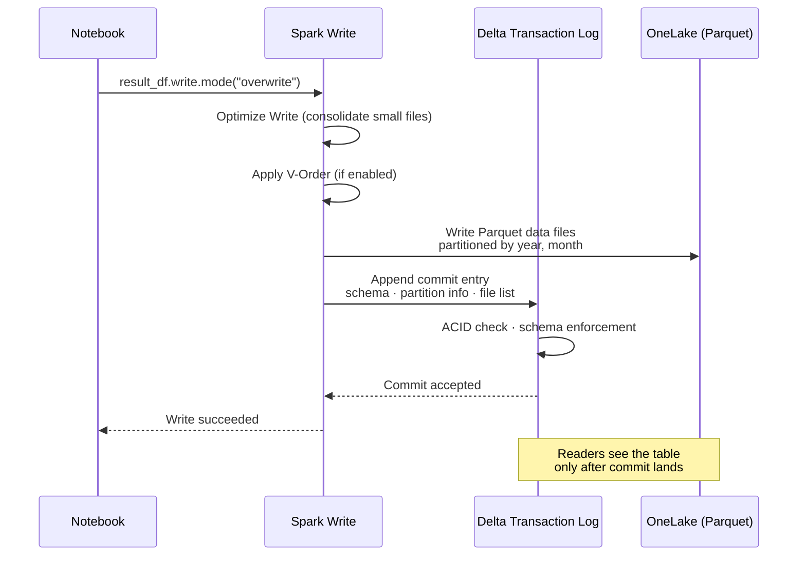
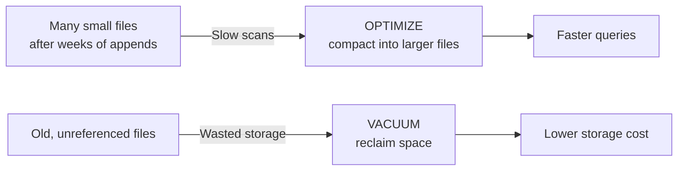

# Unit 5 — Write and size Delta tables

> [!quote] Source
> Microsoft Learn · Path 2 · Module 4 · Unit 5 · "Write and size Delta tables"
> <https://learn.microsoft.com/en-us/training/modules/fabric-transform-data-notebooks/5-write-delta-tables>

## 🎯 Purpose

After transforming data in a notebook, you need to **write the results to Delta tables** so other tools and users can access them. How you write the data affects **query performance and storage efficiency**. Getting the table structure right at write time saves you from having to reprocess data later.

## 💾 Write transformed data to tables

You can write transformed data as a **new Delta table** or **replace an existing one**. Both Spark SQL and PySpark create Delta tables in the lakehouse. The table is accessible to other notebooks, SQL analytics endpoints, and semantic models that connect to the lakehouse.

**Spark SQL**

```sql
CREATE OR REPLACE TABLE gold.fact_sales AS
SELECT * FROM transformed_sales
```

**PySpark**

```python
result_df.write \
    .format("delta") \
    .mode("overwrite") \
    .saveAsTable("gold.fact_sales")
```

## 🎚️ Choose a write mode

Delta tables support two primary write modes. Choose the mode that matches your **data loading pattern**.

| Mode | Behavior | Use when |
|---|---|---|
| **overwrite** | Replaces the entire table with new data | Running a full refresh of transformed data |
| **append** | Adds new rows to the existing table | Adding incremental data (new daily transactions, for example) |

**Spark SQL**

```sql
-- Overwrite: replace entire table
CREATE OR REPLACE TABLE gold.fact_sales AS
SELECT * FROM transformed_sales

-- Append: add new rows to existing table
INSERT INTO gold.fact_sales
SELECT * FROM new_daily_sales
```

**PySpark**

```python
# Overwrite: replace entire table
result_df.write \
    .format("delta") \
    .mode("overwrite") \
    .saveAsTable("gold.fact_sales")

# Append: add new rows to existing table
new_data_df.write \
    .format("delta") \
    .mode("append") \
    .saveAsTable("gold.fact_sales")
```

> [!warning] Use `overwrite` carefully
> `overwrite` mode **replaces all existing data** in the table. If you need to update specific rows, consider using Delta `MERGE` operations instead.

## 📂 Partition tables for query performance

Partitioning organizes table data into **subdirectories based on column values**. When queries filter on partitioned columns, Spark reads only the relevant partitions instead of scanning the entire table.

**Spark SQL**

```sql
CREATE OR REPLACE TABLE gold.fact_sales
USING DELTA
PARTITIONED BY (year, month)
AS SELECT * FROM transformed_sales
```

**PySpark**

```python
result_df.write \
    .format("delta") \
    .partitionBy("year", "month") \
    .mode("overwrite") \
    .saveAsTable("gold.fact_sales")
```

### Partitioning guidelines

Partitioning improves performance for large tables, but it can hurt performance for smaller ones.

- **Partition when** the table exceeds **1 TB** and queries frequently filter on the partition column
- **Target partition size** of at least **1 GB per partition** to avoid the small files problem
- **Avoid over-partitioning** on high-cardinality columns (like customer ID), which creates too many small files
- **Common partition columns** include year, month, and region

> [!tip] Default: skip partitioning for small tables
> For most tables under 1 TB, **skip partitioning entirely**. Spark and Delta handle these table sizes efficiently without it.

## 📐 Manage file sizes

Delta tables consist of **Parquet files stored in OneLake**. The size and number of these files directly affect query performance.

- **Too many small files** slow down queries because Spark spends more time opening files than reading data.
- **Files that are too large** can cause memory issues and reduce parallelism.
- **Target file size between 128 MB and 1 GB** for most workloads.

Fabric includes **Optimize Write**, which is **enabled by default**. This feature consolidates small files during write operations, reducing the small file problem without manual intervention.

If files become fragmented over time due to incremental appends, use the `OPTIMIZE` command to compact them. To remove old, unreferenced files and reclaim storage, use `VACUUM`. Both commands run as Spark SQL in a notebook cell:

```sql
-- Compact small files into larger ones
OPTIMIZE gold.fact_sales

-- Remove old, unreferenced files
VACUUM gold.fact_sales
```

## ⚙️ Use Delta table features

Delta tables provide built-in features that maintain **data reliability**.

### ACID transactions
Ensure that each write operation either **fully succeeds or fully rolls back**. If a write fails partway through, the table remains in its previous consistent state. This is important for production transformation pipelines where partial writes could corrupt downstream analysis.

### Schema enforcement
Validates that incoming data matches the table's **expected column names and data types**. If you try to write data with a mismatched schema, Delta **rejects the write and returns an error**. This catches data quality issues early in the pipeline.

### V-Order
A **write-time Parquet optimization for read-heavy workloads**. V-Order is **disabled by default in new Fabric workspaces**. For tables that support dashboards and interactive queries, enable V-Order at the session level:

**Spark SQL**

```sql
SET spark.sql.parquet.vorder.default=TRUE
```

**PySpark**

```python
spark.conf.set("spark.sql.parquet.vorder.default", "true")
```

> [!note] Foundation for downstream analytics
> Well-structured Delta tables with clear naming, proper data types, and appropriate sizing form the foundation for downstream analytics. Fabric IQ data agents and Copilot generate more accurate results when they query **clean, well-organized data**.

## 🧠 Visual — Delta Lake write transaction



## 🧠 Visual — when to OPTIMIZE / VACUUM



## 🔑 Key takeaways

- Write results with `saveAsTable` (PySpark) or `CREATE OR REPLACE TABLE … AS` (Spark SQL) — both produce Delta tables in the lakehouse.
- **`overwrite`** for full refreshes; **`append`** for incremental loads; use `MERGE` for surgical row-level updates.
- **Partition** tables that exceed 1 TB with frequent filters on the partition column; target ≥1 GB per partition.
- **Skip partitioning** for tables under 1 TB — it adds overhead without benefit.
- **Optimize Write** (on by default) consolidates small files at write time.
- **`OPTIMIZE`** compacts files after the fact; **`VACUUM`** reclaims storage by removing unreferenced files.
- Delta gives you **ACID transactions**, **schema enforcement**, and **V-Order** for read-heavy optimization.

## 🧭 Next

→ [[Unit-6-Exercise]]
← [[Unit-4-Combine-Aggregate]]
↑ [[_MOC]]
