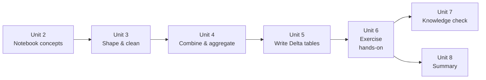

# Unit 6 — Exercise: Transform data with notebooks

> [!quote] Source
> Microsoft Learn · Path 2 · Module 4 · Unit 6 · "Exercise: Transform data with notebooks"
> <https://learn.microsoft.com/en-us/training/modules/fabric-transform-data-notebooks/6-exercise>

## 🎯 Purpose

A **30-minute hands-on lab** that puts [[Unit-3-Shape-Clean-Data]] through [[Unit-5-Write-Delta-Tables]] into practice. You clean raw sales data in a Fabric notebook, join it with customer and product tables, apply aggregations and window functions, and write the results to a Delta table.

> [!warning] Prerequisites
> You need access to a **Fabric-enabled workspace** to complete this exercise. For information about a trial license, see [Getting started with Fabric](https://learn.microsoft.com/en-us/fabric/get-started/fabric-trial).
>
> This lab takes approximately **30 minutes** to complete.

## 🔬 What the lab does

The exercise walks you through an end-to-end notebook transformation pipeline:

1. **Read raw sales data** from a lakehouse table into a notebook DataFrame.
2. **Clean the data** — remove duplicates, handle null values (fill with defaults or drop unusable rows), filter to a relevant scope, and rename columns to a consistent convention.
3. **Join** the cleaned sales data with **customer and product tables** to enrich each row with descriptive attributes.
4. **Aggregate** the enriched data using `GROUP BY` (e.g., totals by region or product) and apply a **window function** for a ranking or running-total metric.
5. **Write the transformed result** to a Delta table in the lakehouse so downstream tools can consume it.

> [!info] Format note
> Per the task specification, this unit is a **summary of what the lab does, not the lab itself**. The full step-by-step lab lives behind the [launch exercise link](https://go.microsoft.com/fwlink/?linkid=2360808) on the Microsoft Learn page.

## 🔑 Skills practiced

| Skill | From unit |
|---|---|
| Read raw data from a lakehouse table | [[Unit-3-Shape-Clean-Data]] |
| Deduplicate and handle nulls | [[Unit-3-Shape-Clean-Data]] |
| Filter rows and rename columns | [[Unit-3-Shape-Clean-Data]] |
| Cast data types and add calculated columns | [[Unit-3-Shape-Clean-Data]] |
| Join sales with customer/product tables | [[Unit-4-Combine-Aggregate]] |
| Aggregate with `GROUP BY` and apply window functions | [[Unit-4-Combine-Aggregate]] |
| Write results to a Delta table in the lakehouse | [[Unit-5-Write-Delta-Tables]] |

## 🧠 Visual — where this lab sits in the module

## 🔗 Launch the exercise

> [!success] Launch
> [Launch the exercise on Microsoft Learn →](https://go.microsoft.com/fwlink/?linkid=2360808)

## 🧭 Next

→ [[Unit-7-Knowledge-Check]]
← [[Unit-5-Write-Delta-Tables]]
↑ [[_MOC]]
