# Unit 8 — Summary

> [!quote] Source
> Microsoft Learn · Path 2 · Module 4 · Unit 8 · "Summary"
> <https://learn.microsoft.com/en-us/training/modules/fabric-transform-data-notebooks/8-summary>

## 📝 Verbatim recap

> In this module, you learned how Fabric notebooks provide an interactive environment for running Spark SQL and PySpark transformations, with the ability to connect to lakehouses, warehouses, KQL databases, and external sources.
>
> You explored how notebooks work, what data stores they access, and common development patterns like interactive development, parameterized notebooks, and pipeline integration. You then applied core shaping techniques, including filtering rows, handling nulls, adding calculated columns, and converting data types. You combined data from multiple tables using joins, calculated summary metrics with aggregations, and applied window functions for rankings and running totals. Finally, you wrote your transformed results to Delta tables with appropriate write modes and sizing considerations.
>
> These skills give you the tools to build repeatable transformation pipelines that turn raw data into reliable, structured outputs. The Spark SQL and PySpark patterns you practiced work across any data store that Spark can reach. The clean Delta tables you produce serve as the foundation for reports, semantic models, and AI-powered experiences like Fabric IQ data agents that query your data using natural language.

## 🧠 Key takeaway diagram

```mermaid
flowchart LR
    subgraph Engine["Notebook Engine"]
      NB[Fabric notebook<br/>Spark SQL + PySpark]
      SS[Shared Spark session<br/>persistent across cells]
      MC[Magic commands<br/>%%sql · %%pyspark · %%scala]
    end

    subgraph Sources["Data Stores Spark Reaches"]
      LH[Lakehouse<br/>default lakehouse]
      WH[Warehouse<br/>3-part queries]
      KQL[KQL database<br/>Spark / Kusto connector]
      EXT[External<br/>JDBC · ADLS · REST]
    end

    subgraph Shape["Shape & Clean"]
      Dedup[Deduplicate]
      Null[Handle nulls]
      Filter[Filter rows]
      Cast[Cast types]
      Calc[Calculated columns]
      Cond[Conditional columns]
    end

    subgraph Combine["Combine & Aggregate"]
      Join[Joins<br/>inner · left · right · full · cross]
      Group[GROUP BY<br/>+ HAVING]
      Win[Window functions<br/>row_number · rank · running totals]
      Pivot[Pivot<br/>rows → columns]
      CTE[CTEs<br/>named, chained steps]
    end

    subgraph Write["Write Delta Tables"]
      Mode[overwrite · append]
      Part[Partitioning<br/>≥1 TB · ≥1 GB/partition]
      Opt[OPTIMIZE · VACUUM]
      Acid[ACID + schema enforcement]
      VOrd[V-Order<br/>read-heavy optimization]
    end

    subgraph Consume["Downstream Consumers"]
      Rep[Reports]
      SM[Semantic models]
      AI[Fabric IQ data agents<br/>+ Copilot]
    end

    LH --> NB
    WH --> NB
    KQL --> NB
    EXT --> NB
    NB --> SS
    NB --> MC
    NB --> Shape
    Shape --> Combine
    Combine --> Write
    Write --> Rep
    Write --> SM
    Write --> AI
```

## 🔑 One-paragraph synthesis

A Fabric notebook is an **interactive, code-based Apache Spark environment** that reaches across the Fabric platform — reading from and writing to **lakehouses, warehouses, KQL databases, and external sources**. Within a notebook, all cells share a **persistent Spark session**, and you can **mix Spark SQL and PySpark cell-by-cell** using `%%sql` magic commands. Three production patterns — interactive development, parameterized notebooks, and pipeline integration — turn a development notebook into a reusable component. The transformation toolkit covers **shaping** (deduplicate, null handling, filtering, type casting, calculated and conditional columns), **combining and aggregating** (joins across all five types, `GROUP BY` with `HAVING`, window functions that keep row detail, CTEs for readability, pivots for cross-tabs), and **writing Delta tables** (with the right write mode, partitioning for tables over 1 TB, `OPTIMIZE`/`VACUUM` for file sizing, and Delta features like ACID transactions, schema enforcement, and V-Order). The clean Delta tables you produce become the foundation for **reports, semantic models, and AI-powered experiences** like Fabric IQ data agents.

## 📚 Learn more (Microsoft docs)

- [How to use Microsoft Fabric notebooks](https://learn.microsoft.com/en-us/fabric/data-engineering/how-to-use-notebook)
- [Delta Lake table optimization and V-Order](https://learn.microsoft.com/en-us/fabric/data-engineering/delta-optimization-and-v-order)
- [Apache Spark in Microsoft Fabric](https://learn.microsoft.com/en-us/fabric/data-engineering/spark-compute)

## 🧭 Done with Module 4

← [[Unit-7-Knowledge-Check]]
↑ [[_MOC]]

**Module outcome:** Transform data using Spark SQL and PySpark in Fabric notebooks — from shaping raw inputs through joining, aggregating, and writing clean Delta tables ready for analytics and AI.
