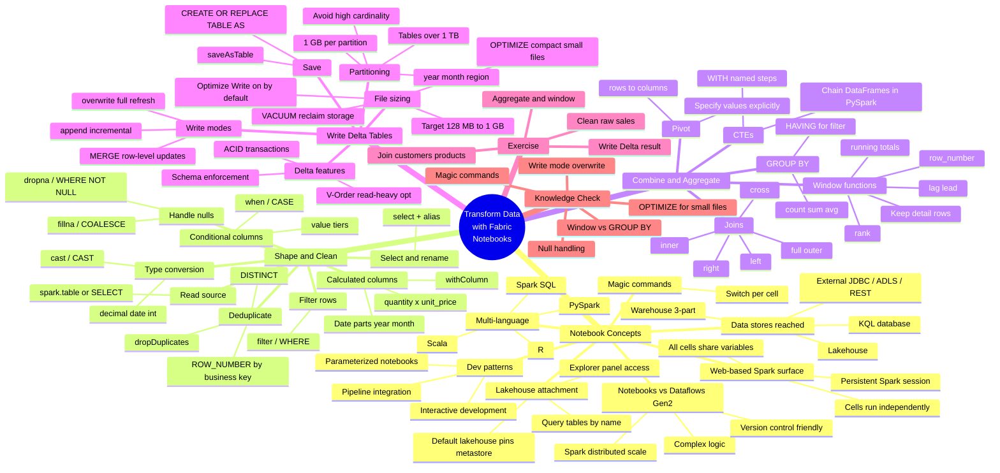

# Module — Transform data using notebooks in Microsoft Fabric

> [!info] Module map
> Path 2 Module 4 in the **Fabric Analytics Engineer** (DP-600) track. This module is the **notebook-driven transformation deep-dive**: how Fabric notebooks work, how to shape and clean data with Spark SQL and PySpark, how to combine and aggregate across tables, and how to write properly sized Delta tables.

## 🎯 Learning objectives (synthesized from unit-level goals)

By the end of this module you should be able to:

1. **Describe** Fabric notebooks — what they are, the Spark session model, and when to use them vs. Dataflows Gen2.
2. **Identify** the data stores notebooks can reach — lakehouses, warehouses, KQL databases, and external sources via Spark connectors.
3. **Shape and clean** data in a notebook — read tables, deduplicate, handle nulls, filter rows, select and rename columns, add calculated and conditional columns, and convert data types.
4. **Combine and aggregate** data — join tables (inner, left, right, full outer, cross), group and aggregate with `GROUP BY`/`HAVING`, apply window functions for rankings and running totals, chain transformations with CTEs, and pivot rows into columns.
5. **Write** transformed results to Delta tables with the appropriate **write mode** (`overwrite` vs. `append`), **partitioning** strategy, and **file sizing** considerations.
6. **Apply** Delta table features — `OPTIMIZE`, `VACUUM`, ACID transactions, schema enforcement, and V-Order for read-heavy workloads.
7. **Choose** the right Spark SQL or PySpark syntax for each task — and mix them cell by cell using `%%sql` magic commands.

## 🧠 Module mind map

> [!tip] How to use
> The mind map below is duplicated as a standalone Mermaid file (`Module-Mind-Map.md`) you can open in Obsidian's Mermaid preview or the [Mermaid Live Editor](https://mermaid.live). It is the **single-page view** of the entire module.

## 📑 Unit breakdown

| # | Unit | XP | Minutes | Focus |
|---|------|----|---------|-------|
| 1 | [Introduction](./Unit-1-Introduction.md) | 100 | 2 | Why Fabric notebooks exist |
| 2 | [Describe notebooks in Fabric](./Unit-2-Describe-Notebooks.md) | 100 | 5 | Spark session, magic commands, lakehouse attachment, dev patterns |
| 3 | [Shape and clean data](./Unit-3-Shape-Clean-Data.md) | 100 | 10 | Dedup, nulls, filter, rename, calculated/conditional columns, type casts |
| 4 | [Combine and aggregate data](./Unit-4-Combine-Aggregate.md) | 100 | 10 | Joins, GROUP BY, window functions, CTEs, pivot |
| 5 | [Write and size Delta tables](./Unit-5-Write-Delta-Tables.md) | 100 | 6 | Write modes, partitioning, OPTIMIZE/VACUUM, Delta features |
| 6 | [Exercise: Transform data with notebooks](./Unit-6-Exercise.md) | 100 | 30 | Hands-on lab |
| 7 | [Knowledge check](./Unit-7-Knowledge-Check.md) | 200 | 3 | 5 multiple-choice questions |
| 8 | [Summary](./Unit-8-Summary.md) | 100 | 2 | Recap + learn-more links |

**Total: 900 XP · ~68 minutes (~1 hr 8 min)**

## 🔗 Knowledge-check answers (unit 7)

Microsoft Learn does not display the correct answers; the table below is derived from the unit content.

| # | Question topic | Correct answer |
|---|----------------|----------------|
| 1 | Magic command to run Spark SQL in a PySpark notebook | **`%%sql`** |
| 2 | Replace nulls in `discount` with zero in PySpark | **`df.fillna({"discount": 0})`** |
| 3 | Nightly full-refresh write mode for a gold table | **`overwrite`** |
| 4 | What window functions provide that GROUP BY does not | **It calculates aggregated values while keeping the individual row detail** |
| 5 | Compact many small Parquet files after incremental appends | **`OPTIMIZE`** |

See [[Unit-7-Knowledge-Check]] for full reasoning on each answer.

## 🧭 Downstream links

- [[Unit-1-Introduction]] · [[Unit-2-Describe-Notebooks]] · [[Unit-3-Shape-Clean-Data]] · [[Unit-4-Combine-Aggregate]] · [[Unit-5-Write-Delta-Tables]] · [[Unit-6-Exercise]] · [[Unit-7-Knowledge-Check]] · [[Unit-8-Summary]]
- [[Module-Mind-Map]]
- Parent MOC — `../02-Study-Guide-Index/_MOC.md`

## 📚 External references

- Microsoft Learn module page: <https://learn.microsoft.com/en-us/training/modules/fabric-transform-data-notebooks/>
- [How to use Microsoft Fabric notebooks](https://learn.microsoft.com/en-us/fabric/data-engineering/how-to-use-notebook)
- [Delta Lake table optimization and V-Order](https://learn.microsoft.com/en-us/fabric/data-engineering/delta-optimization-and-v-order)
- [Apache Spark in Microsoft Fabric](https://learn.microsoft.com/en-us/fabric/data-engineering/spark-compute)
