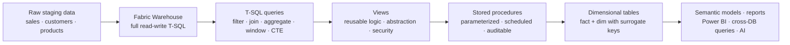

# Unit 1 — Introduction

> [!quote] Source
> Microsoft Learn · Path 2 · Module 5 · Unit 1 · "Introduction"
> <https://learn.microsoft.com/en-us/training/modules/fabric-transform-data-tsql/1-introduction>

## 🎯 Purpose

A short framing unit that explains **why T-SQL is the right tool for transformation work in Fabric** and **what you'll build** by the end of the module. The scenario: an organization that has migrated data into a Fabric warehouse, with staging tables holding raw sales, customer, and product data from multiple source systems — analytics teams need clean, well-structured data, while ML teams need consistent aggregated datasets.

> [!note] Framing
> The source content for this unit is conceptual scene-setting — the substantive material begins in [[Unit-2-Transform-Queries]] and runs through the dimensional-modeling work in [[Unit-5-Implement-Dimensional-Tables]].

## 🔑 Key takeaways

- Organizations store large volumes of data in warehouses and lakehouses, but **raw data rarely arrives in the shape** analysts and downstream systems need.
- **T-SQL is the standard language** for querying and transforming relational data.
- In Microsoft Fabric, you can run T-SQL in **both warehouses and lakehouses**:
  - **Warehouse** — full read-write T-SQL capabilities (`SELECT`, `INSERT`, `UPDATE`, `DELETE`, `CTAS`).
  - **Lakehouse** — exposes Delta tables through a **read-only SQL analytics endpoint** for querying and analysis.
- This module focuses on transforming data **within a Fabric warehouse**, where read-write support lets you **persist** transformation results.
- You'll build the transformation layer in four escalating steps:
  1. **Query-based transformations** — filter, join, aggregate.
  2. **Views** — encapsulate reusable logic.
  3. **Stored procedures** — automate repeatable processing.
  4. **Dimensional tables** — fact and dimension tables as the foundation for semantic models and analytics.
- By the end of the module, you're able to transform warehouse data using T-SQL queries, create views and stored procedures for reusable logic, and implement dimensional tables for analytics.

## 🧠 Visual — what T-SQL transformation covers

## ⚖️ Warehouse vs. lakehouse — quick reference

| Capability | Fabric Warehouse | Lakehouse SQL analytics endpoint |
|---|---|---|
| `SELECT` | ✅ | ✅ |
| `INSERT`, `UPDATE`, `DELETE` | ✅ | ❌ (read-only) |
| `CREATE TABLE AS SELECT` (CTAS) | ✅ | ❌ |
| Persist transformation results | ✅ | ❌ |
| Query Delta tables | ✅ (3-part name) | ✅ (native) |

> [!info] Why this distinction matters
> The same T-SQL **query language** works in both — but only the warehouse lets you **materialize** results. If your transformation needs to land data in a new table, you must run it in a warehouse, not the lakehouse SQL endpoint.

## 🧭 Next

→ [[Unit-2-Transform-Queries]]
↑ [[_MOC]]