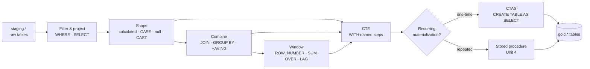

# Unit 2 — Transform data with T-SQL queries

> [!quote] Source
> Microsoft Learn · Path 2 · Module 5 · Unit 2 · "Transform data with T-SQL queries"
> <https://learn.microsoft.com/en-us/training/modules/fabric-transform-data-tsql/2-transform-queries>

## 🎯 Purpose

Walk through the **core T-SQL query techniques for transforming data in a Fabric warehouse** — filter and shape rows, handle nulls, convert types, join and aggregate across tables, apply window functions that keep row detail, structure complex logic with CTEs, and persist results with `CREATE TABLE AS SELECT` (CTAS).

## 🛠️ Where you run T-SQL in Fabric

A Fabric warehouse exposes T-SQL through several surfaces:

| Tool | When to use |
|---|---|
| **SQL query editor** (browser, in warehouse explorer) | Default — IntelliSense, syntax highlighting, multiple query tabs |
| **SSMS** or **VS Code + MSSQL extension** | Connect via the warehouse's T-SQL connection string for richer tooling |
| **Visual Query Editor** | No-code drag-and-drop; generates T-SQL behind the scenes; "View SQL" toggle reveals it |

> [!tip] Visual Query Editor scope
> The Visual Query Editor is a good fit for quick exploration or simple joins. For complex transformations — **window functions, CTEs, conditional logic** — drop into the SQL query editor.

## 🔍 Filter and shape data

The most common starting point: **filter rows** and **project columns** to narrow the dataset before further processing. Filtering early improves both clarity and performance of downstream steps.

```sql
SELECT
    customer_id,
    order_date,
    amount
FROM staging.orders
WHERE order_date >= '2024-01-01'
    AND status = 'Completed';
```

### ➕ Add calculated columns

Derived columns encode business rules directly in the query so every consumer sees the same value:

```sql
SELECT
    order_id,
    quantity,
    unit_price,
    quantity * unit_price AS line_total,
    CASE
        WHEN quantity * unit_price > 1000 THEN 'High'
        ELSE 'Standard'
    END AS order_tier
FROM staging.orders;
```

### 🚫 Handle null values

Pick a default replacement (`ISNULL`) or a list-fallback (`COALESCE`) before the data lands in analytical tables:

```sql
SELECT
    ISNULL(discount, 0) AS discount,
    COALESCE(shipping_address, billing_address) AS address
FROM staging.orders;
```

### 🔢 Convert data types

Source data frequently arrives as strings that need to be converted to dates or numbers for proper sorting and aggregation:

```sql
SELECT
    CAST(order_date_text AS DATE) AS order_date,
    CONVERT(DECIMAL(10,2), amount_text) AS amount
FROM staging.raw_orders;
```

> [!info] Why shape and clean first
> Filtering, projecting, calculating, null-handling, and type-casting are the **building blocks** for more complex transformations. Each query shapes the data one step closer to its final analytical form.

## 🔗 Combine data with joins and aggregations

Real transformations almost always require **combining data from multiple tables**. Source systems normalize data across many tables, but analytical consumers need a combined view.

### 🔗 Basic join

```sql
SELECT
    o.order_id,
    o.order_date,
    c.customer_name,
    c.segment
FROM staging.orders AS o
INNER JOIN staging.customers AS c
    ON o.customer_id = c.customer_id;
```

### 📊 GROUP BY with aggregates

This pattern is the foundation of most analytical queries — turning detailed transactions into summary metrics:

```sql
SELECT
    c.region,
    YEAR(o.order_date) AS order_year,
    COUNT(*) AS order_count,
    SUM(o.amount) AS total_sales
FROM staging.orders AS o
INNER JOIN staging.customers AS c
    ON o.customer_id = c.customer_id
GROUP BY c.region, YEAR(o.order_date);
```

### 🪟 HAVING — filter after aggregation

`HAVING` filters **groups** after aggregation, unlike `WHERE` which filters individual rows before grouping. Use it to keep only groups that meet a threshold:

```sql
SELECT
    region,
    YEAR(order_date) AS order_year,
    SUM(amount) AS total_sales
FROM staging.orders
GROUP BY region, YEAR(order_date)
HAVING SUM(amount) > 50000;
```

> [!warning] WHERE vs HAVING
> `WHERE` runs **before** grouping and cannot reference aggregates. `HAVING` runs **after** grouping and is the right place to filter on `SUM`, `COUNT`, `AVG`, etc.

## 📐 Apply window functions

Window functions perform calculations **across a set of rows related to the current row without collapsing the result set**. Unlike `GROUP BY`, which produces one output row per group, window functions keep **every row** in the result and add calculated values alongside them — ideal for **running totals, rankings, and row-to-row comparisons**.

```sql
SELECT
    customer_id,
    order_date,
    amount,
    ROW_NUMBER() OVER (
        PARTITION BY customer_id
        ORDER BY order_date
    ) AS order_sequence,
    SUM(amount) OVER (
        PARTITION BY customer_id
        ORDER BY order_date
    ) AS running_total,
    LAG(amount) OVER (
        PARTITION BY customer_id
        ORDER BY order_date
    ) AS previous_order_amount
FROM staging.orders;
```

| Function | Behavior |
|---|---|
| `ROW_NUMBER()` | Sequential number within the partition; identifies the first/most recent order |
| `SUM(...) OVER (...)` | Cumulative running total within the partition |
| `LAG(col)` | Previous row's value within the partition — period-over-period deltas without self-joins |
| `RANK()` | Handles ties differently from `ROW_NUMBER` |
| `DENSE_RANK()` | Like `RANK` but no gaps in the sequence |
| `LEAD(col)` | Looks forward instead of backward |

## 🪜 Structure complex queries with CTEs

Common table expressions (CTEs) **break a complex query into readable, named steps**. Each CTE defines an intermediate result that the next step can reference.

```sql
WITH monthly_totals AS (
    SELECT
        YEAR(order_date) AS yr,
        MONTH(order_date) AS mo,
        SUM(amount) AS monthly_total
    FROM staging.orders
    GROUP BY YEAR(order_date), MONTH(order_date)
)
SELECT
    yr,
    mo,
    monthly_total,
    SUM(monthly_total) OVER (ORDER BY yr, mo) AS ytd_total
FROM monthly_totals;
```

The CTE aggregates orders into monthly totals, then the outer query calculates a year-to-date running total. **Chain multiple CTEs by separating them with commas** to build the transformation layer by layer.

## 💾 Persist results with CREATE TABLE AS SELECT (CTAS)

When a transformation query produces results you want to **store**, use CTAS to create a new table and populate it in a single statement:

```sql
CREATE TABLE gold.regional_sales_summary
AS
SELECT
    c.region,
    YEAR(o.order_date) AS order_year,
    MONTH(o.order_date) AS order_month,
    SUM(o.amount) AS total_sales,
    COUNT(DISTINCT o.customer_id) AS unique_customers
FROM staging.orders AS o
INNER JOIN staging.customers AS c
    ON o.customer_id = c.customer_id
GROUP BY c.region, YEAR(o.order_date), MONTH(o.order_date);
```

| Use case | Right tool |
|---|---|
| One-time materialization (initial data load) | **CTAS** |
| Recurring, parameterized transformations | **Stored procedure** (see [[Unit-4-Build-Stored-Procedures]]) |

> [!success] What you now have
> The core query techniques for transforming data in a Fabric warehouse. Next, [[Unit-3-Create-Views]] shows how to make these queries **reusable** by saving them as views.

## 🧠 Visual — the T-SQL transformation toolkit



## 🔑 Key takeaways

- **Filter and project early** — narrows the dataset and improves downstream performance.
- **Calculated columns** + **CASE** encode business rules once in the query.
- **`ISNULL` / `COALESCE`** for null handling; **`CAST` / `CONVERT`** for type fixes.
- **`JOIN` + `GROUP BY` + `HAVING`** is the standard combination/aggregation pattern.
- **Window functions** keep every row in the result while computing running totals, rankings, and `LAG`/`LEAD` comparisons — the **defining advantage over `GROUP BY`**.
- **CTEs** break complex logic into named, chainable steps.
- **CTAS** persists results in one statement for one-time materializations.
- **For recurring transformations**, reach for stored procedures (covered in [[Unit-4-Build-Stored-Procedures]]).

## 🧭 Next

→ [[Unit-3-Create-Views]]
← [[Unit-1-Introduction]]
↑ [[_MOC]]