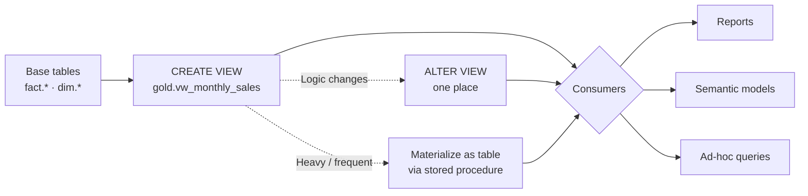

# Unit 3 — Create views for reusable logic

> [!quote] Source
> Microsoft Learn · Path 2 · Module 5 · Unit 3 · "Create views for reusable logic"
> <https://learn.microsoft.com/en-us/training/modules/fabric-transform-data-tsql/3-create-views>

## 🎯 Purpose

Explain what T-SQL **views** are, why they're worth using for transformation logic, how to create and modify them in a Fabric warehouse, and how to **choose between a view and a table** when you need to persist results.

## 💡 What views provide

A view is a **named `SELECT` statement stored as a database object**. When you query a view, the warehouse runs the underlying query and returns the results. Views **don't store data themselves** — they always reflect the current state of the source tables.

> [!success] Three key benefits
> 1. **Reusability** — Define transformation logic once and reference it from multiple queries, reports, and semantic models. When the logic changes, you update the view definition in one place.
> 2. **Abstraction** — Hide complex joins and calculations behind a simple name. Consumers query the view without knowing the underlying table structure, which reduces errors and speeds up onboarding.
> 3. **Security** — Expose only specific columns or filtered rows to different user groups, restricting access to sensitive data without duplicating tables.

## 🏗️ Create a view in a warehouse

Use the `CREATE VIEW` statement. The following example creates a view that joins fact and dimension tables to produce a monthly sales summary:

```sql
CREATE VIEW gold.vw_monthly_sales
AS
SELECT
    d.fiscal_year,
    d.fiscal_month,
    p.category,
    SUM(f.sales_amount) AS total_sales,
    COUNT(*) AS transaction_count
FROM fact.sales AS f
INNER JOIN dim.date AS d
    ON f.date_key = d.date_key
INNER JOIN dim.product AS p
    ON f.product_key = p.product_key
GROUP BY d.fiscal_year, d.fiscal_month, p.category;
```

After creation, any user or tool can query it with:

```sql
SELECT * FROM gold.vw_monthly_sales;
```

If the business later changes how it calculates `total_sales`, you update the view definition and every consumer automatically gets the new logic.

## ✏️ Modify an existing view

Use `ALTER VIEW` with the same syntax:

```sql
ALTER VIEW gold.vw_monthly_sales
AS
SELECT
    d.fiscal_year,
    d.fiscal_month,
    p.category,
    p.subcategory,
    SUM(f.sales_amount) AS total_sales,
    COUNT(*) AS transaction_count
FROM fact.sales AS f
INNER JOIN dim.date AS d
    ON f.date_key = d.date_key
INNER JOIN dim.product AS p
    ON f.product_key = p.product_key
GROUP BY d.fiscal_year, d.fiscal_month, p.category, p.subcategory;
```

> [!info] Schemas in Fabric warehouses
> Fabric warehouses support **custom schemas**. Organize views into schemas like `gold` or `reporting` to separate them from staging and intermediate objects.

## 🎨 Common view patterns

The pattern you choose depends on the type of transformation the view encapsulates:

| Pattern | Purpose | Example |
|---|---|---|
| **Transformation view** | Apply business rules and calculations | Convert currency, classify tiers, compute derived columns |
| **Aggregation view** | Summarize data at a specific grain | Monthly sales by region, daily order counts |
| **Denormalized view** | Flatten joins for reporting tools | Combine fact and dimension tables into a single wide result set |

> [!tip] Save directly from the Visual Query Editor
> You can also save a query as a view directly from the **Visual Query Editor** by selecting the **Save as view** button — useful for persisting a visual query for reuse without writing T-SQL.

## ⚖️ Choose between views and tables

Views and tables serve different purposes. The right choice depends on how the data is consumed and how frequently it changes.

| Factor | Views | Tables |
|---|---|---|
| **Data freshness** | Always current (runs the query live) | Snapshot at load time |
| **Performance** | Depends on query complexity | Already computed — faster results |
| **Storage cost** | No extra storage | Consumes storage |
| **Best for** | Simple to moderate aggregations, security filtering, abstraction | Performance-critical dashboards, large result sets, complex multi-step transforms |

> [!success] Decision rule
> - Straightforward transformation + consumers need **latest data** → **view**.
> - Expensive to compute + **large result** + queried frequently by dashboards → **materialize as a table** (typically via a stored procedure — see [[Unit-4-Build-Stored-Procedures]]).

## 🧠 Visual — view lifecycle



## 🔑 Key takeaways

- A view is a **named, stored `SELECT`** — it doesn't store data, so it's always current.
- **Reusability, abstraction, security** are the three benefits.
- `CREATE VIEW` creates; **`ALTER VIEW`** updates the definition in one place.
- Organize views into **schemas** (`gold`, `reporting`) to separate them from staging and intermediate objects.
- Three common patterns: **transformation view**, **aggregation view**, **denormalized view**.
- Choose **views** for live, low-cost transformations; choose **tables** for performance-critical dashboards or large materialized results.
- The **stored procedure** (next unit) is the bridge that materializes view-shaped results into tables in a repeatable way.

## 🧭 Next

→ [[Unit-4-Build-Stored-Procedures]]
← [[Unit-2-Transform-Queries]]
↑ [[_MOC]]