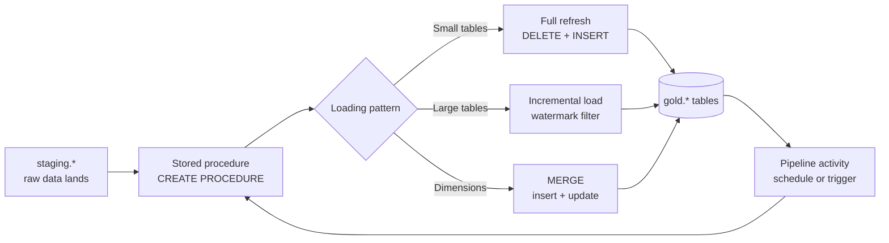

# Unit 4 — Build stored procedures

> [!quote] Source
> Microsoft Learn · Path 2 · Module 5 · Unit 4 · "Build stored procedures"
> <https://learn.microsoft.com/en-us/training/modules/fabric-transform-data-tsql/4-build-stored-procedures>

## 🎯 Purpose

Explain what stored procedures add beyond views — **write operations, parameters, multi-step logic, error handling** — and walk through the **three common loading patterns** (full refresh, incremental load, merge/upsert) plus how Data Factory pipelines in Fabric can call them on a schedule.

## 💡 What stored procedures provide

A stored procedure is a **named block of T-SQL that you save in the warehouse and execute on demand**. Stored procedures extend what views can do in four important ways:

| Capability | View | Stored procedure |
|---|---|---|
| Read-only `SELECT` | ✅ | ✅ |
| `INSERT`, `UPDATE`, `DELETE`, `CREATE TABLE` | ❌ | ✅ |
| Parameters | ❌ | ✅ |
| Multi-statement sequencing | ❌ | ✅ |
| `TRY...CATCH` error handling | ❌ | ✅ |

> [!success] Why procedures matter
> They let you **materialize** transformation results into tables, accept parameters to make logic flexible, run multi-step workflows in a controlled order, and recover gracefully from errors.

## 🏗️ Create a stored procedure

Use `CREATE PROCEDURE`. The following example creates a procedure that refreshes a monthly sales summary table for a specific period:

```sql
CREATE PROCEDURE gold.usp_refresh_monthly_sales
    @year INT,
    @month INT
AS
BEGIN
    -- Remove existing data for the target period
    DELETE FROM gold.monthly_sales
    WHERE fiscal_year = @year AND fiscal_month = @month;

    -- Insert fresh aggregated data
    INSERT INTO gold.monthly_sales
        (fiscal_year, fiscal_month, category, total_sales, transaction_count)
    SELECT
        d.fiscal_year,
        d.fiscal_month,
        p.category,
        SUM(f.sales_amount),
        COUNT(*)
    FROM fact.sales AS f
    INNER JOIN dim.date AS d
        ON f.date_key = d.date_key
    INNER JOIN dim.product AS p
        ON f.product_key = p.product_key
    WHERE d.fiscal_year = @year AND d.fiscal_month = @month
    GROUP BY d.fiscal_year, d.fiscal_month, p.category;
END;
```

Run it with `EXEC` and parameter values:

```sql
EXEC gold.usp_refresh_monthly_sales @year = 2024, @month = 6;
```

Each execution **deletes the existing rows for the specified month and replaces them with freshly aggregated data**. The parameters let you target a specific period without modifying the procedure itself.

> [!tip] Naming convention
> Use a `usp_` (user stored procedure) prefix to distinguish your custom procedures from system procedures. It makes them easier to identify and manage in the Explorer pane.

## ⚙️ Choose a loading pattern

Depending on data volume and refresh requirements, choose from these common patterns:

| Pattern | Description | When to use |
|---|---|---|
| **Full refresh** | Delete all rows and reload the entire table | Small tables or when source data changes unpredictably |
| **Incremental load** | Process only new or changed data since the last run | Large tables where most data doesn't change between refreshes |
| **Merge (upsert)** | Insert new rows and update existing ones in a single operation | Dimension tables that need to stay current with source changes |

### 🔄 Full refresh

Simplest pattern: delete everything and reload. Works well for small to medium tables where the cost of a complete reload is acceptable. The `usp_refresh_monthly_sales` example above is a **partitioned full refresh** — full refresh scoped to a single month via parameters.

### 📥 Incremental load

More efficient for large tables. Typically relies on a **watermark column** (like `modified_date` or a row version) to identify rows that changed since the last run.

### 🔀 Merge (upsert)

Uses a `MERGE` statement to handle inserts and updates together in a single atomic operation:

```sql
CREATE PROCEDURE staging.usp_merge_customers
AS
BEGIN
    MERGE dim.customer AS target
    USING staging.customers AS source
        ON target.customer_id = source.customer_id
    WHEN MATCHED THEN
        UPDATE SET
            target.customer_name = source.customer_name,
            target.segment = source.segment,
            target.region = source.region
    WHEN NOT MATCHED THEN
        INSERT (customer_id, customer_name, segment, region)
        VALUES (source.customer_id, source.customer_name,
                source.segment, source.region);
END;
```

This pattern is **especially useful for dimension tables** because a single execution handles both new records and updates to existing ones.

## 🔌 Run stored procedures from pipelines

You don't have to run stored procedures manually every time new data arrives. **Data Factory pipelines in Fabric** can call stored procedures as activities in an automated data flow. This lets you:

- Schedule **nightly refresh** after new data lands in staging tables.
- Trigger a **cascade** of procedures that refresh tables in dependency order.

> [!info] Pipeline orchestration
> A later module covers Data Factory pipeline orchestration of stored procedures in more detail.

## 🧠 Visual — the stored procedure role



## 🔑 Key takeaways

- Stored procedures **write data**, accept **parameters**, run **multi-step logic**, and support **`TRY...CATCH`**.
- Use `CREATE PROCEDURE` to create; use `EXEC` with named parameters to run.
- The `usp_` prefix keeps your custom procedures easy to find in Explorer.
- **Three loading patterns**:
  - **Full refresh** — delete + reload; simple, fine for small/medium tables.
  - **Incremental load** — watermark-based; efficient for large tables.
  - **`MERGE`** — single atomic upsert; ideal for dimension tables.
- **Data Factory pipelines** in Fabric can execute stored procedures as activities for scheduled, automated refreshes.

## 🧭 Next

→ [[Unit-5-Implement-Dimensional-Tables]]
← [[Unit-3-Create-Views]]
↑ [[_MOC]]