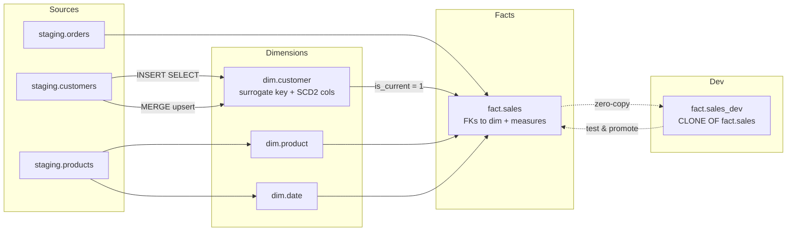

# Unit 5 — Implement dimensional tables

> [!quote] Source
> Microsoft Learn · Path 2 · Module 5 · Unit 5 · "Implement dimensional tables"
> <https://learn.microsoft.com/en-us/training/modules/fabric-transform-data-tsql/5-implement-dimensional-tables>

## 🎯 Purpose

Apply the techniques from [[Unit-2-Transform-Queries]] through [[Unit-4-Build-Stored-Procedures]] to **build the tables that hold your transformed data** — fact tables for measures and dimension tables for descriptive attributes — and use **table clones** for safe development and testing.

## 🧩 Dimensional modeling recap

Dimensional modeling organizes data into:

- **Fact tables** — measures and metrics (sales amount, quantity, count).
- **Dimension tables** — descriptive attributes (customer name, product category, date hierarchy).

The structure is **optimized for analytical queries and semantic models**.

## 🏷️ Create dimension tables

Dimension tables hold the descriptive attributes that give context to your measures. Each dimension table uses a **surrogate key** (an autogenerated integer) that fact tables reference instead of the natural business key.

Using surrogate keys provides several benefits:

- **Compact integers** that join efficiently.
- **Insulate** the warehouse from source-system key changes.
- **Support SCD patterns** where the same business entity has multiple historical records.

```sql
CREATE TABLE dim.customer (
    customer_key INT IDENTITY(1,1),
    customer_id NVARCHAR(20) NOT NULL,
    customer_name NVARCHAR(100),
    segment NVARCHAR(50),
    region NVARCHAR(50),
    effective_date DATE,
    end_date DATE,
    is_current BIT DEFAULT 1
);
```

| Column | Purpose |
|---|---|
| `customer_key INT IDENTITY(1,1)` | Auto-generated **surrogate key** |
| `customer_id` | **Natural business key** from the source system |
| `customer_name`, `segment`, `region` | Descriptive attributes |
| `effective_date`, `end_date`, `is_current` | **SCD Type 2 tracking** — preserve history instead of overwriting |

When a customer's attributes change, you set `end_date` and `is_current = 0` on the existing row, then insert a new row with the updated values.

> [!info] Schema conventions
> Organize dimensional tables using schemas that reflect their role. Common conventions include `dim` for dimension tables, `fact` for fact tables, and `staging` for raw source data.

## 📊 Create fact tables

Fact tables store the **quantitative data** — the numbers you aggregate in reports. Each row represents a business event (a sale, a shipment) and contains foreign keys that reference dimension tables plus one or more numeric measures.

```sql
CREATE TABLE fact.sales (
    sales_key INT IDENTITY(1,1),
    date_key INT NOT NULL,
    customer_key INT NOT NULL,
    product_key INT NOT NULL,
    quantity INT,
    unit_price DECIMAL(10,2),
    sales_amount DECIMAL(12,2)
);
```

| Column | Purpose |
|---|---|
| `sales_key INT IDENTITY(1,1)` | Surrogate key on the fact row |
| `date_key`, `customer_key`, `product_key` | **Foreign keys** to the corresponding dimension tables |
| `quantity`, `unit_price`, `sales_amount` | **Measures** that get aggregated in queries and reports |

> [!important] No foreign-key enforcement
> Fabric warehouses **don't enforce foreign-key constraints** at the engine level. Define your key relationships through **naming conventions** and **loading logic** to maintain referential integrity between fact and dimension tables. This pattern is common in cloud data warehouses where the query engine optimizes joins without needing constraint enforcement.

## ⬇️ Load dimension tables

### Initial load — `INSERT ... SELECT`

```sql
INSERT INTO dim.customer
    (customer_id, customer_name, segment, region, effective_date, is_current)
SELECT
    customer_id,
    customer_name,
    segment,
    region,
    CAST(GETDATE() AS DATE),
    1
FROM staging.customers;
```

### Ongoing updates — SCD Type 1 vs SCD Type 2

| SCD type | Behavior | When to use |
|---|---|---|
| **SCD Type 1 (overwrite)** | Use `MERGE` to update existing rows in place. Simpler but **doesn't preserve history**. | Historical values aren't important (e.g., fix a misspelled customer name). |
| **SCD Type 2 (history)** | Mark the current row as expired (`is_current = 0`, `end_date = today`), then insert a new row with updated values. **Preserves full change history.** | Trend analysis where you need to know what a customer's segment was at the time of a past transaction. |

> [!warning] Pick deliberately
> SCD Type 1 is faster and simpler. SCD Type 2 costs more storage and load complexity but unlocks historical analysis. Don't conflate them in the same column.

## ⬇️ Load fact tables

Fact table loading **joins staging data with dimension tables to look up the correct surrogate keys**. This step translates natural business keys (like customer IDs from the source system) into the surrogate keys used in the dimensional model.

```sql
INSERT INTO fact.sales
    (date_key, customer_key, product_key, quantity, unit_price, sales_amount)
SELECT
    d.date_key,
    c.customer_key,
    p.product_key,
    s.quantity,
    s.unit_price,
    s.quantity * s.unit_price
FROM staging.orders AS s
INNER JOIN dim.date AS d
    ON s.order_date = d.calendar_date
INNER JOIN dim.customer AS c
    ON s.customer_id = c.customer_id
    AND c.is_current = 1
INNER JOIN dim.product AS p
    ON s.product_id = p.product_id;
```

> [!info] Why the `is_current = 1` filter?
> The join to `dim.customer` filters on `is_current = 1` to ensure each fact row links to the **current** version of the customer record. If you need **historical accuracy** — linking to the customer record active at the time of the order — match on the **effective date range** instead (`s.order_date BETWEEN c.effective_date AND c.end_date`).

## 🧪 Use table clones for development and testing

When developing transformation logic, you don't want to risk corrupting production tables. Fabric supports **table clones**, which create a **zero-copy reference** to an existing table's data at a point in time:

```sql
CREATE TABLE fact.sales_dev AS CLONE OF fact.sales;
```

| Clone behavior | Detail |
|---|---|
| Initial state | Shares the same underlying data files as the source — **no duplicate storage** |
| After modifications | Only changed data is written; storage stays efficient |
| Use cases | Develop transformation logic; create snapshots before risky transforms for **rollback** |
| Promotion path | After validating against the clone, apply the same logic to the production table |

## 🧠 Visual — dimensional loading pipeline



## 🔑 Key takeaways

- **Dimension tables** carry descriptive attributes and use **surrogate keys** (`IDENTITY`) instead of natural keys.
- **Fact tables** carry measures and reference dimension keys (no FK enforcement — use naming + loading logic).
- **`effective_date` / `end_date` / `is_current`** columns enable **SCD Type 2** history tracking.
- **SCD Type 1** = overwrite in place (`MERGE`). **SCD Type 2** = expire old row, insert new one.
- **Fact loads** join staging to dimensions to translate natural keys into surrogate keys; the `is_current = 1` filter pins fact rows to the current dimension version.
- **Table clones** (`CREATE TABLE ... AS CLONE OF ...`) provide zero-copy development sandboxes and rollback points.

## 🧭 Next

→ [[Unit-6-Exercise]]
← [[Unit-4-Build-Stored-Procedures]]
↑ [[_MOC]]