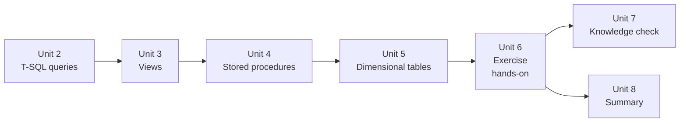

# Unit 6 — Exercise: Transform data with T-SQL

> [!quote] Source
> Microsoft Learn · Path 2 · Module 5 · Unit 6 · "Exercise: Transform data with T-SQL"
> <https://learn.microsoft.com/en-us/training/modules/fabric-transform-data-tsql/6-exercise>

## 🎯 Purpose

A **45-minute hands-on lab** that consolidates [[Unit-2-Transform-Queries]] through [[Unit-5-Implement-Dimensional-Tables]]. You write T-SQL queries to filter, join, and aggregate staging data in a Fabric warehouse, create a view for reusable transformation logic, build a stored procedure with parameters for repeatable processing, and create and load dimensional tables.

> [!warning] Prerequisites
> You need access to a **Fabric-enabled workspace** to complete this exercise. For information about a trial license, see [Getting started with Fabric](https://learn.microsoft.com/en-us/fabric/get-started/fabric-trial).
>
> This lab takes approximately **45 minutes** to complete.

## 🔬 What the lab does

The exercise walks you through an end-to-end T-SQL transformation pipeline in a Fabric warehouse:

1. **Write T-SQL queries** against staging tables — **filter** rows, **join** staging with dimension tables, **aggregate** with `GROUP BY`/`HAVING`, and apply a **window function** (running total or ranking).
2. **Create a view** that encapsulates the reusable transformation logic — a queryable object reports and semantic models can reference by name.
3. **Build a stored procedure** that accepts parameters (e.g., year/month) and automates the refresh of a summary table using one of the loading patterns from [[Unit-4-Build-Stored-Procedures]].
4. **Create dimensional tables** (`dim.customer`, `fact.sales`) with surrogate keys and SCD Type 2 support columns.
5. **Load the dimensional tables** from staging data using `INSERT ... SELECT` for initial loads and `MERGE` for ongoing SCD Type 1 updates.

> [!info] Format note
> Per the task specification, this unit is a **summary of what the lab does, not the lab itself**. The full step-by-step lab lives behind the [launch exercise link](https://go.microsoft.com/fwlink/?linkid=2361022) on the Microsoft Learn page.

## 🔑 Skills practiced

| Skill | From unit |
|---|---|
| Filter, join, and aggregate with T-SQL | [[Unit-2-Transform-Queries]] |
| Apply a window function for running totals / rankings | [[Unit-2-Transform-Queries]] |
| Create a `CREATE VIEW` for reusable logic | [[Unit-3-Create-Views]] |
| Build a parameterized `CREATE PROCEDURE` | [[Unit-4-Build-Stored-Procedures]] |
| Choose and implement a loading pattern (full refresh / merge) | [[Unit-4-Build-Stored-Procedures]] |
| Define `dim.*` and `fact.*` tables with surrogate keys | [[Unit-5-Implement-Dimensional-Tables]] |
| Load dimensions and facts from staging | [[Unit-5-Implement-Dimensional-Tables]] |

## 🧠 Visual — where this lab sits in the module

## 🔗 Launch the exercise

> [!success] Launch
> [Launch the exercise on Microsoft Learn →](https://go.microsoft.com/fwlink/?linkid=2361022)

## 🧭 Next

→ [[Unit-7-Knowledge-Check]]
← [[Unit-5-Implement-Dimensional-Tables]]
↑ [[_MOC]]