# Unit 8 — Summary

> [!quote] Source
> Microsoft Learn · Path 2 · Module 5 · Unit 8 · "Summary"
> <https://learn.microsoft.com/en-us/training/modules/fabric-transform-data-tsql/8-summary>

## 📝 Verbatim recap

> Your organization needed to transform raw staging data into clean, structured datasets that analysts and downstream systems can rely on. In this module, you applied T-SQL techniques in a Fabric warehouse to address that challenge.
>
> You started by writing queries to filter, join, aggregate, and reshape data using the SQL query editor and the Visual Query Editor. You then created views to encapsulate reusable transformation logic, hiding complexity behind simple, queryable objects. With stored procedures, you automated repeatable data processing tasks using parameterized logic and loading patterns like full refresh, incremental load, and merge. Finally, you implemented dimensional tables that form the foundation for semantic models and analytics.
>
> These T-SQL transformation patterns give you a complete, repeatable approach to preparing warehouse data. The dimensional model you built is ready to serve as the source for Power BI semantic models, cross-database queries, and AI workloads.

## 🧠 Key takeaway diagram

```mermaid
flowchart LR
    subgraph Engines["T-SQL Surfaces"]
        SQLE[SQL Query Editor<br/>in warehouse explorer]
        VQE[Visual Query Editor<br/>drag-and-drop]
        EXT[SSMS / VS Code MSSQL]
    end

    subgraph Capabilities["What T-SQL Can Do in a Fabric Warehouse"]
        RW[Full read-write<br/>SELECT · INSERT · UPDATE · DELETE · CTAS]
        LAKE[Lakehouse SQL endpoint<br/>read-only Delta query]
    end

    subgraph Transform["Transform Layer"]
        Q[Queries<br/>filter · project · CASE · CAST<br/>JOIN · GROUP BY · HAVING]
        WIN[Window functions<br/>ROW_NUMBER · SUM OVER · LAG · LEAD]
        CTE[CTEs<br/>named, chained steps]
    end

    subgraph Reuse["Reuse & Automation"]
        VW[Views<br/>CREATE / ALTER VIEW<br/>reuse · abstract · secure]
        SP[Stored procedures<br/>CREATE PROCEDURE<br/>EXEC with params]
        PT[Loading patterns<br/>full refresh · incremental · MERGE]
        ERR[TRY CATCH<br/>error handling]
    end

    subgraph Model["Dimensional Model"]
        DIM[Dimension tables<br/>surrogate keys + SCD2 cols]
        FAC[Fact tables<br/>FKs to dims + measures]
        NOCK[No FK enforcement<br/>naming + loading logic]
        CL[Table clones<br/>zero-copy dev & test]
    end

    subgraph Consume["Downstream Consumers"]
        REP[Reports · Power BI]
        SM[Semantic models]
        XD[Cross-database queries]
        AI[AI workloads]
    end

    Engines --> RW
    Engines --> LAKE
    RW --> Transform
    Transform --> Reuse
    Reuse --> Model
    Model --> Consume
    LAKE -.->|read-only| Consume
```

## 🔑 One-paragraph synthesis

A Fabric **warehouse** gives you full read-write T-SQL — `SELECT`, `INSERT`, `UPDATE`, `DELETE`, and `CREATE TABLE AS SELECT` — while a **lakehouse SQL analytics endpoint** exposes the same query language in read-only form against Delta tables. Inside the warehouse you build a four-step transformation layer: **queries** that filter, project, calculate, null-handle, cast, join, aggregate, apply window functions, and chain via CTEs; **views** that `CREATE VIEW` once and `ALTER VIEW` in one place to give reusability, abstraction, and security across reports and semantic models; **stored procedures** that automate the work with parameters, multi-step logic, and `TRY...CATCH`, applying the right **loading pattern** — full refresh, incremental load, or `MERGE` upsert — for the data volume and change profile; and a **dimensional model** of surrogate-keyed `dim.*` tables with SCD Type 2 columns and `fact.*` tables that reference them (with naming conventions standing in for unenforced FKs). **Table clones** (`AS CLONE OF`) let you develop and test this logic against production data with zero-copy overhead. The dimensional output becomes the source for **Power BI semantic models, cross-database queries, and AI workloads**.

## 📚 Learn more (Microsoft docs)

- [Query the warehouse in Microsoft Fabric](https://learn.microsoft.com/en-us/fabric/data-warehouse/query-warehouse)
- [Tables in Fabric Data Warehouse](https://learn.microsoft.com/en-us/fabric/data-warehouse/tables)
- [Clone tables in Fabric Data Warehouse](https://learn.microsoft.com/en-us/fabric/data-warehouse/clone-table)

## 🧭 Done with Module 5

← [[Unit-7-Knowledge-Check]]
↑ [[_MOC]]

**Module outcome:** Transform warehouse data in Microsoft Fabric using T-SQL — query, view, and stored-procedure patterns layered on top of a dimensional model — producing clean, structured datasets that feed Power BI semantic models, cross-database queries, and AI workloads.