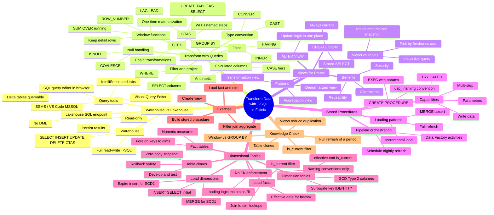

# Module — Transform data using T-SQL in Microsoft Fabric

> [!info] Module map
> Path 2 Module 5 in the **Fabric Analytics Engineer** (DP-600) track. This module is the **T-SQL transformation deep-dive**: how to use T-SQL inside a Fabric warehouse (and the read-only SQL analytics endpoint of a lakehouse) to filter, join, aggregate, and reshape data — then encapsulate that logic in views, automate it with stored procedures, and land it in fact/dimension tables ready for semantic models and analytics.

## 🎯 Learning objectives (synthesized from unit-level goals)

By the end of this module you should be able to:

1. **Differentiate** T-SQL capabilities between a Fabric **warehouse** (full read-write — `SELECT`, `INSERT`, `UPDATE`, `DELETE`, `CTAS`) and a **lakehouse SQL analytics endpoint** (read-only query of Delta tables).
2. **Transform** data with T-SQL queries — filter, project, calculate, handle nulls, cast types, join, aggregate, apply window functions, and structure complex logic with CTEs.
3. **Persist** transformation results with `CREATE TABLE AS SELECT` (CTAS) for one-time materializations.
4. **Create views** that encapsulate reusable transformation logic — for reusability, abstraction, and row/column-level security.
5. **Choose between views and tables** based on data freshness, performance, storage cost, and consumption patterns.
6. **Build stored procedures** with parameters, multi-step logic, and `TRY...CATCH` error handling to automate repeatable transformations.
7. **Apply loading patterns** — full refresh, incremental load, and `MERGE` (upsert) — based on data volume and change frequency.
8. **Implement dimensional tables** — surrogate-keyed dimension tables, fact tables with foreign keys to dimensions, and SCD Type 1 vs. SCD Type 2 handling.
9. **Use table clones** to develop and test transformation logic against production data with minimal storage overhead.

## 🧠 Module mind map

> [!tip] How to use
> The mind map below is duplicated as a standalone Mermaid file (`Module-Mind-Map.md`) you can open in Obsidian's Mermaid preview or the [Mermaid Live Editor](https://mermaid.live). It is the **single-page view** of the entire module.

## 📑 Unit breakdown

| # | Unit | XP | Minutes | Focus |
|---|------|----|---------|-------|
| 1 | [Introduction](./Unit-1-Introduction.md) | 100 | 2 | Why T-SQL in Fabric warehouses matters |
| 2 | [Transform data with T-SQL queries](./Unit-2-Transform-Queries.md) | 100 | 10 | Filter, join, aggregate, window, CTE, CTAS |
| 3 | [Create views for reusable logic](./Unit-3-Create-Views.md) | 100 | 6 | `CREATE VIEW`, `ALTER VIEW`, patterns, views vs tables |
| 4 | [Build stored procedures](./Unit-4-Build-Stored-Procedures.md) | 100 | 8 | `CREATE PROCEDURE`, parameters, loading patterns |
| 5 | [Implement dimensional tables](./Unit-5-Implement-Dimensional-Tables.md) | 100 | 8 | Fact/dim schema, surrogate keys, SCD, table clones |
| 6 | [Exercise: Transform data with T-SQL](./Unit-6-Exercise.md) | 100 | 45 | Hands-on lab |
| 7 | [Knowledge check](./Unit-7-Knowledge-Check.md) | 200 | 3 | 5 multiple-choice questions |
| 8 | [Summary](./Unit-8-Summary.md) | 100 | 2 | Recap + learn-more links |

**Total: 900 XP · ~84 minutes (~1 hr 24 min)**

## 🔗 Knowledge-check answers (unit 7)

Microsoft Learn does not display the correct answers; the table below is derived from the unit content.

| # | Question topic | Correct answer |
|---|----------------|----------------|
| 1 | Running total that keeps every row | **A window function with `SUM ... OVER`** |
| 2 | Same complex join/aggregation used by many reports | **Define the query once as a view, reference by name** |
| 3 | Procedure that deletes a period's rows and inserts fresh aggregates | **Full refresh of a partition** |
| 4 | Why join staging.orders to `dim.customer` filtered by `is_current = 1` | **Links each fact row to the current version of the dimension record** |
| 5 | Test transforms against production data with minimal storage | **Create a table clone of the production table** |

See [[Unit-7-Knowledge-Check]] for full reasoning on each answer.

## 🧭 Downstream links

- [[Unit-1-Introduction]] · [[Unit-2-Transform-Queries]] · [[Unit-3-Create-Views]] · [[Unit-4-Build-Stored-Procedures]] · [[Unit-5-Implement-Dimensional-Tables]] · [[Unit-6-Exercise]] · [[Unit-7-Knowledge-Check]] · [[Unit-8-Summary]]
- [[Module-Mind-Map]]
- Sibling module — [[../04-Path2-Module4-Notebooks-Spark/_MOC|Module 4: Transform data using notebooks]]
- Parent MOC — `../02-Study-Guide-Index/_MOC.md`

## 📚 External references

- Microsoft Learn module page: <https://learn.microsoft.com/en-us/training/modules/fabric-transform-data-tsql/>
- [Query the warehouse in Microsoft Fabric](https://learn.microsoft.com/en-us/fabric/data-warehouse/query-warehouse)
- [Tables in Fabric Data Warehouse](https://learn.microsoft.com/en-us/fabric/data-warehouse/tables)
- [Clone tables in Fabric Data Warehouse](https://learn.microsoft.com/en-us/fabric/data-warehouse/clone-table)