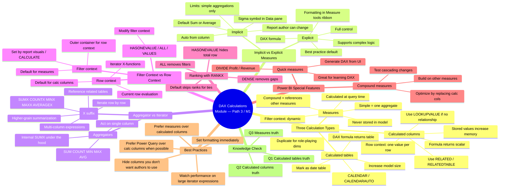

# Module — Create DAX calculations in semantic models · Mind Map

## 🧭 How to view

- **Obsidian**: open this file, Obsidian will render the Mermaid block natively.
- **Web**: paste into <https://mermaid.live> for an editable SVG.
- **Export**: use the Mermaid CLI (`mmdc`) to render PNG/SVG.

## 🔗 Related

- [[_MOC]] — full module index
- [[Unit-1-Introduction]] · [[Unit-2-Calculated-Tables]] · [[Unit-3-Calculated-Columns]] · [[Unit-4-Implicit-Measures]] · [[Unit-5-Explicit-Measures]] · [[Unit-6-Iterator-Functions]] · [[Unit-7-Exercise]] · [[Unit-8-Knowledge-Check]] · [[Unit-9-Summary]]