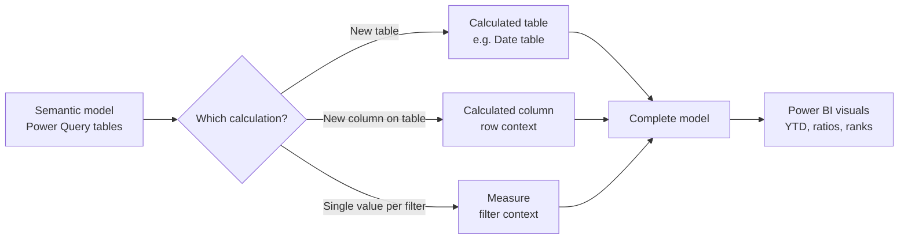

# Unit 1 — Introduction

## 🎯 Why this matters

When you first build a semantic model by applying Power Query queries, the model contains **tables and columns only**. That's rarely enough to answer business questions. You might need extra relationships, hierarchies, model properties — and most importantly, **calculations** that summarise the data in ways a single column can't.

> [!quote] From the module
> "You might need to create or adjust model relationships, create other tables or columns, add hierarchies, or set model properties. You might also identify the need for calculations to summarize the model data, especially when the requirement can't be achieved by summarizing a single column. For example, you might want to calculate year-to-date (YTD) sales revenue, which requires special time filters."

DAX is the language that fills the gap between *"here is the data"* and *"here is the answer."*

## 🧱 The three DAX calculation types

> [!info] What you can add with DAX
> You can use **Data Analysis Expressions (DAX)** to add three types of calculations to your semantic model:

| Type | What it produces | Typical use |
|------|------------------|-------------|
| **Calculated table** | A new table, built by a DAX formula that returns a table object | Date tables, role-playing dimensions, what-if parameters |
| **Calculated column** | A new column on an existing table, evaluated row by row | Fiscal labels, sortable keys, values derived from `RELATED` |
| **Measure** | A single value calculated at query time from filter context | Sales totals, YTD revenue, profit margin, ratio of month-over-year |

## 🔑 Key terms (flashcards)

- **DAX (Data Analysis Expressions)** — Formula language for Power BI, Analysis Services, and Power Pivot.
- **Calculated table** — A table in the model defined by a DAX expression that returns a table.
- **Calculated column** — A column on an existing table defined by a DAX expression that returns a scalar per row.
- **Measure** — A DAX formula evaluated at query time, returning a single value in the current filter context.
- **Filter context** — The set of filters applied by visuals, slicers, or `CALCULATE` when a measure is evaluated.
- **Row context** — The "current row" concept used when evaluating calculated columns and iterator X-functions.

## 🧭 Module roadmap

| # | Unit | What you learn |
|---|------|----------------|
| 2 | [[Unit-2-Calculated-Tables]] | Duplicate tables, `CALENDARAUTO`, mark-as-date-table |
| 3 | [[Unit-3-Calculated-Columns]] | Fiscal year/quarter, row context, `RELATED`/`LOOKUPVALUE` |
| 4 | [[Unit-4-Implicit-Measures]] | Auto-summarization, sigma symbol, defaults and limits |
| 5 | [[Unit-5-Explicit-Measures]] | Simple, compound, Quick measures; calc-column-vs-measure comparison |
| 6 | [[Unit-6-Iterator-Functions]] | `SUMX`/`AVERAGEX`/`RANKX`, `ALL`/`VALUES`/`HASONEVALUE` |
| 7 | [[Unit-7-Exercise]] | Hands-on lab |
| 8 | [[Unit-8-Knowledge-Check]] | 3 knowledge-check questions |
| 9 | [[Unit-9-Summary]] | Recap + further reading |

## 🧭 Next

→ [[Unit-2-Calculated-Tables]]
↑ [[_MOC]]