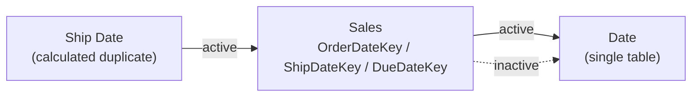
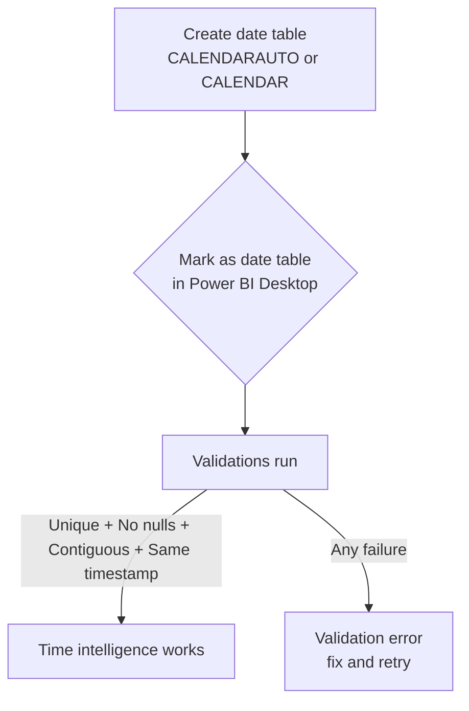

# Unit 2 — Create calculated tables

## 🎯 Why this matters

A **calculated table** is created with a DAX formula that returns a **table object**, letting you duplicate or transform existing model data into a new table. They solve modelling problems Power Query can't solve cleanly while the model is live:

- **Role-playing dimensions** — when one table needs multiple relationships (e.g. `Date` → `Sales` by order date, ship date, due date), but only one relationship can be **active** at a time.
- **Date tables** — required for time intelligence functions, which don't work with regular date columns.

## 🧩 The role-playing-dimension problem

The `Sales` table typically stores sales data by **order date**, **ship date**, and **due date**, producing three relationships to the `Date` table. Only one relationship is **active** (solid line); the other two are **inactive** (dashed line).



> [!warning] Power BI filter rule
> Filters applied to `Date` only filter `Sales` by **order date** (the active relationship). To filter by ship date, you need a **separate `Date`-like table** that has its own active relationship to `Sales`.

## 🧪 Duplicate a table

The simplest calculated table duplicates an existing table to create a role-playing dimension:

```dax
Ship Date = 'Date'
```

> [!tip] What you get
> A new table named `Ship Date` with the same columns and rows as `Date`. When `Date` is refreshed, `Ship Date` is recalculated to stay synchronised.

### Configuring the duplicate

You must apply any custom configurations you want carried over — they're **not** inherited. For a `Ship Date` duplicate you'd typically:

- Rename `Fiscal Year` → `Ship Fiscal Year`.
- Sort `Ship Full Date` by `Ship Date`.
- Hide the `MonthKey` column.

> [!warning] Cost of calculated tables
> Calculated tables **increase the model's storage size** and can prolong data refresh times, especially when they depend on other tables. The module explicitly notes: *"While duplicate tables solve this challenge, there are other more performant solutions. We cover this concept again when discussing measures later in this module."* (The more performant solution is usually `USERELATIONSHIP` inside a measure.)

## 📅 Create a date table

Date tables are required to apply **time intelligence** filters. The recommended DAX function is [`CALENDARAUTO`](https://learn.microsoft.com/en-us/dax/calendarauto-function-dax/):

```dax
Due Date = CALENDARAUTO(6)
```

The single argument is the **last month of the financial year**. Passing `6` sets **June** as the year-end, giving an Australian-style July-to-June fiscal year.

> [!info] How `CALENDARAUTO` works
> 1. Scans every date and date/time column in the model.
> 2. Finds the earliest and latest dates in the data.
> 3. Generates a complete set of dates that **spans all years** in the data.
> 4. The argument specifies your fiscal year-end month.

| Example data span | Function returns |
|------------------|------------------|
| Earliest: Oct 15 2021, Latest: Jun 15 2022 | Dates from **Jul 1 2021 → Jun 30 2022** (complete fiscal years) |

> [!tip] `CALENDAR` for explicit ranges
> The [`CALENDAR`](https://learn.microsoft.com/en-us/dax/calendar-function-dax/) function lets you specify explicit start and end dates — either as static values or as expressions based on model data. Use it when you want full control over the date range (e.g. for forecasts that extend beyond the data).

### Mark as a date table

> [!important] Required step
> Once you create a date table, you must **Mark it as a date table** in Power BI Desktop. Without this setting, time-intelligence DAX functions will not work against it.

When you mark a column as a date, Power BI Desktop validates that the column data contains:

- ✅ **Unique values** — no duplicates.
- ✅ **No null values**.
- ✅ **Contiguous date values** from beginning to end.
- ✅ **Same timestamp** across each value for date/time data.



> [!note] Custom table vs auto date/time
> You must **either** use a custom date table **or** enable the built-in **auto date/time** feature to use time intelligence. Auto date/time has limited values and can't be customised — one reason to prefer a custom date table.

## 🔑 Key terms (flashcards)

- **Calculated table** — A model table defined by a DAX expression that returns a table.
- **Role-playing dimension** — A dimension that needs to join to a fact table on multiple columns (e.g. order/ship/due date), solved by duplicating the dimension table.
- **Active relationship** — The single relationship Power BI uses for filter propagation; others are inactive.
- **`CALENDARAUTO(fiscal_year_end_month)`** — Generates a date table that spans all years present in the model, ending the fiscal year in the given month.
- **`CALENDAR(start, end)`** — Generates a date table for an explicit date range.
- **Mark as date table** — Power BI Desktop setting that unlocks time-intelligence functions; validates uniqueness, no-null, contiguity, and timestamp uniformity.

## 🧭 Module context

| Why this exists | Where you go next |
|-----------------|-------------------|
| Solves the multi-relationship problem | Performance alternative is in [[Unit-6-Iterator-Functions]] (`USERELATIONSHIP`) |
| Generates date tables for YTD/QTD/MTD | Those time-intelligence functions come in a later module |
| `CALENDARAUTO` is the easiest default | `CALENDAR` when you need explicit control |

## 🧭 Next

→ [[Unit-3-Calculated-Columns]]
← [[Unit-1-Introduction]]
↑ [[_MOC]]