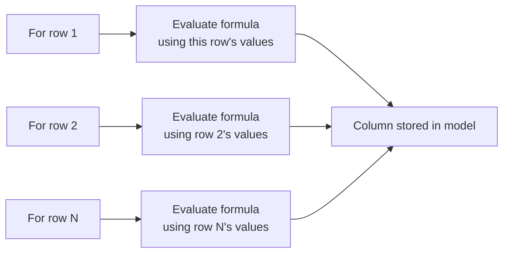
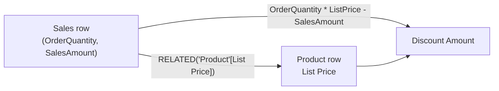

# Unit 3 — Create calculated columns

## 🎯 Why this matters

Sometimes you need more columns than exist in the source data. Ideally you add them **at the source** (easier maintenance, reusable across models). When that isn't possible, your two in-Power-BI options are:

| Option | Where created | Preferred when |
|--------|---------------|----------------|
| **Custom column** | Power Query Editor | You want compact storage and optimal load performance |
| **Calculated column** | Semantic model (DAX) | The formula depends on summarised model data or needs DAX-only modelling functions (`RELATED`, `RELATEDTABLE`, parent-child) |

> [!warning] Cost
> Calculated columns in **Import-mode** models increase storage size and can prolong refresh times — especially when they depend on other tables. Be cautious and ask: *"Could a measure do this instead?"*

## 🧮 Worked example — fiscal columns on the `Due Date` table

This section walks through five calculated columns that support fiscal analysis on a `Due Date` calculated table (created in [[Unit-2-Calculated-Tables]]).

### 1. `Due Fiscal Year`

> [!quote] Goal
> Concatenate `"FY"` with the year, but increment the year by **one** for dates in the **second half** of the calendar year (because the fiscal year starts in July).

```dax
Due Fiscal Year =
"FY"
    & YEAR('Due Date'[Due Date])
        + IF(
            MONTH('Due Date'[Due Date]) > 6,
            1
        )
```

> [!info] How Power BI evaluates this
> 1. The **addition operator (+)** is evaluated before the **text concatenation operator (&)**.
> 2. [`YEAR`](https://learn.microsoft.com/en-us/dax/year-function-dax/) returns the calendar-year integer of the due date.
> 3. [`IF`](https://learn.microsoft.com/en-us/dax/if-function-dax/) returns `1` when the due-date month is 7-12 (July-December) and `BLANK()` otherwise. (Because the Adventure Works fiscal year is July-June, the last six months of the calendar year use the **next** calendar year as their fiscal year.)
> 4. `YEAR(...)` is added to the `IF` result. `BLANK` is **implicitly converted to 0** so the addition succeeds.
> 5. `"FY"` is concatenated with that integer, which is implicitly converted to text.

### 2. `Due Fiscal Quarter`

Assigns a fiscal quarter per the July-start fiscal year (Q1 = Jul-Sep). It **appends** `" Q"` and the quarter number to the **fiscal year label**.

```dax
Due Fiscal Quarter =
'Due Date'[Due Fiscal Year] & " Q"
    & IF(
        MONTH('Due Date'[Due Date]) <= 3,
        3,
        IF(
            MONTH('Due Date'[Due Date]) <= 6,
            4,
            IF(
                MONTH('Due Date'[Due Date]) <= 9,
                1,
                2
            )
        )
    )
```

> [!tip] Notice the dependency
> This formula **chains** off the previously-created `Due Fiscal Year` column. Calculated columns can build on each other, but each one adds storage.

### 3. `MonthKey`

> [!quote] Goal
> Produce a numeric key that lets you sort `Due Month` text values in **chronological** order.

```dax
MonthKey =
(YEAR('Due Date'[Due Date]) * 100) + MONTH('Due Date'[Due Date])
```

`2024-08` becomes `202408`, which sorts correctly even though the *visible* month label is text.

### 4. `Due Full Date`

```dax
Due Full Date =
FORMAT('Due Date'[Due Date], "yyyy mmm, dd")
```

[`FORMAT`](https://learn.microsoft.com/en-us/dax/format-function-dax/) converts the date to text using a **format string** → e.g. `2024 Aug, 12`. See [custom date and time formats for `FORMAT`](https://learn.microsoft.com/en-us/dax/custom-date-and-time-formats-for-the-format-function/) for the full grammar.

After these additions the `Due Date` table has **6 columns** (the original `Due Date` plus 5 calculated columns).

## 🧠 Row context — the most important concept in this unit

> [!important] Definition
> Power BI evaluates a calculated column's formula **for each row in the table**. The phrase *"the current row"* = **row context**.



> [!quote] From the module
> "When Power BI runs this formula, `'Due Date'[Due Date]` gives the value from the current row. If you've used Excel tables, this idea might feel familiar."

### Reaching across tables

Row context **only** applies to the current table. To get values from another table you have two routes:

| Situation | Function | Notes |
|-----------|----------|-------|
| A relationship exists | [`RELATED`](https://learn.microsoft.com/en-us/dax/related-function-dax/) (one-side) / [`RELATEDTABLE`](https://learn.microsoft.com/en-us/dax/relatedtable-function-dax/) (many-side) | **Prefer `RELATED`** — usually faster because of how Power BI stores/indexes data. |
| No relationship | [`LOOKUPVALUE`](https://learn.microsoft.com/en-us/dax/lookupvalue-function-dax/) | Slower; use only when there is no relationship to leverage. |

### Worked example — `Discount Amount` on `Sales`

```dax
Discount Amount =
(
    Sales[Order Quantity]
        * RELATED('Product'[List Price])
) - Sales[Sales Amount]
```

Power BI evaluates this **for each row in `Sales`**. It reads `Order Quantity` and `Sales Amount` from the current row, then uses `RELATED` to fetch `List Price` from the `Product` table (one-side of the relationship).



> [!quote] Forward link
> "Row context always applies when Power BI evaluates calculated column formulas. It also comes into play with **iterator functions**, which let you create more advanced summaries. You learn about iterator functions later in this module." → [[Unit-6-Iterator-Functions]]

## 🔑 Key terms (flashcards)

- **Row context** — "The current row" when Power BI evaluates a calculated column or iterator.
- **`RELATED`** — Pulls a value from the **one-side** of a relationship. Faster than `LOOKUPVALUE`.
- **`RELATEDTABLE`** — Returns a **table** of values from the **many-side** of a relationship.
- **`LOOKUPVALUE`** — Looks up a value when there is **no relationship**. Use as last resort.
- **`YEAR` / `MONTH` / `FORMAT`** — Date/time functions that return scalar values from a date column.
- **Sort-by-column key** — A numeric column (like `MonthKey`) that drives correct chronological sorting of text labels.
- **Compound calculated column** — One calculated column that references another (e.g. `Due Fiscal Quarter` → `Due Fiscal Year`).

## 🧭 Module context

| Concept | Where you'll see it again |
|---------|--------------------------|
| Row context | [[Unit-6-Iterator-Functions]] — `SUMX`, `AVERAGEX`, `RANKX` all use row context internally |
| `RELATED` inside expressions | [[Unit-6-Iterator-Functions]] — `RELATED` inside `SUMX` |
| Custom vs calculated column trade-off | [[Unit-5-Explicit-Measures]] — table compares calc columns to measures |

## 🧭 Next

→ [[Unit-4-Implicit-Measures]]
← [[Unit-2-Calculated-Tables]]
↑ [[_MOC]]