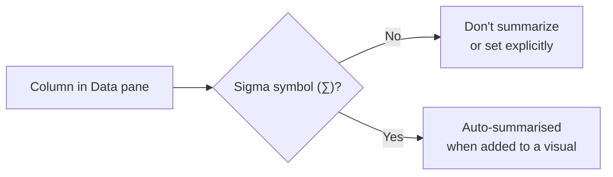
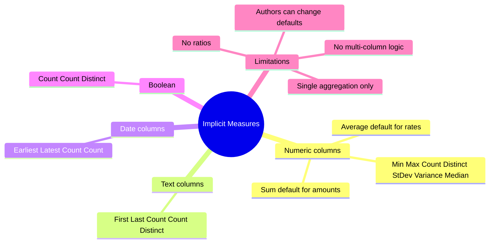

# Unit 4 — Understand implicit measures

## 🎯 Why this matters

Power BI gives you summarization **for free**: drop a numeric column into a visual and Power BI writes the `SUM`/`AVG` for you. These are **implicit measures**. As a modeler you control the *default*, but report authors can override it. This unit is the bridge between **calculated columns** (which store data) and **explicit DAX measures** (which you'll write by hand).

## 🔎 Identify an implicit measure

> [!info] The sigma symbol (∑) tells you two facts
> In the **Data** pane, a column with the sigma symbol (∑) shows that:
> 1. The column is **numeric**.
> 2. Values will be **summarized** when used in a visual that supports summarization.

You control how a column summarises by setting the **Summarization** property:

| Setting | Effect |
|---------|--------|
| **Don't summarize** | Sigma disappears in Data pane; column is treated as a label/key |
| `Sum` (default for integers/decimals) | Adds up values in the visual |
| `Average` | Averages — the right default for *rates* like `Unit Price` |
| `Minimum`, `Maximum`, `Count`, `Count (Distinct)`, `Standard deviation`, `Variance`, `Median` | Other aggregations numeric columns support |

## 🖼️ How Power BI applies defaults

> [!quote] From the module
> "If you add the `Sales Amount` field from the `Sales` table to a matrix visual that groups by fiscal year and month, Power BI summarizes the values implicitly. The **Sum** aggregation function is selected by default."

| Field | Default | Why |
|-------|---------|-----|
| `Sales Amount` (money totals) | **Sum** | Adding monetary totals across rows makes sense (additive) |
| `Unit Price` (a rate) | **Average** | Summing a unit *price* doesn't make sense — they're non-additive |

> [!warning] The risk
> Even if you set a sensible default, **report authors can change it** — e.g. sum `Unit Price` and inflate the totals. Implicit measures give flexibility at the cost of consistency.

## 📋 Summarising non-numeric columns

The sigma symbol only shows next to numeric fields, but non-numeric columns still aggregate:

| Column type | Allowed aggregations |
|-------------|----------------------|
| **Text** | First, Last, Count, Count (Distinct) |
| **Date** | Earliest, Latest, Count, Count |
| **Boolean** | Count, Count (Distinct) |

Use cases:

- *"How many unique products are there?"* → **Count (Distinct)** on a text column.
- *"What was the earliest order date?"* → **Earliest** on a date column.
- *"How many orders were marked as complete?"* → **Count** on a boolean column.

## ⚖️ Considerations

> [!success] Strengths
> - **Easy to use** — report authors start with a default and change as needed.
> - **Less modeler work** — you don't write every measure by hand.
> - **Flexible** — one field serves many visuals.

> [!warning] Limitations
> - **Misuse risk** — authors can pick the wrong aggregation (sum a rate).
> - **Single-aggregation only** — can't, e.g., compute *monthly sales as a ratio of yearly sales*. That needs an **explicit DAX measure**.

> [!quote] From the module
> "Implicit measures let report authors quickly visualize data without needing to write calculations. As a data modeler, you spend less time creating explicit measures. However, even if you set a default summarization, report authors can change it to something that might not make sense. […] The biggest limitation is that implicit measures only work for simple scenarios. They can summarize column values using a single aggregation function, but they can't handle more complex calculations."

## 🔑 Key terms (flashcards)

- **Implicit measure** — Auto-generated aggregation Power BI applies when you drop a numeric column into a visual.
- **Explicit measure** — A DAX formula you write to define a calculation (see [[Unit-5-Explicit-Measures]]).
- **Summarization property** — The model-level setting on a column that controls its default aggregation.
- **Sigma symbol (∑)** — The icon in the Data pane that signals *"numeric + auto-summarised"*.
- **Non-additive** — A measure where `Sum` is *wrong* (e.g. unit price, ratios, percentages).
- **Default aggregation** — The aggregation Power BI picks first; report authors can override.

## 🧭 Module context

| Decision | Guidance |
|----------|----------|
| Set `Sum` for additive amounts | Sales amount, cost, quantity |
| Set `Average` for rates | Unit price, margin %, discount % |
| Set `Don't summarize` for keys/IDs | Order number, customer key |
| Need anything more complex | Switch to **explicit measure** → [[Unit-5-Explicit-Measures]] |

## 🧭 Next

→ [[Unit-5-Explicit-Measures]]
← [[Unit-3-Calculated-Columns]]
↑ [[_MOC]]