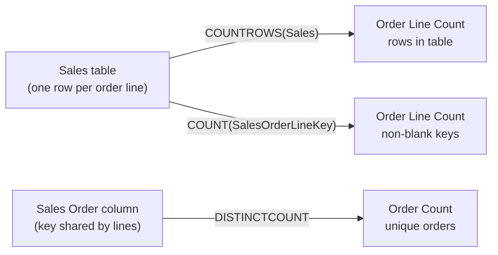
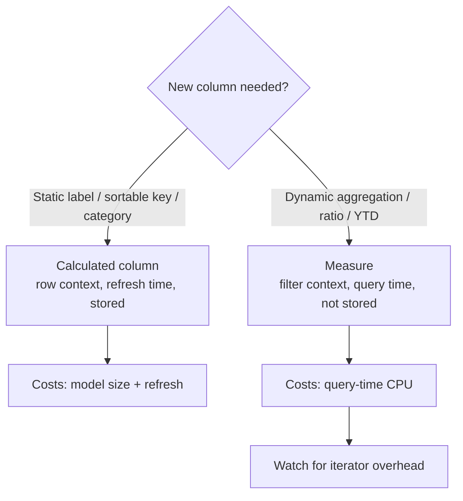

# Unit 5 — Create explicit measures

## 🎯 Why this matters

When an **implicit measure** can't do the job — anything beyond a single-column aggregate — you write an **explicit measure**. You can add a measure to **any table** in the model by writing a DAX formula. The formula **must return a single value**.

> [!quote] Key property
> "Measures don't store values in the model. Instead, Power BI calculates them at query time to summarize model data. Measures can't reference a table or column directly, so you must use a **function** to summarize the data."

## 🧰 Simple measures (single-column aggregates)

A **simple** measure aggregates one column or one table — semantically identical to an implicit measure, but you control the formula, name, format, and home table.

### `Revenue`

```dax
Revenue =
SUM(Sales[Sales Amount])
```

> [!tip] Workflow
> In the Data pane, select the table → **Table Tools** ribbon → **New measure**. The Measure Tools contextual ribbon then lets you format (decimal places, currency), set the data type, and change the **home table** (where the measure appears in the Data pane).

### `Order Line Count` and `Order Count`

```dax
Order Line Count =
COUNT(Sales[SalesOrderLineKey])

Order Count =
DISTINCTCOUNT('Sales Order'[Sales Order])
```

> [!info] Why two measures
> [`COUNT`](https://learn.microsoft.com/en-us/dax/count-function-dax/) counts **non-BLANK** values in a column. An order can have **multiple** order lines, so `SalesOrderLineKey` has duplicates — counting it gives *line* count, not *order* count. Use [`DISTINCTCOUNT`](https://learn.microsoft.com/en-us/dax/distinctcount-function-dax/) on `Sales Order` to get unique-order count.

`Order Line Count` can also be written with [`COUNTROWS`](https://learn.microsoft.com/en-us/dax/countrows-function-dax/):

```dax
Order Line Count =
COUNTROWS(Sales)
```



## 🧱 Compound measures (measures that reference measures)

A **compound measure** references one or more other measures. Example — redefine `Profit` without using a calculated column:

```dax
Profit =
[Revenue] - [Cost]
```

> [!success] Why this matters
> "By removing the calculated column, you optimize the semantic model because it results in a decreased semantic model size and shorter data refresh times. The `Profit Amount` calculated column wasn't required after all because the `Profit` measure can directly produce the required result by using existing measures."

> [!warning] Test cascading changes
> "Sometimes, it makes sense to define measures that depend on other measures. Always test changes carefully, because updates can affect all dependent measures."

## ⚡ Quick measures — let Power BI write the DAX

> [!quote] What they are
> "Quick measures let you perform common calculations without writing DAX yourself. Power BI generates the DAX expression for you, which helps you learn and build your DAX skills."

### Example: build `Profit Margin`

1. On the **Table tools** ribbon, click **Quick measure**.
2. Choose **Mathematical operations → Division**.
3. Set `Profit` as **Numerator**, `Revenue` as **Denominator**.

Power BI creates this for you:

```dax
Profit Margin =
DIVIDE([Profit], [Revenue])
```

> [!tip] `DIVIDE` vs `/`
> The [`DIVIDE`](https://learn.microsoft.com/en-us/dax/divide-function-dax/) function handles the divide-by-zero case gracefully (returns `BLANK` or an alternate result) — preferable to the `/` operator in DAX measures.

## 🆚 Calculated columns vs measures — the big comparison

> [!info] Side-by-side

| | **Calculated columns** | **Measures** |
|---|---|---|
| **Purpose** | Adds a new column to a table | Defines how to summarize model data |
| **Evaluation** | Evaluated using **row context** at **data refresh** time | Evaluated using **filter context** at **query** time |
| **Storage** | Stores a value for each row (Import mode) | **Never** stores values in the model |
| **Use in visuals** | Can filter, group, or summarize data (as implicit measures) | Designed specifically to summarize data |
| **Performance impact** | Can increase memory usage and model size | More efficient; better performance in large models |
| **Ideal for** | New fields for slicing or relationships | Dynamic calculations based on filters |



> [!quote] From the module
> "Many DAX beginners find calculated columns and measures confusing at first. Both are created in the semantic model using DAX formulas, however, calculated columns and measures behave differently."

## 🔑 Key terms (flashcards)

- **Explicit measure** — A DAX formula you write that returns a single value at query time.
- **Simple measure** — Aggregates a single column or table (`SUM`, `COUNT`, `COUNTROWS`, `MIN`, `MAX`).
- **Compound measure** — References one or more other measures (`Profit = [Revenue] - [Cost]`).
- **Quick measure** — UI-generated DAX for common calculations; great for learning DAX.
- **`SUM` / `COUNT` / `DISTINCTCOUNT` / `COUNTROWS`** — Standard aggregating functions.
- **`DIVIDE`** — Safe division; returns `BLANK` on zero denominator instead of an error.
- **Home table** — The table where a measure appears in the Data pane (does not have to be its source table).
- **Filter context** — The set of filters applied by visuals/slicers/`CALCULATE` when a measure is evaluated.

## 🧭 Module context

| If you need… | Use this |
|--------------|----------|
| Add a scalar field to slice/filter on | Calculated column → [[Unit-3-Calculated-Columns]] |
| Add a dynamic aggregation that depends on filters | Measure (this unit) |
| Combine measures | Compound measure (this unit) |
| Learn DAX from worked examples | Quick measure (this unit) |
| Multi-column row-by-row logic | Iterator → [[Unit-6-Iterator-Functions]] |

## 🧭 Next

→ [[Unit-6-Iterator-Functions]]
← [[Unit-4-Implicit-Measures]]
↑ [[_MOC]]