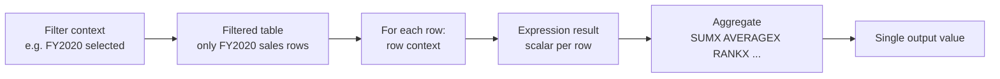
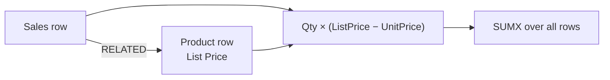
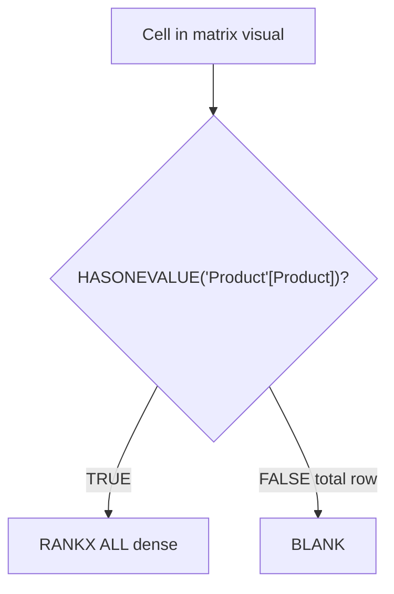

# Unit 6 — Use iterator functions

## 🎯 Why this matters

**Iterator functions** evaluate an expression **for each row in a table**, giving you flexibility and control that single-column aggregators can't match: multi-column expressions, cross-table lookups inside the loop, and higher-grain summarisation.

## ⚙️ The "X" pattern

Single-column summarisation functions (`SUM`, `COUNT`, `MIN`, `MAX`) have **iterator equivalents** with an `X` suffix:

| Aggregator | Iterator | Iterates over |
|------------|----------|---------------|
| `SUM` | `SUMX` | A table, evaluating a scalar expression per row |
| `COUNT` | `COUNTX` | A table, counting rows that produce a non-blank result |
| `MIN` | `MINX` | A table, returning the minimum of the per-row expression |
| `MAX` | `MAXX` | A table, returning the maximum of the per-row expression |
| `AVERAGE` | `AVERAGEX` | A table, averaging the per-row expression |
| — | `RANKX` | Ranks values produced per row |

> [!quote] From the module
> "Every iterator function requires a table and an expression. The table can be a model table or any expression that returns a table. The expression must return a single value for each row."

### SUM is shorthand for SUMX

> [!info] Under the hood
> "Single-column summarization functions, like SUM, act as shorthand. Power BI internally converts SUM to SUMX. For example, both of the following measures return the same result and have the same performance:"

```dax
Revenue = SUM(Sales[Sales Amount])
```

```dax
Revenue =
SUMX(
    Sales,
    Sales[Sales Amount]
)
```

## 🧠 How iterators evaluate

Iterator functions evaluate the expression **for each row** in a table using **row context**, then the **table** itself is filtered by **filter context** (e.g. the slicers/visuals that surround the measure).



> [!warning] Performance caveat
> "Using iterator functions with large tables and complex expressions can slow performance. Functions like `SEARCH` and `LOOKUPVALUE` can be expensive. When possible, use `RELATED` for better performance."

## 🧮 Complex summarization — multi-column expressions

A single aggregator can only sum one column. `SUMX` can combine many:

```dax
Revenue =
SUMX(
    Sales,
    Sales[Order Quantity] * Sales[Unit Price] * (1 - Sales[Unit Price Discount Pct])
)
```

This multiplies **Order Quantity × Unit Price × (1 − discount)** for each row, then sums.

### `RELATED` inside an iterator

```dax
Discount =
SUMX(
    Sales,
    Sales[Order Quantity]
    * (
        RELATED('Product'[List Price]) - Sales[Unit Price]
    )
)
```

For each row in `Sales`, `RELATED('Product'[List Price])` walks the relationship to the `Product` table to fetch the list price.



## 📊 Higher-grain summarization with `AVERAGEX` + `VALUES`

Sometimes you want the average **per order**, not per line item. The trick is to feed `AVERAGEX` a table of **unique** values using [`VALUES`](https://learn.microsoft.com/en-us/dax/values-function-dax/):

### Per order-line (the easy case)

```dax
Revenue Avg Order Line =
AVERAGEX(
    Sales,
    Sales[Order Quantity] * Sales[Unit Price] * (1 - Sales[Unit Price Discount Pct])
)
```

`Sales` has one row per line item, so `AVERAGEX` averages at the line-item grain.

### Per sales-order (higher grain)

```dax
Revenue Avg Order =
AVERAGEX(
    VALUES('Sales Order'[Sales Order]),
    [Revenue]
)
```

`VALUES('Sales Order'[Sales Order])` returns the **unique** sales orders in the current filter context. `AVERAGEX` then iterates over each, evaluating the existing `[Revenue]` measure for that order, and averages the per-order totals.

```mermaid
flowchart TD
    A[Filter context<br/>e.g. one month] --> B[VALUES('Sales Order'[Sales Order])<br/>unique orders in context]
    B --> C[For each order:<br/>evaluate [Revenue]]
    C --> D[AVERAGEX<br/>mean of per-order revenues]
```

## 🏅 Ranking with `RANKX`

[`RANKX`](https://learn.microsoft.com/en-us/dax/rankx-function-dax/) calculates ranks by iterating over a table and evaluating an expression for each row.

```dax
Product Quantity Rank =
RANKX(
    ALL('Product'[Product]),
    [Quantity]
)
```

- `ALL('Product'[Product])` removes the product filter — so `RANKX` ranks **every** product, even inside a product-filtered visual.
- Default direction is **descending** (highest rank = 1), and ties **skip ranks**.

### Dense ranking

> [!tip] No gaps with `DENSE`
> Pass `DENSE` as the fifth argument to assign the next rank after a tie **without** skipping numbers.

```dax
Product Quantity Rank =
RANKX(
    ALL('Product'[Product]),
    [Quantity],
    ,
    ,
    DENSE
)
```

| Behaviour | Two ties at rank 10 | Next rank |
|-----------|---------------------|-----------|
| Default | rank 11 **skipped** | 12 |
| `DENSE` | rank 11 assigned | 11 |

### Suppressing the total row with `HASONEVALUE`

In a totals row, the rank measure produces `1` (because the total is itself "ranked"). To suppress this:

```dax
Product Quantity Rank =
IF(
    HASONEVALUE('Product'[Product]),
    RANKX(
        ALL('Product'[Product]),
        [Quantity],
        ,
        ,
        DENSE
    )
)
```

[`HASONEVALUE`](https://learn.microsoft.com/en-us/dax/hasonevalue-function-dax/) returns `TRUE` when the product column has a single value in filter context — true for each product group but **false** for the totals row, which spans all products. So the total cell becomes `BLANK`.



> [!quote] From the module
> "Iterator functions provide powerful ways to summarize, aggregate, and rank data in Power BI models. They support complex calculations and let you control the level of detail in your reports."

## 🔑 Key terms (flashcards)

- **Iterator function** — Any function whose name ends in `X` (`SUMX`, `AVERAGEX`, `RANKX` …) that loops row-by-row.
- **Row context** — The "current row" inside an iterator.
- **Filter context** — Outer filters from the visual that determine which rows the iterator sees.
- **`RELATED` inside an iterator** — Fetches a value from the one-side of a relationship on each iteration; faster than `LOOKUPVALUE`.
- **`VALUES`** — Returns the unique values of a column in the current filter context; lets you average/aggregate at a **higher grain** than the underlying table.
- **`ALL`** — Removes filters from a column or table; commonly used inside `RANKX` to rank across all rows.
- **`RANKX`** — Ranks rows by an expression; supports `DENSE` (no gaps) and is normally combined with `ALL`/`HASONEVALUE`.
- **`HASONEVALUE`** — `TRUE` when exactly one value of a column is in filter context; great for hiding total rows.

## 🧭 Module context

| Question | Iterator answer |
|----------|-----------------|
| Multi-column expression per row | `SUMX`, `AVERAGEX` |
| Look up a related value inside the loop | `SUMX(... , RELATED(...))` |
| Average at a higher grain than the table | `AVERAGEX(VALUES(...), [Measure])` |
| Rank products ignoring current filter | `RANKX(ALL(...), [Measure])` |
| Hide the rank from total rows | wrap in `IF(HASONEVALUE(...), ...)` |

## 🧭 Next

→ [[Unit-7-Exercise]]
← [[Unit-5-Explicit-Measures]]
↑ [[_MOC]]