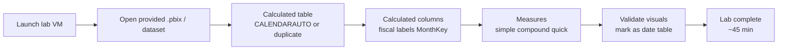

# Unit 7 — Exercise: Create DAX calculations

> [!warning] Interactive lab — not performed here
> This unit is an **interactive Microsoft Learn lab** that runs in a hosted sandbox. It is **not** executed by these notes. The summary below describes what the lab does so you know what to expect when you click the launch button.

## 🧪 Lab summary

> [!quote] Module description
> "In this exercise, you learn how to use DAX to:
> - Create calculated tables.
> - Create calculated columns.
> - Create measures."

This lab takes approximately **45 minutes** to complete.

## 🛠️ Prerequisites

> [!warning] Workspace requirement
> You need access to a **Microsoft Fabric-enabled workspace** to complete this exercise. For more information, see [**Getting started with Fabric**](https://learn.microsoft.com/en-us/fabric/get-started/fabric-trial) to enable a Fabric trial license.

> [!note] Lab environment
> "A virtual machine containing the client tools you need is provided, along with the exercise instructions. Use the **Launch lab** button to launch the virtual machine. A limited number of concurrent sessions are available. If the hosted environment is unavailable, please try again later."

> [!tip] Working with the lab VM
> To dock the lab environment so that it fills the window, select the **PC** icon at the top and then select **Fit Window to Machine**.

You are automatically logged in to your lab environment as `data-ai\student`.

## 🚀 Launch

Open the lab at: <https://go.microsoft.com/fwlink/?linkid=2320991>

Alternatively, you can [open the instructions in a separate window](https://go.microsoft.com/fwlink/?linkid=2320991).

## 🧭 What you'll do (inferred from module objectives)

| # | Step | What you do | What it teaches |
|---|------|-------------|-----------------|
| 1 | Create a calculated table | Add a new DAX table (e.g. `CALENDARAUTO` for a `Date` table) | How calculated tables extend the model and how to mark-as-date-table for time intelligence |
| 2 | Create calculated columns | Add row-context columns (e.g. fiscal year/quarter, `MonthKey`) | How row context evaluates per row and how `RELATED` pulls values across tables |
| 3 | Create measures | Write simple measures (`SUM`, `COUNT`), compound measures, and Quick measures | How filter context works at query time and how explicit measures replace implicit summarization |

## 🎯 Skills practiced

> [!success] Skills this lab reinforces
> - Creating a **calculated table** with `CALENDARAUTO` (or duplicating an existing table) and **marking it as a date table**.
> - Authoring **calculated columns** that use `YEAR`/`MONTH`/`FORMAT` and reference values from related tables via `RELATED`.
> - Writing **explicit measures** that aggregate, combine, and divide other measures (`SUM`, `COUNT`, `DIVIDE`).
> - Using the **Quick measures** UI to generate DAX and then reading the resulting formula.

## 🔗 Concepts to revisit before the lab

> [!tip] Pre-lab review
> - [[Unit-2-Calculated-Tables]] — `CALENDARAUTO`, mark-as-date-table, role-playing dimensions.
> - [[Unit-3-Calculated-Columns]] — row context, fiscal year/quarter, `MonthKey`, `RELATED`.
> - [[Unit-4-Implicit-Measures]] — when to leave the default and when to write a measure.
> - [[Unit-5-Explicit-Measures]] — `SUM`, `COUNT`, `DISTINCTCOUNT`, compound measures, Quick measures, `DIVIDE`.
> - [[Unit-6-Iterator-Functions]] — `SUMX`, `AVERAGEX`, `RANKX`, `ALL`, `VALUES`, `HASONEVALUE`.

## 🔑 Key terms (flashcards)

- **Calculated table** — DAX formula that returns a table (lab typically creates a date table).
- **Calculated column** — DAX formula that returns a scalar per row (lab adds fiscal columns).
- **Measure** — DAX formula evaluated at query time in filter context (lab adds revenue/profit/margin).
- **Quick measure** — UI-generated DAX (the lab may show this for `Profit Margin` via `DIVIDE`).
- **Mark as date table** — Setting that unlocks time-intelligence functions on a custom date table.

## 🧭 Next

→ [[Unit-8-Knowledge-Check]]
← [[Unit-6-Iterator-Functions]]
↑ [[_MOC]]