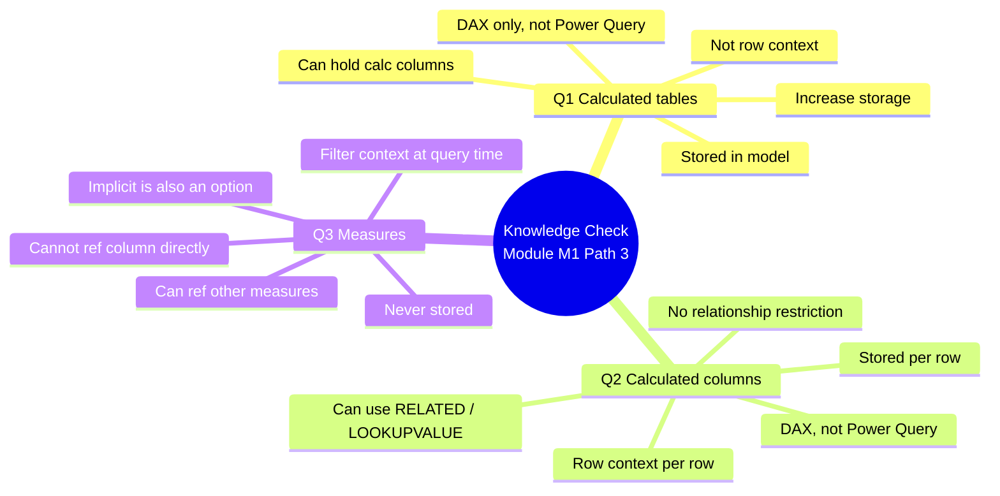

# Unit 8 — Check your knowledge

> [!warning] Answer provenance
> Microsoft Learn intentionally does **not** publish the correct answers for knowledge-check questions. The answers below are **derived from the unit content** and the wording of each question. Treat them as best-effort study notes — verify against the live module if you fail the check.

## 📋 Questions

### Question 1
> Which statement about **calculated tables** is true?

- Calculated tables increase the size of the semantic model.
- Calculated tables are evaluated by using row context.
- Calculated tables are created in Power Query.
- Calculated tables can't include calculated columns.

### Question 2
> Which statement about **calculated columns** is true?

- Calculated columns are created in the Power Query Editor window.
- Calculated column formulas are evaluated by using row context.
- Calculated column formulas can only reference columns from within their table.
- Calculated columns can't be related to noncalculated columns.

### Question 3
> Which statement about **measures** is correct?

- Measures store values in the semantic model.
- Measures must be added to the semantic model to achieve summarization.
- Measures can reference columns directly.
- Measures can reference other measures directly.

## ✅ Answer key (derived)

| # | Correct answer | Why the others are wrong | Source unit |
|---|----------------|--------------------------|-------------|
| 1 | **Calculated tables increase the size of the semantic model.** | Row-context evaluation describes calculated *columns*, not tables. Tables are created with DAX (not Power Query — that's custom columns). Tables *can* include calculated columns. | [[Unit-2-Calculated-Tables]] · [[Unit-3-Calculated-Columns]] |
| 2 | **Calculated column formulas are evaluated by using row context.** | They are **not** created in Power Query — that's the competing *custom column* approach. They **can** reference other tables via `RELATED`/`LOOKUPVALUE`. There is no restriction against relationships with non-calculated columns. | [[Unit-3-Calculated-Columns]] |
| 3 | **Measures can reference other measures directly.** | Measures do **not** store values — they're computed at query time. Summarization can also come from **implicit measures** (so explicit measures are not "must add"). Measures cannot reference columns directly — they must use an aggregation function. | [[Unit-4-Implicit-Measures]] · [[Unit-5-Explicit-Measures]] |

## 🧠 Why these answers (linking back to the module)

## 🎯 Re-study pointers

> [!tip] If you missed a question, re-read:
> - Q1 → "Calculated tables increase the model's storage size" in [[Unit-2-Calculated-Tables]]
> - Q2 → "Understand row context" in [[Unit-3-Calculated-Columns]]
> - Q3 → "Measures can't reference a table or column directly" + "Compound measures" in [[Unit-5-Explicit-Measures]] (also see the comparison table there)

## 🔑 Key terms (flashcards)

- **Calculated table** — DAX formula that returns a table; stored, increases model size.
- **Calculated column** — DAX formula that returns a scalar per row; row context; stored.
- **Measure** — DAX formula that returns a single value; filter context; not stored; can reference other measures.

## 🧭 Next

→ [[Unit-9-Summary]]
← [[Unit-7-Exercise]]
↑ [[_MOC]]