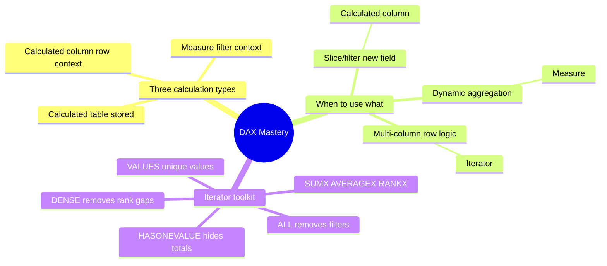

# Unit 9 — Summary

## 📌 Module recap

> [!quote] Microsoft Learn summary
> "This module covered using DAX calculations to extend your semantic model. You learned the differences between calculated columns and measures, including when and how Power BI evaluates them and how they store data. Explicit measures are important because they allow you to create complex DAX formulas to achieve the precise calculations that your report visuals need.
>
> You also learned how calculated columns are evaluated within row context, and iterator functions are available in measures for advanced row-by-row calculations.
>
> Understanding how to create and use DAX calculations is fundamental for building effective, flexible, and maintainable semantic models in Power BI. These concepts help you design reports that deliver accurate insights and support a wide range of analytical requirements."

## 🧠 What you now know

> [!success] Skills earned
> - **Calculated tables** solve the role-playing-dimension problem and create custom date tables; they are stored and increase model size.
> - **Calculated columns** are evaluated in **row context** at refresh time and stored per row; reach across tables with `RELATED` / `RELATEDTABLE` / `LOOKUPVALUE`.
> - **Implicit measures** auto-summarise a column (sigma symbol); convenient but limited to single-aggregation scenarios and subject to misuse.
> - **Explicit measures** are DAX formulas evaluated in **filter context** at query time; never stored; can be simple, compound, or generated via Quick measures.
> - **Iterator (X) functions** evaluate an expression per row (`SUMX`, `AVERAGEX`, `RANKX`), enabling multi-column logic, higher-grain summarisation via `VALUES`, and ranking via `ALL` / `HASONEVALUE` / `DENSE`.
> - **DAX is the differentiator** — separating competent modellers from analysts who can build flexible, maintainable semantic models.

## 🔑 Key terms (flashcards)

- **Calculated table** — DAX returns a table; stored; used for date tables and role-playing dims.
- **Calculated column** — DAX returns a scalar per row; evaluated in row context; stored.
- **Measure** — DAX returns a single value; evaluated in filter context; not stored.
- **Implicit measure** — Auto-summarisation of a numeric column (sigma symbol).
- **Explicit measure** — DAX formula you write (simple / compound / Quick).
- **Iterator (X) function** — Row-by-row evaluator (`SUMX`, `AVERAGEX`, `RANKX`).
- **Row context** — The "current row" used by calculated columns and iterators.
- **Filter context** — The outer filter set applied by visuals / `CALCULATE`.

## 📚 Further learning

> [!tip] External resources
> - [Introduction to DAX in Power BI](https://learn.microsoft.com/en-us/dax/dax-overview)
> - [DAX function reference](https://learn.microsoft.com/en-us/dax/)
> - [CALENDARAUTO](https://learn.microsoft.com/en-us/dax/calendarauto-function-dax/) · [CALENDAR](https://learn.microsoft.com/en-us/dax/calendar-function-dax/)
> - [RELATED](https://learn.microsoft.com/en-us/dax/related-function-dax/) · [RELATEDTABLE](https://learn.microsoft.com/en-us/dax/relatedtable-function-dax/) · [LOOKUPVALUE](https://learn.microsoft.com/en-us/dax/lookupvalue-function-dax/)
> - [RANKX](https://learn.microsoft.com/en-us/dax/rankx-function-dax/) · [HASONEVALUE](https://learn.microsoft.com/en-us/dax/hasonevalue-function-dax/)
> - [DIVIDE](https://learn.microsoft.com/en-us/dax/divide-function-dax/)
> - [Custom date and time formats for FORMAT](https://learn.microsoft.com/en-us/dax/custom-date-and-time-formats-for-the-format-function/)

## 🧭 Next

← [[Unit-8-Knowledge-Check]]
↑ [[_MOC]]