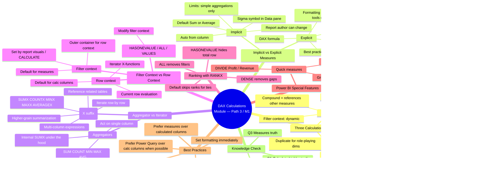

# Module — Create DAX calculations in semantic models

> [!info] Module map
> This is the **DAX core** of the Fabric Analytics Engineer track. The model you build in Power Query is data; the **DAX calculations** you add are what turn that data into answers. The module covers the three calculation types (**calculated tables**, **calculated columns**, **measures**), the **implicit vs explicit** measure distinction, and the **iterator (X) functions** that unlock row-by-row logic. Mastery here is the single biggest differentiator between a modeler and an analyst.

## 🎯 Learning objectives (from Microsoft Learn)

By the end of this module you should be able to:

1. **Create calculated tables** — duplicate an existing table or generate a fresh `CALENDARAUTO`/`CALENDAR` date table for time intelligence.
2. **Create calculated columns** — add row-context-driven columns that depend on the current row or use `RELATED`/`RELATEDTABLE`/`LOOKUPVALUE` to pull from other tables.
3. **Understand implicit measures** — know how Power BI auto-summarizes numeric columns, the `Summarization` property, and the limits of "free" aggregations.
4. **Create explicit measures** — write DAX measures, build simple and compound measures, and use **Quick measures** to learn by example.
5. **Use iterator functions** — apply `SUMX`, `AVERAGEX`, `RANKX` (with `ALL`, `VALUES`, `HASONEVALUE`) to do multi-column and higher-grain summarization.

## 🧠 Module mind map

> [!tip] How to use
> The mind map below is duplicated as a standalone Mermaid file (`Module-Mind-Map.md`) you can open in Obsidian's Mermaid preview or the [Mermaid Live Editor](https://mermaid.live). It is the **single-page view** of the entire module.

## 📑 Unit breakdown

| # | Unit | XP | Minutes | Focus |
|---|------|----|---------|-------|
| 1 | [Introduction](./Unit-1-Introduction.md) | 100 | 2 | Why DAX is needed beyond Power Query; three calculation types |
| 2 | [Create calculated tables](./Unit-2-Calculated-Tables.md) | 100 | 8 | Duplicate tables, `CALENDARAUTO`, mark-as-date-table |
| 3 | [Create calculated columns](./Unit-3-Calculated-Columns.md) | 100 | 6 | Fiscal year/quarter, `MonthKey`, `FORMAT`, **row context**, `RELATED`/`LOOKUPVALUE` |
| 4 | [Understand implicit measures](./Unit-4-Implicit-Measures.md) | 100 | 6 | Sigma symbol, Summarization property, defaults, limits |
| 5 | [Create explicit measures](./Unit-5-Explicit-Measures.md) | 100 | 7 | `SUM`/`COUNT`/`DISTINCTCOUNT`/`COUNTROWS`, compound measures, **Quick measures**, calc-col-vs-measure table |
| 6 | [Use iterator functions](./Unit-6-Iterator-Functions.md) | 100 | 7 | `SUMX`/`AVERAGEX`, `RELATED` in iterators, `VALUES` for higher grain, `RANKX` + `ALL`/`HASONEVALUE`/`DENSE` |
| 7 | [Exercise — Create DAX calculations](./Unit-7-Exercise.md) | 100 | 45 | Hands-on lab: tables, columns, measures |
| 8 | [Check your knowledge](./Unit-8-Knowledge-Check.md) | 200 | 3 | 3 knowledge-check questions |
| 9 | [Summary](./Unit-9-Summary.md) | 100 | 1 | Recap + further reading |

**Total: 1000 XP · 85 minutes (1 hr 25 min)**

## 🔗 Knowledge-check answers (unit 8)

> [!warning] Answer provenance
> Microsoft Learn intentionally does not publish the correct answers for knowledge-check questions. The answers below are **derived from the unit content** for this module and the wording of each question. Treat them as best-effort study notes — verify against the live module if you fail the check.

| Q | Question | Correct answer |
|---|----------|----------------|
| 1 | Which statement about **calculated tables** is true? | **Calculated tables increase the size of the semantic model.** (Calculated tables store data — they increase model size. They are *not* evaluated by row context; that's calculated columns. They are *not* created in Power Query; they're created with DAX. They *can* include calculated columns.) |
| 2 | Which statement about **calculated columns** is true? | **Calculated column formulas are evaluated by using row context.** (They are *not* created in Power Query — that's custom columns; Power Query is preferred but is different. They *can* reference other tables via `RELATED`/`LOOKUPVALUE`. They *can* be related to non-calculated columns — there's no such restriction.) |
| 3 | Which statement about **measures** is correct? | **Measures can reference other measures directly.** (Measures do *not* store values — they're calculated at query time. They are *not* the only way to summarise (implicit measures exist). They *cannot* reference columns directly — they must use a function like `SUM`. They *can* reference other measures, e.g. `Profit = [Revenue] - [Cost]`.) |

## 🧭 Downstream links

- [[Unit-1-Introduction]] · [[Unit-2-Calculated-Tables]] · [[Unit-3-Calculated-Columns]] · [[Unit-4-Implicit-Measures]] · [[Unit-5-Explicit-Measures]] · [[Unit-6-Iterator-Functions]] · [[Unit-7-Exercise]] · [[Unit-8-Knowledge-Check]] · [[Unit-9-Summary]]
- [[Module-Mind-Map]]
- Sister module: [Module — Intro to Fabric](../01-Module-Intro-to-Fabric/_MOC.md)
- Sister module: [Module — Discover OneLake](../03-Path1-Module2-Discover-OneLake/_MOC.md)

## 📚 External references

- Microsoft Learn module page: <https://learn.microsoft.com/en-us/training/modules/dax-power-bi-create-calculations/>
- DAX overview: <https://learn.microsoft.com/en-us/dax/dax-overview>
- `CALENDARAUTO`: <https://learn.microsoft.com/en-us/dax/calendarauto-function-dax/>
- `CALENDAR`: <https://learn.microsoft.com/en-us/dax/calendar-function-dax/>
- `RELATED`: <https://learn.microsoft.com/en-us/dax/related-function-dax/>
- `RELATEDTABLE`: <https://learn.microsoft.com/en-us/dax/relatedtable-function-dax/>
- `LOOKUPVALUE`: <https://learn.microsoft.com/en-us/dax/lookupvalue-function-dax/>
- `FORMAT`: <https://learn.microsoft.com/en-us/dax/format-function-dax/>
- `RANKX`: <https://learn.microsoft.com/en-us/dax/rankx-function-dax/>
- `HASONEVALUE`: <https://learn.microsoft.com/en-us/dax/hasonevalue-function-dax/>
- `DIVIDE`: <https://learn.microsoft.com/en-us/dax/divide-function-dax/>
- Custom date/time formats for `FORMAT`: <https://learn.microsoft.com/en-us/dax/custom-date-and-time-formats-for-the-format-function/>
- DP-600 learning path: <https://learn.microsoft.com/en-us/training/paths/dax-power-bi/>