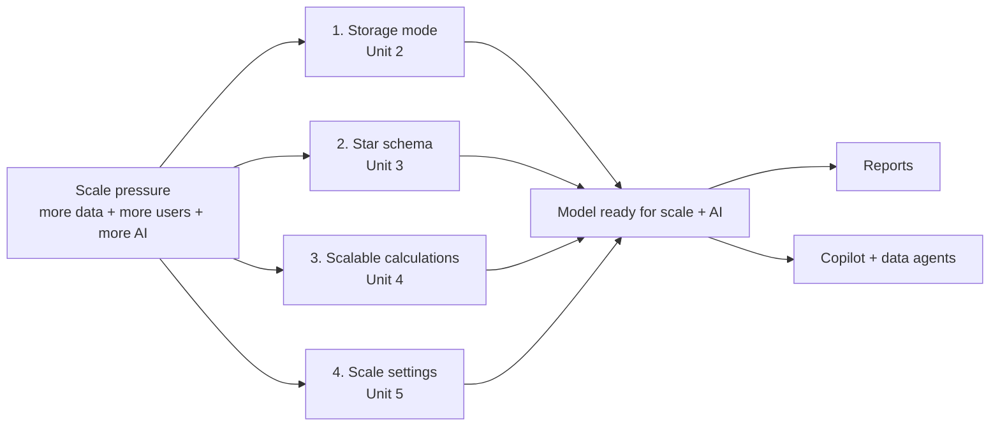

# Unit 1 — Introduction

> [!quote] Source
> Microsoft Learn · Module 2 · Unit 1 · "Introduction"
> <https://learn.microsoft.com/en-us/training/modules/design-semantic-models-scale/1-introduction>

## 🎯 Purpose

A short framing unit that explains **why semantic-model design decisions need to change as scale grows**. Scenario: an organization scaling its analytics in Microsoft Fabric whose semantic models were built in Power BI Desktop for small teams and now need to handle larger datasets, more concurrent users, and broader consumption patterns.

> [!note] Framing
> The source content for this unit is conceptual scene-setting — the substantive design material begins in [[Unit-2-Storage-Modes]] and continues through [[Unit-5-Scale-Settings]].

## 🔑 Key takeaways

- **Semantic models are the foundation of analytics in Microsoft Fabric.** They define how data is structured, calculated, and consumed across reports, dashboards, and AI experiences.
- **A model that works for a small team does not automatically serve scale.** Data volumes grow, teams expand, consumption patterns shift — design decisions behind the model need to change.
- **In this module you make four scale-oriented design decisions:**
  1. Choose the **right storage mode** for how data flows into the model — see [[Unit-2-Storage-Modes]].
  2. **Design star schema relationships** for clarity and performance — see [[Unit-3-Star-Schema]].
  3. **Design calculations** that stay performant and maintainable as data volumes and team size grow — see [[Unit-4-Calculation-Patterns]].
  4. **Configure settings** for large datasets, concurrent queries, and external tool access — see [[Unit-5-Scale-Settings]].
- **End state:** a model that uses the right storage mode, follows star-schema best practices, includes scalable calculation patterns, and is configured for growing data volumes and consumption demands.
- **Models designed for scale also benefit AI consumption.** Copilot and data agents demand the same things from a model that scale does: current data, clear relationships, descriptive structures, and capacity to handle additional query load.

> [!important] Why design for scale before AI
> AI consumption is not a separate concern bolted on at the end. A model that is current, clearly related, descriptively named, and has query capacity will produce better AI answers. Storage mode choice, star schema, and calculation discipline all affect what Copilot and data agents can return.

## 🧠 Visual — the four design decisions

## 🧭 Next

→ [[Unit-2-Storage-Modes]]
↑ [[_MOC]]
