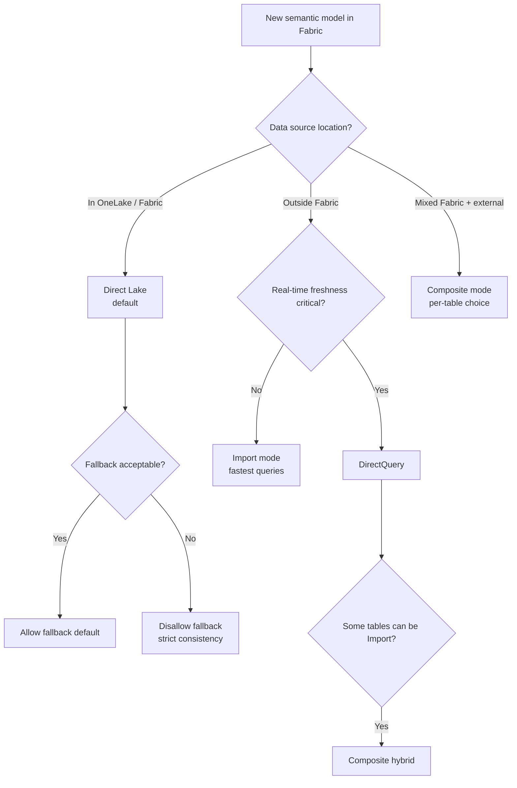

# Unit 2 — Choose a storage mode

> [!quote] Source
> Microsoft Learn · Module 2 · Unit 2 · "Choose a storage mode"
> <https://learn.microsoft.com/en-us/training/modules/design-semantic-models-scale/2-storage-modes>

## 🎯 Purpose

The first design decision for any semantic model in Microsoft Fabric is **how data flows into the model**. The storage mode you choose affects query performance, data freshness, and which Fabric features are available. In Fabric, **Direct Lake is the default**, and for most workloads it's the right choice.

## 🔑 The four storage modes

| Mode | Data location | Query speed | Data freshness | Best for |
|---|---|---|---|---|
| **Direct Lake** | OneLake (Delta tables) | Fast | Near real-time | Fabric-native workloads (default) |
| **Import** | In-model cache | Fastest | Refresh-dependent | Non-Fabric sources, max performance |
| **DirectQuery** | Source system | Depends on source | Near real-time | Real-time requirements, very large external data |
| **Composite** | Mixed | Varies | Mixed | Cross-source scenarios, hybrid requirements |

## Direct Lake mode

Direct Lake is the **default storage mode** for semantic models created in Microsoft Fabric.

- Unlike Import, Direct Lake **does not copy data** into the model.
- Unlike DirectQuery, it **does not translate** queries into source SQL.
- Instead, it **reads Delta tables directly from OneLake into memory** — combining the speed of Import with the freshness of DirectQuery.
- When a user opens a report, the engine loads column data from Delta Parquet files on demand. **No scheduled refresh required** — when Delta tables update, the model reflects those changes.
- Direct Lake models **automatically enable the large semantic model storage format** (removes the 10-GB limit, prerequisite for query scaleout and XMLA read/write — see [[Unit-5-Scale-Settings]]).

> [!info] Connection options
> Direct Lake models can connect to data through two paths:
>
> - **OneLake tables** — connect directly to Delta tables in a lakehouse or warehouse. Simplest path for data in a single Fabric data store.
> - **SQL analytics endpoint** — connect through the SQL endpoint of a lakehouse or warehouse. Enables access to views, cross-database queries, and security defined at the SQL layer.
>
> Choose **OneLake tables** when your data is straightforward and lives in one place. Choose the **SQL analytics endpoint** when you need views, cross-source joins, or row-level security defined in SQL.

### Fallback behavior

Some operations cause Direct Lake to **fall back to DirectQuery** — complex DAX, queries exceeding memory, or unsupported operations. Fallback runs against the SQL analytics endpoint instead of reading Delta files.

| Fallback setting | Behavior |
|---|---|
| **Allow fallback** (default) | Failing queries fall back automatically. Users get results, but performance may decrease. |
| **Disallow fallback** | Failing queries return an error. Enforces consistent performance but requires all queries stay within Direct Lake capabilities. |

> [!tip] Operational approach
> For most production workloads, start with fallback allowed and monitor which queries trigger it. Then optimize those queries or data structures to reduce fallback frequency over time.

## Import mode

Import mode copies data into the semantic model and stores it in a **compressed, in-memory format**. Queries run against the local copy — the **fastest storage mode** for query performance. Data is only as current as the last refresh.

**Use Import when:**
- Your data source is **outside Fabric** (on-premises databases, third-party APIs, flat files).
- **Query performance is the top priority** and near-real-time freshness isn't required.
- You need features **not yet supported in Direct Lake**.

> [!tip] Size-reduction guidance
> When using Import, connect to **views** instead of raw tables, include only necessary columns, and use appropriate data types. See [techniques to reduce data loaded into Import models](https://learn.microsoft.com/en-us/power-bi/guidance/import-modeling-data-reduction).

## DirectQuery mode

DirectQuery sends queries **directly to the data source at query time**. No data is stored in the model — suitable for real-time scenarios and very large datasets that can't be imported.

**Tradeoff:** every report interaction generates a query against the source. Use DirectQuery when:
- Real-time data is required and even short refresh delays are unacceptable.
- Source data volumes are too large to import, and the source is outside Fabric.
- Governance requirements mandate data stays at the source.

## Composite mode

Composite mode **combines storage modes within a single model** — some tables use Import, others DirectQuery or Direct Lake. Provides flexibility when tables have different performance and freshness needs.

Example: a large fact table stays in Direct Lake while a small reference table from an external source uses Import. Composite also enables **many-to-many relationships** between tables from different sources.

> [!info] Composite scenarios
> Use composite when you need data from both Fabric and non-Fabric sources, some tables require real-time data while others benefit from cached performance, or you need to combine Direct Lake with Import for cross-source analysis.

## 🧠 Decision flow

## ⚠️ Storage mode and AI consumption

> [!important] AI implication
> When Copilot or data agents query a semantic model, they return answers based on whatever data the model currently reflects. **Direct Lake's near-real-time freshness** means AI queries return current results without waiting for a scheduled refresh. For models serving both human users and AI, storage mode choice directly affects the quality of both experiences.

## 🧭 Decision rule

> [!success] Fabric default
> **In Fabric, start with Direct Lake. Move to another mode only when your specific scenario requires it.**

## 🧭 Next

→ [[Unit-3-Star-Schema]]
← [[Unit-1-Introduction]]
↑ [[_MOC]]
